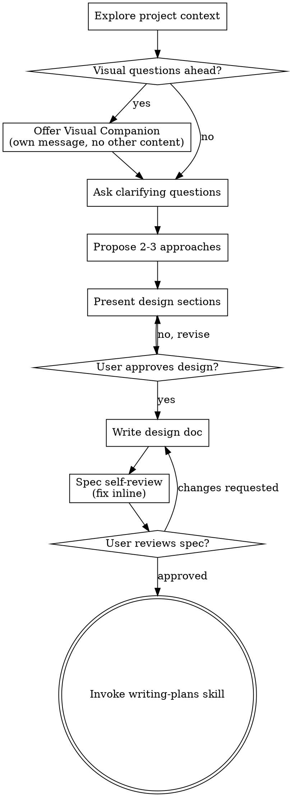
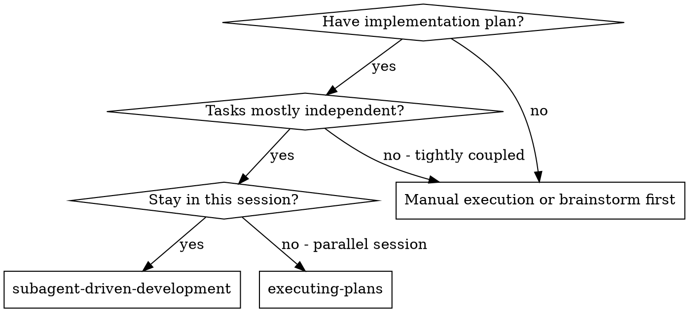
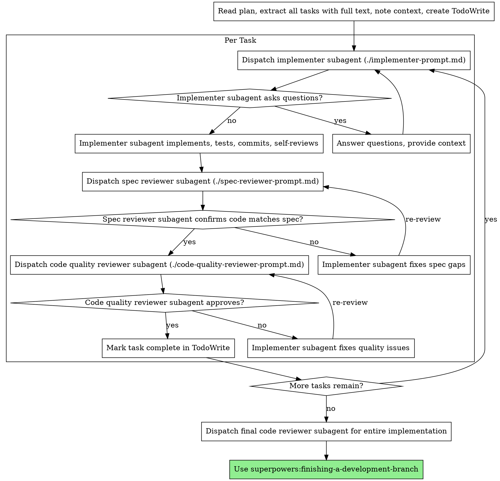

# Flutter авторизация: лишний редирект анкеты (fork #1)

**Session ID:** ses_2872f3197ffe24AbYHhmR8xQYF
**Created:** 4/10/2026, 10:14:03 PM
**Updated:** 4/10/2026, 11:31:36 PM

---

## Assistant (Build · gpt-5.3-codex · 10.1s)

_Thinking:_


**Tool: apply_patch**

**Input:**
```json
{
  "patchText": "*** Begin Patch\n*** Update File: /Users/macbook1/Desktop/LighChat/mobile/app/lib/features/auth/ui/auth_screen.dart\n@@\n                                 final next = googleRouteFromProfileStatus(\n                                   status,\n                                 );\n-                                if (next == null) return;\n+                                if (next == null) {\n+                                  context.go('/chats');\n+                                  return;\n+                                }\n                                 context.go(next);\n                               },\n*** End Patch"
}
```

**Output:**
```
Success. Updated the following files:
M mobile/app/lib/features/auth/ui/auth_screen.dart
```

---

## Assistant (Build · gpt-5.3-codex · 5.0s)

_Thinking:_


**Tool: read**

**Input:**
```json
{
  "filePath": "/Users/macbook1/Desktop/LighChat/mobile/app/lib/app_router.dart",
  "offset": 20,
  "limit": 20
}
```

**Output:**
```
<path>/Users/macbook1/Desktop/LighChat/mobile/app/lib/app_router.dart</path>
<type>file</type>
<content>20: 
21:       // Firebase Auth (Google) iOS callback comes as:
22:       //   app-<...>://firebaseauth/link?deep_link_id=...
23:       // GoRouter receives it as a location; we must redirect it to an internal route.
24:       if (uri.host == 'firebaseauth' && uri.path == '/link') {
25:         final user = FirebaseAuth.instance.currentUser;
26:         if (user == null) return '/auth';
27:         final status = await getFirestoreRegistrationProfileStatusWithDeadline(
28:           user,
29:         );
30:         final next = googleRouteFromProfileStatus(status);
31:         return next ?? '/auth';
32:       }
33: 
34:       // If user is already signed in, never land on auth screen.
35:       if (isSignedIn && state.matchedLocation == '/auth') {
36:         return '/chats';
37:       }
38: 
39:       return null;

(Showing lines 20-39 of 86. Use offset=40 to continue.)
</content>
```

---

## Assistant (Build · gpt-5.3-codex · 9.4s)

_Thinking:_


**Tool: apply_patch**

**Input:**
```json
{
  "patchText": "*** Begin Patch\n*** Update File: /Users/macbook1/Desktop/LighChat/mobile/app/lib/app_router.dart\n@@\n         final status = await getFirestoreRegistrationProfileStatusWithDeadline(\n           user,\n         );\n         final next = googleRouteFromProfileStatus(status);\n-        return next ?? '/auth';\n+        return next ?? '/chats';\n       }\n*** End Patch"
}
```

**Output:**
```
Success. Updated the following files:
M mobile/app/lib/app_router.dart
```

---

## Assistant (Build · gpt-5.3-codex · 24.3s)

_Thinking:_


**Tool: bash**

**Input:**
```json
{
  "command": "dart format \"lib/features/chat/ui/chat_list_screen.dart\" \"lib/features/auth/ui/auth_screen.dart\" \"lib/app_router.dart\"",
  "timeout": 120000,
  "workdir": "/Users/macbook1/Desktop/LighChat/mobile/app",
  "description": "Formats files updated for unknown fallback"
}
```

**Output:**
```
Formatted 3 files (0 changed) in 0.06 seconds.

```

---

## Assistant (Build · gpt-5.3-codex · 46.5s)

_Thinking:_


**Tool: bash**

**Input:**
```json
{
  "command": "flutter analyze lib/features/chat/ui/chat_list_screen.dart lib/features/auth/ui/auth_screen.dart lib/app_router.dart",
  "timeout": 120000,
  "workdir": "/Users/macbook1/Desktop/LighChat/mobile/app",
  "description": "Analyzes fallback routing updates in mobile app"
}
```

**Output:**
```
Analyzing 3 items...                                            

   info • Unnecessary use of multiple underscores • lib/features/chat/ui/chat_list_screen.dart:445:39 • unnecessary_underscores

1 issue found. (ran in 2.0s)

```

---

## Assistant (Build · gpt-5.3-codex · 14.3s)

_Thinking:_


Понял, да — это был побочный эффект моего tri-state: `unknown` оставался на экране проверки и мог зациклиться.

Я это исправил, чтобы **не было вечного лоадера**:

- В `mobile/app/lib/features/chat/ui/chat_list_screen.dart`:
  - `unknown` больше не блокирует экран `Проверка профиля...`
  - блокирующий редирект остается только для `incomplete`
- В `mobile/app/lib/features/auth/ui/auth_screen.dart`:
  - после Google Sign-In, если статус `unknown`, теперь идем в `/chats` (вместо зависания)
- В `mobile/app/lib/app_router.dart`:
  - для callback `firebaseauth/link` при `unknown` fallback теперь `/chats` (не `/auth`)

Проверка:
- `flutter analyze` по измененным файлам проходит, остался только один неважный info-линт в `chat_list_screen.dart`, не связанный с этим багом.

Теперь на твоем аккаунте с полным профилем (`+79094189653`, валидные `name/username/email`) должно пускать в приложение без вечной «Проверка профиля...».

---

## User

Добавь еще возможность со страницы дозаполнения анкеты возмодность вернуться на страницу авторизации

---

## Assistant (Build · gpt-5.3-codex · 13.9s)

_Thinking:_


**Tool: skill**

**Input:**
```json
{
  "name": "brainstorming"
}
```

**Output:**
```
<skill_content name="brainstorming">
# Skill: brainstorming

# Brainstorming Ideas Into Designs

Help turn ideas into fully formed designs and specs through natural collaborative dialogue.

Start by understanding the current project context, then ask questions one at a time to refine the idea. Once you understand what you're building, present the design and get user approval.

<HARD-GATE>
Do NOT invoke any implementation skill, write any code, scaffold any project, or take any implementation action until you have presented a design and the user has approved it. This applies to EVERY project regardless of perceived simplicity.
</HARD-GATE>

## Anti-Pattern: "This Is Too Simple To Need A Design"

Every project goes through this process. A todo list, a single-function utility, a config change — all of them. "Simple" projects are where unexamined assumptions cause the most wasted work. The design can be short (a few sentences for truly simple projects), but you MUST present it and get approval.

## Checklist

You MUST create a task for each of these items and complete them in order:

1. **Explore project context** — check files, docs, recent commits
2. **Offer visual companion** (if topic will involve visual questions) — this is its own message, not combined with a clarifying question. See the Visual Companion section below.
3. **Ask clarifying questions** — one at a time, understand purpose/constraints/success criteria
4. **Propose 2-3 approaches** — with trade-offs and your recommendation
5. **Present design** — in sections scaled to their complexity, get user approval after each section
6. **Write design doc** — save to `docs/superpowers/specs/YYYY-MM-DD-<topic>-design.md` and commit
7. **Spec self-review** — quick inline check for placeholders, contradictions, ambiguity, scope (see below)
8. **User reviews written spec** — ask user to review the spec file before proceeding
9. **Transition to implementation** — invoke writing-plans skill to create implementation plan

## Process Flow



**The terminal state is invoking writing-plans.** Do NOT invoke frontend-design, mcp-builder, or any other implementation skill. The ONLY skill you invoke after brainstorming is writing-plans.

## The Process

**Understanding the idea:**

- Check out the current project state first (files, docs, recent commits)
- Before asking detailed questions, assess scope: if the request describes multiple independent subsystems (e.g., "build a platform with chat, file storage, billing, and analytics"), flag this immediately. Don't spend questions refining details of a project that needs to be decomposed first.
- If the project is too large for a single spec, help the user decompose into sub-projects: what are the independent pieces, how do they relate, what order should they be built? Then brainstorm the first sub-project through the normal design flow. Each sub-project gets its own spec → plan → implementation cycle.
- For appropriately-scoped projects, ask questions one at a time to refine the idea
- Prefer multiple choice questions when possible, but open-ended is fine too
- Only one question per message - if a topic needs more exploration, break it into multiple questions
- Focus on understanding: purpose, constraints, success criteria

**Exploring approaches:**

- Propose 2-3 different approaches with trade-offs
- Present options conversationally with your recommendation and reasoning
- Lead with your recommended option and explain why

**Presenting the design:**

- Once you believe you understand what you're building, present the design
- Scale each section to its complexity: a few sentences if straightforward, up to 200-300 words if nuanced
- Ask after each section whether it looks right so far
- Cover: architecture, components, data flow, error handling, testing
- Be ready to go back and clarify if something doesn't make sense

**Design for isolation and clarity:**

- Break the system into smaller units that each have one clear purpose, communicate through well-defined interfaces, and can be understood and tested independently
- For each unit, you should be able to answer: what does it do, how do you use it, and what does it depend on?
- Can someone understand what a unit does without reading its internals? Can you change the internals without breaking consumers? If not, the boundaries need work.
- Smaller, well-bounded units are also easier for you to work with - you reason better about code you can hold in context at once, and your edits are more reliable when files are focused. When a file grows large, that's often a signal that it's doing too much.

**Working in existing codebases:**

- Explore the current structure before proposing changes. Follow existing patterns.
- Where existing code has problems that affect the work (e.g., a file that's grown too large, unclear boundaries, tangled responsibilities), include targeted improvements as part of the design - the way a good developer improves code they're working in.
- Don't propose unrelated refactoring. Stay focused on what serves the current goal.

## After the Design

**Documentation:**

- Write the validated design (spec) to `docs/superpowers/specs/YYYY-MM-DD-<topic>-design.md`
  - (User preferences for spec location override this default)
- Use elements-of-style:writing-clearly-and-concisely skill if available
- Commit the design document to git

**Spec Self-Review:**
After writing the spec document, look at it with fresh eyes:

1. **Placeholder scan:** Any "TBD", "TODO", incomplete sections, or vague requirements? Fix them.
2. **Internal consistency:** Do any sections contradict each other? Does the architecture match the feature descriptions?
3. **Scope check:** Is this focused enough for a single implementation plan, or does it need decomposition?
4. **Ambiguity check:** Could any requirement be interpreted two different ways? If so, pick one and make it explicit.

Fix any issues inline. No need to re-review — just fix and move on.

**User Review Gate:**
After the spec review loop passes, ask the user to review the written spec before proceeding:

> "Spec written and committed to `<path>`. Please review it and let me know if you want to make any changes before we start writing out the implementation plan."

Wait for the user's response. If they request changes, make them and re-run the spec review loop. Only proceed once the user approves.

**Implementation:**

- Invoke the writing-plans skill to create a detailed implementation plan
- Do NOT invoke any other skill. writing-plans is the next step.

## Key Principles

- **One question at a time** - Don't overwhelm with multiple questions
- **Multiple choice preferred** - Easier to answer than open-ended when possible
- **YAGNI ruthlessly** - Remove unnecessary features from all designs
- **Explore alternatives** - Always propose 2-3 approaches before settling
- **Incremental validation** - Present design, get approval before moving on
- **Be flexible** - Go back and clarify when something doesn't make sense

## Visual Companion

A browser-based companion for showing mockups, diagrams, and visual options during brainstorming. Available as a tool — not a mode. Accepting the companion means it's available for questions that benefit from visual treatment; it does NOT mean every question goes through the browser.

**Offering the companion:** When you anticipate that upcoming questions will involve visual content (mockups, layouts, diagrams), offer it once for consent:
> "Some of what we're working on might be easier to explain if I can show it to you in a web browser. I can put together mockups, diagrams, comparisons, and other visuals as we go. This feature is still new and can be token-intensive. Want to try it? (Requires opening a local URL)"

**This offer MUST be its own message.** Do not combine it with clarifying questions, context summaries, or any other content. The message should contain ONLY the offer above and nothing else. Wait for the user's response before continuing. If they decline, proceed with text-only brainstorming.

**Per-question decision:** Even after the user accepts, decide FOR EACH QUESTION whether to use the browser or the terminal. The test: **would the user understand this better by seeing it than reading it?**

- **Use the browser** for content that IS visual — mockups, wireframes, layout comparisons, architecture diagrams, side-by-side visual designs
- **Use the terminal** for content that is text — requirements questions, conceptual choices, tradeoff lists, A/B/C/D text options, scope decisions

A question about a UI topic is not automatically a visual question. "What does personality mean in this context?" is a conceptual question — use the terminal. "Which wizard layout works better?" is a visual question — use the browser.

If they agree to the companion, read the detailed guide before proceeding:
`skills/brainstorming/visual-companion.md`

Base directory for this skill: file:///Users/macbook1/.cache/opencode/node_modules/superpowers/skills/brainstorming
Relative paths in this skill (e.g., scripts/, reference/) are relative to this base directory.
Note: file list is sampled.

<skill_files>
<file>/Users/macbook1/.cache/opencode/node_modules/superpowers/skills/brainstorming/spec-document-reviewer-prompt.md</file>
<file>/Users/macbook1/.cache/opencode/node_modules/superpowers/skills/brainstorming/scripts/helper.js</file>
<file>/Users/macbook1/.cache/opencode/node_modules/superpowers/skills/brainstorming/scripts/server.cjs</file>
<file>/Users/macbook1/.cache/opencode/node_modules/superpowers/skills/brainstorming/scripts/start-server.sh</file>
<file>/Users/macbook1/.cache/opencode/node_modules/superpowers/skills/brainstorming/scripts/frame-template.html</file>
<file>/Users/macbook1/.cache/opencode/node_modules/superpowers/skills/brainstorming/scripts/stop-server.sh</file>
<file>/Users/macbook1/.cache/opencode/node_modules/superpowers/skills/brainstorming/visual-companion.md</file>
</skill_files>
</skill_content>
```

---

## Assistant (Build · gpt-5.3-codex · 14.0s)

_Thinking:_


**Tool: grep**

**Input:**
```json
{
  "pattern": "signOut\\(|logout|sign out",
  "path": "/Users/macbook1/Desktop/LighChat/mobile",
  "include": "*.dart"
}
```

**Output:**
```
Found 3 matches
/Users/macbook1/Desktop/LighChat/mobile/packages/lighchat_firebase/lib/src/auth_repository.dart:
  Line 50:   Future<void> signOut() async {
  Line 51:     await _auth.signOut();

/Users/macbook1/Desktop/LighChat/mobile/app/lib/features/chat/ui/chat_partner_profile_sheet.dart:
  Line 441:                           icon: const Icon(Icons.logout_rounded),
```

---

## Assistant (Build · gpt-5.3-codex · 8.7s)

_Thinking:_


**Tool: read**

**Input:**
```json
{
  "filePath": "/Users/macbook1/Desktop/LighChat/mobile/packages/lighchat_firebase/lib/src/auth_repository.dart",
  "offset": 1,
  "limit": 90
}
```

**Output:**
```
<path>/Users/macbook1/Desktop/LighChat/mobile/packages/lighchat_firebase/lib/src/auth_repository.dart</path>
<type>file</type>
<content>1: import 'package:firebase_auth/firebase_auth.dart';
2: 
3: class AuthRepository {
4:   AuthRepository({FirebaseAuth? auth}) : _auth = auth ?? FirebaseAuth.instance;
5: 
6:   final FirebaseAuth _auth;
7: 
8:   /// Сначала отдаём [currentUser], затем [authStateChanges].
9:   /// Иначе [StreamProvider] в приложении может долго оставаться в loading: первое событие Firebase иногда приходит с заметной задержкой.
10:   Stream<User?> watchUser() async* {
11:     yield _auth.currentUser;
12:     yield* _auth.authStateChanges();
13:   }
14: 
15:   User? get currentUser => _auth.currentUser;
16: 
17:   Future<void> signInAnonymously() async {
18:     await _auth.signInAnonymously();
19:   }
20: 
21:   Future<void> signInWithEmailPassword({
22:     required String email,
23:     required String password,
24:   }) async {
25:     await _auth.signInWithEmailAndPassword(
26:       email: email.trim(),
27:       password: password,
28:     );
29:   }
30: 
31:   Future<void> registerWithEmailPassword({
32:     required String email,
33:     required String password,
34:   }) async {
35:     await _auth.createUserWithEmailAndPassword(
36:       email: email.trim(),
37:       password: password,
38:     );
39:   }
40: 
41:   Future<void> signInWithGoogle() async {
42:     // Matches web parity (Google Auth provider) without pulling the iOS GoogleSignIn pod,
43:     // which currently conflicts with Firebase iOS SDK's GTMSessionFetcher version.
44:     //
45:     // On iOS/macOS this uses native OAuth flow via FirebaseAuth.
46:     final provider = GoogleAuthProvider();
47:     await _auth.signInWithProvider(provider);
48:   }
49: 
50:   Future<void> signOut() async {
51:     await _auth.signOut();
52:   }
53: }
54: 

(End of file - total 54 lines)
</content>
```

---

## Assistant (Build · gpt-5.3-codex · 9.7s)

_Thinking:_


**Tool: read**

**Input:**
```json
{
  "filePath": "/Users/macbook1/Desktop/LighChat/mobile/app/lib/features/auth/ui/google_complete_profile_screen.dart",
  "offset": 1,
  "limit": 210
}
```

**Output:**
```
<path>/Users/macbook1/Desktop/LighChat/mobile/app/lib/features/auth/ui/google_complete_profile_screen.dart</path>
<type>file</type>
<content>1: import 'dart:async';
2: 
3: import 'package:cloud_firestore/cloud_firestore.dart';
4: import 'package:firebase_auth/firebase_auth.dart';
5: import 'package:flutter/material.dart';
6: import 'package:flutter_riverpod/flutter_riverpod.dart';
7: import 'package:go_router/go_router.dart';
8: import 'package:lighchat_firebase/lighchat_firebase.dart';
9: 
10: import 'package:lighchat_mobile/app_providers.dart';
11: 
12: import '../registration_profile_gate.dart'
13:     show
14:         RegistrationProfileStatus,
15:         getFirestoreRegistrationProfileStatusWithDeadline,
16:         kFirestoreRegistrationGetTimeout;
17: import 'auth_validators.dart';
18: import 'auth_brand_header.dart';
19: import 'avatar_picker_cropper.dart';
20: import 'auth_styles.dart';
21: import 'phone_ru_format.dart';
22: import '../../shared/ui/app_back_button.dart';
23: 
24: class GoogleCompleteProfileScreen extends ConsumerStatefulWidget {
25:   const GoogleCompleteProfileScreen({super.key});
26: 
27:   @override
28:   ConsumerState<GoogleCompleteProfileScreen> createState() =>
29:       _GoogleCompleteProfileScreenState();
30: }
31: 
32: class _GoogleCompleteProfileScreenState
33:     extends ConsumerState<GoogleCompleteProfileScreen> {
34:   bool _busy = false;
35:   String? _error;
36:   AvatarResult? _avatar;
37: 
38:   final _name = TextEditingController();
39:   final _username = TextEditingController();
40:   final _phone = TextEditingController();
41:   final _email = TextEditingController();
42:   final _dob = TextEditingController();
43:   final _bio = TextEditingController();
44: 
45:   late final Future<void> _bootstrap;
46: 
47:   @override
48:   void initState() {
49:     super.initState();
50:     _bootstrap = _bootstrapScreen();
51:   }
52: 
53:   @override
54:   void dispose() {
55:     _name.dispose();
56:     _username.dispose();
57:     _phone.dispose();
58:     _email.dispose();
59:     _dob.dispose();
60:     _bio.dispose();
61:     super.dispose();
62:   }
63: 
64:   /// Уже полный профиль на сервере — уходим (паритет с web, без «вечной» анкеты из кэша).
65:   Future<void> _bootstrapScreen() async {
66:     final u = FirebaseAuth.instance.currentUser;
67:     if (u == null) return;
68:     final status = await getFirestoreRegistrationProfileStatusWithDeadline(u);
69:     if (status == RegistrationProfileStatus.complete) {
70:       if (mounted) context.go('/chats');
71:       return;
72:     }
73:     await _hydrateFromFirestore(u);
74:   }
75: 
76:   Future<void> _hydrateFromFirestore(User u) async {
77:     _email.text = u.email ?? _email.text;
78:     _name.text = (u.displayName ?? _name.text).trim();
79:     if (_username.text.isEmpty && u.email != null) {
80:       _username.text = u.email!.split('@').first;
81:     }
82: 
83:     final DocumentSnapshot<Map<String, dynamic>> snap;
84:     try {
85:       snap = await FirebaseFirestore.instance
86:           .collection('users')
87:           .doc(u.uid)
88:           .get()
89:           .timeout(kFirestoreRegistrationGetTimeout);
90:     } on TimeoutException {
91:       return;
92:     }
93:     final data = snap.data();
94:     if (data == null) return;
95:     if (mounted) {
96:       setState(() {
97:         _name.text = (data['name'] as String?) ?? _name.text;
98:         _username.text = (data['username'] as String?) ?? _username.text;
99:         _phone.text = formatPhoneRuForDisplay(
100:           (data['phone'] as String?) ?? _phone.text,
101:         );
102:         _email.text = (data['email'] as String?) ?? _email.text;
103:         _dob.text = (data['dateOfBirth'] as String?) ?? _dob.text;
104:         _bio.text = (data['bio'] as String?) ?? _bio.text;
105:       });
106:     }
107:   }
108: 
109:   String? _validateAll() {
110:     final e = <String?>[
111:       validateName(_name.text),
112:       validateUsername(_username.text),
113:       validatePhone11(_phone.text),
114:       validateEmail(_email.text),
115:       validateDateOfBirth(_dob.text),
116:       validateBio(_bio.text),
117:     ].whereType<String>().toList();
118:     return e.isEmpty ? null : e.first;
119:   }
120: 
121:   Future<void> _submit() async {
122:     final svc = ref.read(registrationServiceProvider);
123:     if (svc == null) return;
124:     final u = FirebaseAuth.instance.currentUser;
125:     if (u == null) return;
126: 
127:     final msg = _validateAll();
128:     if (msg != null) {
129:       setState(() => _error = msg);
130:       return;
131:     }
132: 
133:     setState(() {
134:       _busy = true;
135:       _error = null;
136:     });
137:     try {
138:       await svc.completeGoogleProfile(
139:         uid: u.uid,
140:         data: GoogleProfileCompletionData(
141:           name: _name.text,
142:           username: _username.text,
143:           phone: normalizePhoneRuToE164(_phone.text),
144:           email: _email.text,
145:           dateOfBirth: _dob.text.trim().isEmpty ? null : _dob.text.trim(),
146:           bio: _bio.text.trim().isEmpty ? null : _bio.text.trim(),
147:           avatarFullJpeg: _avatar?.fullJpeg,
148:           avatarThumbPng: _avatar?.thumbPng,
149:         ),
150:       );
151:       if (!mounted) return;
152:       ref.invalidate(registrationProfileCompleteProvider(u.uid));
153:       ref.invalidate(registrationProfileStatusProvider(u.uid));
154:       context.go('/chats');
155:     } catch (e) {
156:       if (e is RegistrationConflict) {
157:         setState(() => _error = e.message);
158:       } else {
159:         setState(() => _error = e.toString());
160:       }
161:     } finally {
162:       if (mounted) setState(() => _busy = false);
163:     }
164:   }
165: 
166:   @override
167:   Widget build(BuildContext context) {
168:     final firebaseReady = ref.watch(firebaseReadyProvider);
169:     final enabled = firebaseReady && !_busy;
170:     return FutureBuilder<void>(
171:       future: _bootstrap,
172:       builder: (context, snapshot) {
173:         return Scaffold(
174:           appBar: AppBar(
175:             leading: const AppBackButton(fallbackLocation: '/chats'),
176:             title: const Text('Завершите регистрацию'),
177:           ),
178:           body: SafeArea(
179:             child: snapshot.connectionState != ConnectionState.done
180:                 ? const Center(child: CircularProgressIndicator())
181:                 : SingleChildScrollView(
182:                     padding: const EdgeInsets.all(16),
183:                     child: Column(
184:                       crossAxisAlignment: CrossAxisAlignment.stretch,
185:                       children: [
186:                         const Center(child: AuthBrandHeader()),
187:                         const SizedBox(height: 12),
188:                         const Text(
189:                           'После входа через Google нужно заполнить профиль, как в веб-версии.',
190:                         ),
191:                         const SizedBox(height: 12),
192:                         AvatarPickerCropper(
193:                           enabled: enabled,
194:                           onChanged: (v) => _avatar = v,
195:                         ),
196:                         const SizedBox(height: 12),
197:                         TextField(
198:                           controller: _name,
199:                           decoration: authGlassInputDecoration(
200:                             context,
201:                             label: 'Имя',
202:                           ),
203:                           enabled: enabled,
204:                         ),
205:                         const SizedBox(height: 12),
206:                         TextField(
207:                           controller: _username,
208:                           decoration: authGlassInputDecoration(
209:                             context,
210:                             label: 'Логин (@username)',

(Showing lines 1-210 of 286. Use offset=211 to continue.)
</content>
```

---

## Assistant (Build · gpt-5.3-codex · 17.4s)

_Thinking:_


**Tool: apply_patch**

**Input:**
```json
{
  "patchText": "*** Begin Patch\n*** Update File: /Users/macbook1/Desktop/LighChat/mobile/app/lib/features/auth/ui/google_complete_profile_screen.dart\n@@\n   Future<void> _submit() async {\n@@\n     }\n   }\n+\n+  Future<void> _backToAuth() async {\n+    final repo = ref.read(authRepositoryProvider);\n+    setState(() {\n+      _busy = true;\n+      _error = null;\n+    });\n+    try {\n+      if (repo != null) {\n+        await repo.signOut();\n+      } else {\n+        await FirebaseAuth.instance.signOut();\n+      }\n+      if (!mounted) return;\n+      context.go('/auth');\n+    } catch (e) {\n+      if (!mounted) return;\n+      setState(() => _error = friendlyAuthError(e));\n+    } finally {\n+      if (mounted) setState(() => _busy = false);\n+    }\n+  }\n@@\n                         FilledButton(\n                           onPressed: enabled ? _submit : null,\n                           style: authPrimaryButtonStyle(context),\n@@\n                                 : const Text('Сохранить и продолжить'),\n                         ),\n+                        const SizedBox(height: 8),\n+                        TextButton(\n+                          onPressed: enabled ? _backToAuth : null,\n+                          child: const Text('Вернуться к авторизации'),\n+                        ),\n                       ],\n                     ),\n                   ),\n*** End Patch"
}
```

**Output:**
```
Success. Updated the following files:
M mobile/app/lib/features/auth/ui/google_complete_profile_screen.dart
```

---

## Assistant (Build · gpt-5.3-codex · 10.6s)

_Thinking:_


**Tool: bash**

**Input:**
```json
{
  "command": "dart format \"lib/features/auth/ui/google_complete_profile_screen.dart\" && flutter analyze lib/features/auth/ui/google_complete_profile_screen.dart",
  "timeout": 120000,
  "workdir": "/Users/macbook1/Desktop/LighChat/mobile/app",
  "description": "Formats and analyzes updated google completion screen"
}
```

**Output:**
```
Formatted 1 file (0 changed) in 0.01 seconds.
Analyzing google_complete_profile_screen.dart...                
No issues found! (ran in 1.8s)

```

---

## Assistant (Build · gpt-5.3-codex · 6.9s)

_Thinking:_


Сделал.

На экране дозаполнения добавил кнопку **«Вернуться к авторизации»**, которая:
- делает `signOut()`
- переводит на `/auth`

Изменение в `mobile/app/lib/features/auth/ui/google_complete_profile_screen.dart:166` и `mobile/app/lib/features/auth/ui/google_complete_profile_screen.dart:299`.

Это важно, потому что без `signOut` роут `/auth` сразу редиректил бы обратно в приложение для уже авторизованного пользователя.  
Проверка `flutter analyze` для файла — без ошибок.

---

## User

1. Не подтянулись чаты пользователя, просто прошла авторизация на пустой экран.2. Доьавь в нижем меню иконку с автаром пользователя, при клике на которую будет открывать меню, как в веб приложении[Image 1]. 3. Реализуй страницу профиля пользователя[Image 2] 

---

## Assistant (Build · gpt-5.3-codex · 10.9s)

_Thinking:_


Some of what we're working on might be easier to explain if I can show it to you in a web browser. I can put together mockups, diagrams, comparisons, and other visuals as we go. This feature is still new and can be token-intensive. Want to try it? (Requires opening a local URL)

---

## User

[Image 1] [Image 2] 

---

## Assistant (Build · gpt-5.3-codex · 12.8s)

_Thinking:_


**Tool: todowrite**

**Input:**
```json
{
  "todos": [
    {
      "content": "Explore current mobile chat loading, bottom nav, and profile screen implementation context",
      "status": "in_progress",
      "priority": "high"
    },
    {
      "content": "Ask one clarifying question about priority/scope for the 3 requested items",
      "status": "pending",
      "priority": "high"
    },
    {
      "content": "Propose 2-3 implementation approaches with recommendation",
      "status": "pending",
      "priority": "medium"
    },
    {
      "content": "Present design for chats load fix + avatar menu + profile screen parity",
      "status": "pending",
      "priority": "high"
    },
    {
      "content": "Write approved design spec in docs/superpowers/specs",
      "status": "pending",
      "priority": "medium"
    },
    {
      "content": "Run spec self-review for consistency/ambiguity",
      "status": "pending",
      "priority": "medium"
    },
    {
      "content": "Ask user to review written spec",
      "status": "pending",
      "priority": "medium"
    },
    {
      "content": "Invoke writing-plans for implementation plan",
      "status": "pending",
      "priority": "medium"
    }
  ]
}
```

**Output:**
```
[
  {
    "content": "Explore current mobile chat loading, bottom nav, and profile screen implementation context",
    "status": "in_progress",
    "priority": "high"
  },
  {
    "content": "Ask one clarifying question about priority/scope for the 3 requested items",
    "status": "pending",
    "priority": "high"
  },
  {
    "content": "Propose 2-3 implementation approaches with recommendation",
    "status": "pending",
    "priority": "medium"
  },
  {
    "content": "Present design for chats load fix + avatar menu + profile screen parity",
    "status": "pending",
    "priority": "high"
  },
  {
    "content": "Write approved design spec in docs/superpowers/specs",
    "status": "pending",
    "priority": "medium"
  },
  {
    "content": "Run spec self-review for consistency/ambiguity",
    "status": "pending",
    "priority": "medium"
  },
  {
    "content": "Ask user to review written spec",
    "status": "pending",
    "priority": "medium"
  },
  {
    "content": "Invoke writing-plans for implementation plan",
    "status": "pending",
    "priority": "medium"
  }
]
```

---

## Assistant (Build · gpt-5.3-codex · 11.7s)

_Thinking:_


**Tool: read**

**Input:**
```json
{
  "filePath": "/Users/macbook1/Desktop/LighChat/mobile/app/lib/features/chat/ui/chat_bottom_nav.dart",
  "offset": 1,
  "limit": 260
}
```

**Output:**
```
<path>/Users/macbook1/Desktop/LighChat/mobile/app/lib/features/chat/ui/chat_bottom_nav.dart</path>
<type>file</type>
<content>1: import 'package:flutter/material.dart';
2: 
3: class ChatBottomNav extends StatelessWidget {
4:   const ChatBottomNav({super.key});
5: 
6:   @override
7:   Widget build(BuildContext context) {
8:     final scheme = Theme.of(context).colorScheme;
9:     final dark = scheme.brightness == Brightness.dark;
10: 
11:     return SafeArea(
12:       top: false,
13:       child: Padding(
14:         padding: const EdgeInsets.fromLTRB(16, 10, 16, 14),
15:         child: Container(
16:           height: 72,
17:           decoration: BoxDecoration(
18:             borderRadius: BorderRadius.circular(22),
19:             color: Colors.white.withValues(alpha: dark ? 0.08 : 0.22),
20:             border: Border.all(color: Colors.white.withValues(alpha: dark ? 0.12 : 0.35)),
21:           ),
22:           padding: const EdgeInsets.symmetric(horizontal: 14),
23:           child: Row(
24:             mainAxisAlignment: MainAxisAlignment.spaceBetween,
25:             children: const [
26:               _NavCircle(icon: Icons.chat_bubble_rounded, active: true),
27:               _NavCircle(icon: Icons.group_rounded),
28:               _NavCircle(icon: Icons.videocam_rounded),
29:               _NavCircle(icon: Icons.call_rounded),
30:             ],
31:           ),
32:         ),
33:       ),
34:     );
35:   }
36: }
37: 
38: class _NavCircle extends StatelessWidget {
39:   const _NavCircle({required this.icon, this.active = false});
40: 
41:   final IconData icon;
42:   final bool active;
43: 
44:   @override
45:   Widget build(BuildContext context) {
46:     final scheme = Theme.of(context).colorScheme;
47:     final color = active ? scheme.primary : scheme.onSurface.withValues(alpha: 0.72);
48:     final bg = active ? scheme.primary.withValues(alpha: 0.22) : Colors.white.withValues(alpha: 0.0);
49: 
50:     return Container(
51:       width: 54,
52:       height: 54,
53:       decoration: BoxDecoration(
54:         shape: BoxShape.circle,
55:         color: bg,
56:       ),
57:       alignment: Alignment.center,
58:       child: Icon(icon, color: color, size: 26),
59:     );
60:   }
61: }
62: 

(End of file - total 62 lines)
</content>
```

**Tool: read**

**Input:**
```json
{
  "filePath": "/Users/macbook1/Desktop/LighChat/mobile/app/lib/features/chat/ui/chat_partner_profile_sheet.dart",
  "offset": 360,
  "limit": 170
}
```

**Output:**
```
<path>/Users/macbook1/Desktop/LighChat/mobile/app/lib/features/chat/ui/chat_partner_profile_sheet.dart</path>
<type>file</type>
<content>360:                         context,
361:                         icon: Icons.perm_media_rounded,
362:                         title: 'Медиа, ссылки и файлы',
363:                         trailing: mediaLabel,
364:                         onTap: () => _toast('Медиа: скоро'),
365:                       ),
366:                       _menuButton(
367:                         context,
368:                         icon: Icons.star_rounded,
369:                         title: 'Избранное',
370:                         trailing: 'Нет',
371:                         onTap: () => _toast('Избранное: скоро'),
372:                       ),
373:                       _menuButton(
374:                         context,
375:                         icon: Icons.forum_rounded,
376:                         title: 'Обсуждения',
377:                         trailing: 'Нет',
378:                         onTap: () => _toast('Обсуждения: скоро'),
379:                       ),
380:                       const SizedBox(height: 6),
381:                       _menuButton(
382:                         context,
383:                         icon: Icons.notifications_rounded,
384:                         title: 'Уведомления',
385:                         onTap: () => _toast('Уведомления: скоро'),
386:                       ),
387:                       _menuButton(
388:                         context,
389:                         icon: Icons.palette_rounded,
390:                         title: 'Тема чата',
391:                         onTap: () => _toast('Тема чата: скоро'),
392:                       ),
393:                       const SizedBox(height: 6),
394:                       _menuButton(
395:                         context,
396:                         icon: Icons.timer_rounded,
397:                         title: 'Исчезающие сообщения',
398:                         trailing: 'Выкл',
399:                         onTap: () => _toast('Скоро'),
400:                       ),
401:                       _menuButton(
402:                         context,
403:                         icon: Icons.shield_rounded,
404:                         title: 'Расширенная приватность чата',
405:                         trailing: 'По умолчанию',
406:                         onTap: () => _toast('Приватность: скоро'),
407:                       ),
408:                       if (showEncryptionRow)
409:                         _menuButton(
410:                           context,
411:                           icon: Icons.lock_rounded,
412:                           title: 'Шифрование',
413:                           subtitle: e2eeOn
414:                               ? 'Сообщения защищены сквозным шифрованием.'
415:                               : 'Сквозное шифрование выключено.',
416:                           trailing: encryptionLabel,
417:                           onTap: () => _toast('Шифрование: скоро'),
418:                         ),
419:                       if (!_isSaved && !_isGroup && partnerId != null) ...[
420:                         const SizedBox(height: 12),
421:                         Text(
422:                           'Нет общих групп',
423:                           style: TextStyle(
424:                             fontSize: 12,
425:                             fontWeight: FontWeight.w600,
426:                             color: scheme.onSurface.withValues(alpha: 0.45),
427:                           ),
428:                         ),
429:                         const SizedBox(height: 6),
430:                         _menuButton(
431:                           context,
432:                           icon: Icons.add_circle_outline_rounded,
433:                           title: 'Создать группу с ${fresh?.name ?? _displayTitle}',
434:                           onTap: () => _toast('Скоро'),
435:                         ),
436:                       ],
437:                       if (_isGroup) ...[
438:                         const SizedBox(height: 12),
439:                         TextButton.icon(
440:                           onPressed: () => _toast('Покинуть группу: скоро'),
441:                           icon: const Icon(Icons.logout_rounded),
442:                           label: const Text('Покинуть группу'),
443:                         ),
444:                       ],
445:                       const SizedBox(height: 8),
446:                     ],
447:                   ),
448:                 ),
449:               ),
450:             ],
451:           ),
452:         ),
453:       ),
454:     );
455:   }
456: 
457:   Widget _detailTile(BuildContext context, IconData icon, String label, String value) {
458:     final scheme = Theme.of(context).colorScheme;
459:     return Padding(
460:       padding: const EdgeInsets.fromLTRB(12, 0, 12, 12),
461:       child: Row(
462:         crossAxisAlignment: CrossAxisAlignment.start,
463:         children: [
464:           Icon(icon, size: 22, color: scheme.primary.withValues(alpha: 0.85)),
465:           const SizedBox(width: 12),
466:           Expanded(
467:             child: Column(
468:               crossAxisAlignment: CrossAxisAlignment.start,
469:               children: [
470:                 Text(
471:                   label,
472:                   style: TextStyle(
473:                     fontSize: 10,
474:                     fontWeight: FontWeight.w800,
475:                     color: scheme.onSurface.withValues(alpha: 0.5),
476:                   ),
477:                 ),
478:                 const SizedBox(height: 2),
479:                 Text(value, style: const TextStyle(fontWeight: FontWeight.w700, fontSize: 14)),
480:               ],
481:             ),
482:           ),
483:         ],
484:       ),
485:     );
486:   }
487: 
488:   Widget _menuButton(
489:     BuildContext context, {
490:     required IconData icon,
491:     required String title,
492:     String? subtitle,
493:     String? trailing,
494:     required VoidCallback onTap,
495:   }) {
496:     final scheme = Theme.of(context).colorScheme;
497:     final dark = scheme.brightness == Brightness.dark;
498:     return Padding(
499:       padding: const EdgeInsets.only(bottom: 6),
500:       child: Material(
501:         color: Colors.transparent,
502:         child: InkWell(
503:           borderRadius: BorderRadius.circular(16),
504:           onTap: onTap,
505:           child: Container(
506:             padding: const EdgeInsets.symmetric(horizontal: 14, vertical: 12),
507:             decoration: BoxDecoration(
508:               borderRadius: BorderRadius.circular(16),
509:               color: Colors.white.withValues(alpha: dark ? 0.06 : 0.22),
510:               border: Border.all(color: Colors.white.withValues(alpha: dark ? 0.10 : 0.32)),
511:             ),
512:             child: Row(
513:               children: [
514:                 Icon(icon, color: scheme.onSurface.withValues(alpha: 0.80)),
515:                 const SizedBox(width: 12),
516:                 Expanded(
517:                   child: Column(
518:                     crossAxisAlignment: CrossAxisAlignment.start,
519:                     children: [
520:                       Text(
521:                         title,
522:                         maxLines: 2,
523:                         overflow: TextOverflow.ellipsis,
524:                         style: const TextStyle(fontWeight: FontWeight.w700, fontSize: 14),
525:                       ),
526:                       if (subtitle != null)
527:                         Text(
528:                           subtitle,
529:                           maxLines: 2,

(Showing lines 360-529 of 598. Use offset=530 to continue.)
</content>
```

**Tool: glob**

**Input:**
```json
{
  "pattern": "mobile/app/lib/features/**/ui/*profile*.dart",
  "path": "/Users/macbook1/Desktop/LighChat"
}
```

**Output:**
```
/Users/macbook1/Desktop/LighChat/mobile/app/lib/features/auth/ui/google_complete_profile_screen.dart
/Users/macbook1/Desktop/LighChat/mobile/app/lib/features/chat/ui/chat_partner_profile_sheet.dart
```

**Tool: grep**

**Input:**
```json
{
  "pattern": "context\\.go\\('/chats|/profile|profile|bottom nav|avatar",
  "path": "/Users/macbook1/Desktop/LighChat/mobile/app/lib",
  "include": "*.dart"
}
```

**Output:**
```
Found 177 matches (showing first 100)
/Users/macbook1/Desktop/LighChat/mobile/app/lib/features/auth/ui/google_complete_profile_screen.dart:
  Line 12: import '../registration_profile_gate.dart'
  Line 19: import 'avatar_picker_cropper.dart';
  Line 36:   AvatarResult? _avatar;
  Line 70:       if (mounted) context.go('/chats');
  Line 147:           avatarFullJpeg: _avatar?.fullJpeg,
  Line 148:           avatarThumbPng: _avatar?.thumbPng,
  Line 154:       context.go('/chats');
  Line 216:                           onChanged: (v) => _avatar = v,

/Users/macbook1/Desktop/LighChat/mobile/app/lib/app_router.dart:
  Line 6: import 'features/auth/registration_profile_gate.dart';
  Line 8: import 'features/auth/ui/google_complete_profile_screen.dart';

/Users/macbook1/Desktop/LighChat/mobile/app/lib/features/auth/ui/auth_screen.dart:
  Line 9: import '../registration_profile_gate.dart';
  Line 92:       if (goChatsOnSuccess) context.go('/chats');
  Line 136:                                   onPressed: () => context.go('/chats'),
  Line 159:                       LoginForm(onDone: () => context.go('/chats')),
  Line 197:                                   context.go('/chats');
  Line 231:         if (context.mounted) context.go('/chats');

/Users/macbook1/Desktop/LighChat/mobile/app/lib/features/chat/ui/chat_list_screen.dart:
  Line 7: import '../data/user_profile.dart';
  Line 9: import '../../auth/registration_profile_gate.dart';
  Line 76:                     // If user is signed in but required profile fields are incomplete, force completion.
  Line 96:                           // Do not block chats forever on transient profile check failures.
  Line 315:     // Fetch profiles for DM naming + avatars.
  Line 316:     final profilesRepoProvider = ref.watch(userProfilesRepositoryProvider);
  Line 317:     final profilesStream = profilesRepoProvider?.watchUsersByIds(
  Line 322:       stream: profilesStream,
  Line 324:         final profiles = snapProfiles.data ?? const <String, UserProfile>{};
  Line 433:                       onPressed: () => context.go('/chats/new'),
  Line 449:                   String? avatarUrl;
  Line 454:                     avatarUrl = null;
  Line 460:                     final p = profiles[other];
  Line 461:                     avatarUrl = p?.avatarThumb ?? p?.avatar;
  Line 482:                     avatarUrl: avatarUrl,
  Line 483:                     onTap: () => context.go('/chats/${c.id}'),
  Line 555:                       context.go('/chats/new');

/Users/macbook1/Desktop/LighChat/mobile/app/lib/app_providers.dart:
  Line 6: import 'features/auth/registration_profile_gate.dart';
  Line 9: import 'features/chat/data/user_profiles_repository.dart';

/Users/macbook1/Desktop/LighChat/mobile/app/lib/features/auth/ui/register_form.dart:
  Line 8: import 'avatar_picker_cropper.dart';
  Line 34:   AvatarResult? _avatar;
  Line 87:           avatarFullJpeg: _avatar?.fullJpeg,
  Line 88:           avatarThumbPng: _avatar?.thumbPng,
  Line 112:           AvatarPickerCropper(enabled: enabled, onChanged: (v) => _avatar = v),

/Users/macbook1/Desktop/LighChat/mobile/app/lib/features/auth/registration_profile_gate.dart:
  Line 40:           name: 'registration_profile_gate',
  Line 49:         'registration profile status deadline ($deadline)',
  Line 50:         name: 'registration_profile_gate',
  Line 121:           'profile incomplete (missing_required_field): nameLen=${name.trim().length}, '
  Line 126:           name: 'registration_profile_gate',
  Line 133:         name: 'registration_profile_gate',
  Line 157:         name: 'registration_profile_gate',
  Line 183:       name: 'registration_profile_gate',
  Line 190:       name: 'registration_profile_gate',
  Line 197:       name: 'registration_profile_gate',
  Line 216:         name: 'registration_profile_gate',
  Line 223:         name: 'registration_profile_gate',
  Line 230:         name: 'registration_profile_gate',
  Line 239:       'registration profile status=incomplete for uid=${firebaseUser.uid}',
  Line 240:       name: 'registration_profile_gate',
  Line 246:     'registration profile status=unknown for uid=${firebaseUser.uid}',
  Line 247:     name: 'registration_profile_gate',

/Users/macbook1/Desktop/LighChat/mobile/app/lib/features/chat/ui/chat_screen.dart:
  Line 14: import '../data/user_profile.dart';
  Line 17: import 'chat_partner_profile_sheet.dart';
  Line 109:             final profilesRepo = ref.watch(userProfilesRepositoryProvider);
  Line 110:             final profileWatchIds = <String>[user.uid];
  Line 111:             if (dmOtherId != null && dmOtherId.isNotEmpty) profileWatchIds.add(dmOtherId);
  Line 112:             final profilesStream = profilesRepo == null ? null : profilesRepo.watchUsersByIds(profileWatchIds);
  Line 115:               stream: profilesStream,
  Line 117:                 final profileMap = snap.data;
  Line 118:                 final selfProfile = profileMap == null ? null : profileMap[user.uid];
  Line 119:                 final profile = dmOtherId != null && profileMap != null ? profileMap[dmOtherId] : null;
  Line 124:                     ? ((profile?.name ?? dmFallbackName) ?? 'Чат')
  Line 129:                             : ((profile?.name ?? dmFallbackName) ?? 'Чат');
  Line 131:                     dmOtherId != null && partInfo != null ? partInfo[dmOtherId]?.avatarThumb : null;
  Line 133:                     dmOtherId != null && partInfo != null ? partInfo[dmOtherId]?.avatar : null;
  Line 134:                 final avatarUrl = conv?.data.isGroup == true
  Line 137:                         ? (selfProfile?.avatarThumb ?? selfProfile?.avatar)
  Line 138:                         : (profile?.avatarThumb ?? profile?.avatar ?? dmFallbackAvatarThumb ?? dmFallbackAvatar);
  Line 143:                         : partnerPresenceLine(profile);
  Line 156:                     context.go('/chats');
  Line 176:                           partnerProfile: profile,
  Line 203:                                 avatarUrl: avatarUrl,
  Line 264:                                               profile,
  Line 441:     UserProfile? profile,
  Line 460:       otherUserName: profile?.name,
  Line 488:     UserProfile? profile,
  Line 508:             otherUserName: profile?.name,
  Line 516:         await _pinMessage(m, user, convWrap, isGroup, otherId, profile);

/Users/macbook1/Desktop/LighChat/mobile/app/lib/features/chat/ui/chat_partner_profile_sheet.dart:
  Line 10: import '../data/profile_attachment_stats.dart';
  Line 11: import '../data/profile_field_visibility.dart';
  Line 14: import '../data/user_profile.dart';
  Line 15: import 'chat_avatar.dart';
  Line 65:     if (_isSaved) return widget.selfProfile?.avatarThumb ?? widget.selfProfile?.avatar;
  Line 67:     return widget.partnerProfile?.avatarThumb ??
  Line 68:         widget.partnerProfile?.avatar ??
  Line 69:         (pid == null ? null : widget.conversation.participantInfo?[pid]?.avatarThumb) ??
  Line 70:         (pid == null ? null : widget.conversation.participantInfo?[pid]?.avatar);
  Line 95:       avatar: info.avatar,
  Line 96:       avatarThumb: info.avatarThumb,
  Line 180:       data: (m) => profileMediaDocsCount(m),
  Line 231:                       ChatAvatar(title: _displayTitle, radius: 44, avatarUrl: _displayAvatarUrl),

/Users/macbook1/Desktop/LighChat/mobile/app/lib/features/chat/data/partner_presence_line.dart:
  Line 2: import 'user_profile.dart';

/Users/macbook1/Desktop/LighChat/mobile/app/lib/features/chat/data/profile_attachment_stats.dart:
  Line 6: int profileMediaDocsCount(List<ChatMessage> messages) {

/Users/macbook1/Desktop/LighChat/mobile/app/lib/features/chat/data/user_chat_policy.dart:
  Line 1: import 'user_profile.dart';

(Results truncated: showing 100 of 177 matches (77 hidden). Consider using a more specific path or pattern.)
```

---

## Assistant (Build · gpt-5.3-codex · 12.5s)

_Thinking:_


Принял.

Один уточняющий момент, чтобы сделать без лишнего объема и не уйти в «полуфичу»: в меню по аватару делаем сейчас **полный набор пунктов как на веб-скрине**, но кликабельными только:

- `Профиль` (ведет на страницу профиля),
- `Выйти` (logout),

а остальные пункты пока как disabled/`скоро`?

Это мой рекомендуемый первый шаг, чтобы быстро закрыть твои пункты 1–3 и не тормозить выпуск.

---

## User

Все верно

---

## Assistant (Build · gpt-5.3-codex · 11.3s)

_Thinking:_


**Tool: todowrite**

**Input:**
```json
{
  "todos": [
    {
      "content": "Explore current mobile chat loading, bottom nav, and profile screen implementation context",
      "status": "completed",
      "priority": "high"
    },
    {
      "content": "Ask one clarifying question about priority/scope for the 3 requested items",
      "status": "completed",
      "priority": "high"
    },
    {
      "content": "Propose 2-3 implementation approaches with recommendation",
      "status": "in_progress",
      "priority": "medium"
    },
    {
      "content": "Present design for chats load fix + avatar menu + profile screen parity",
      "status": "pending",
      "priority": "high"
    },
    {
      "content": "Write approved design spec in docs/superpowers/specs",
      "status": "pending",
      "priority": "medium"
    },
    {
      "content": "Run spec self-review for consistency/ambiguity",
      "status": "pending",
      "priority": "medium"
    },
    {
      "content": "Ask user to review written spec",
      "status": "pending",
      "priority": "medium"
    },
    {
      "content": "Invoke writing-plans for implementation plan",
      "status": "pending",
      "priority": "medium"
    }
  ]
}
```

**Output:**
```
[
  {
    "content": "Explore current mobile chat loading, bottom nav, and profile screen implementation context",
    "status": "completed",
    "priority": "high"
  },
  {
    "content": "Ask one clarifying question about priority/scope for the 3 requested items",
    "status": "completed",
    "priority": "high"
  },
  {
    "content": "Propose 2-3 implementation approaches with recommendation",
    "status": "in_progress",
    "priority": "medium"
  },
  {
    "content": "Present design for chats load fix + avatar menu + profile screen parity",
    "status": "pending",
    "priority": "high"
  },
  {
    "content": "Write approved design spec in docs/superpowers/specs",
    "status": "pending",
    "priority": "medium"
  },
  {
    "content": "Run spec self-review for consistency/ambiguity",
    "status": "pending",
    "priority": "medium"
  },
  {
    "content": "Ask user to review written spec",
    "status": "pending",
    "priority": "medium"
  },
  {
    "content": "Invoke writing-plans for implementation plan",
    "status": "pending",
    "priority": "medium"
  }
]
```

---

## Assistant (Build · gpt-5.3-codex · 16.6s)

Отлично. Тогда зафиксирую варианты и финальный дизайн.

Варианты реализации:

- **1) Быстрый вертикальный срез (Recommended)**
  - Чиним загрузку чатов (убираем пустой/зависший экран).
  - Добавляем аватар-кнопку в нижний бар + bottom sheet меню.
  - Делаем страницу профиля с основными полями и сохранением.
  - В меню рабочие пункты: `Профиль`, `Выйти`; остальные `Скоро`.
- **2) Полная parity-реализация меню сразу**
  - Все пункты меню сразу с навигацией и экранами.
  - Дольше и выше риск регрессий.
- **3) Только багфикс чатов + минимальный профиль**
  - Самый быстрый, но UX по меню останется неполным.

Рекомендую **вариант 1** (как ты подтвердил).

Дизайн (что именно делаем):

- **Чаты / пустой экран**
  - В `chat_list_screen` добавляем fallback на `watchUserChatIndex`/`watchConversationsByIds`: если данных нет, показываем корректный empty-state со списком, а не «пустой фон».
  - `unknown` профиль-gate не блокирует рендер списка.
  - Кнопка `Повторить` реинвалидирует нужные провайдеры.

- **Аватар в нижнем меню**
  - В `chat_bottom_nav.dart` добавляем пятый элемент — круглый avatar (thumb пользователя, fallback initials).
  - По клику открываем bottom sheet в стиле веб-меню.
  - Меню содержит: `Профиль` (navigate), `Выйти` (signOut + `/auth`), остальные пункты как disabled/`Скоро`.

- **Страница профиля**
  - Новый экран `profile_screen.dart` (mobile) со структурой как на веб-скрине:
    - аватар + редактирование
    - ФИО, логин, email, телефон (с маской), дата рождения, о себе
    - кнопки `Отмена` / `Сохранить`
  - Сохранение через текущий `registrationService`/repo-слой (не меняя backend-модель).
  - Валидации берем из существующих `auth_validators` + phone normalize.

- **Навигация**
  - Добавим route `/profile` в `app_router.dart`.
  - Из bottom-sheet `Профиль` -> `/profile`.

Если дизайн ок — фиксирую в спеке и сразу перехожу к implementation plan.

---

## User

ок

---

## Assistant (Build · gpt-5.3-codex · 13.8s)

_Thinking:_


**Tool: todowrite**

**Input:**
```json
{
  "todos": [
    {
      "content": "Explore current mobile chat loading, bottom nav, and profile screen implementation context",
      "status": "completed",
      "priority": "high"
    },
    {
      "content": "Ask one clarifying question about priority/scope for the 3 requested items",
      "status": "completed",
      "priority": "high"
    },
    {
      "content": "Propose 2-3 implementation approaches with recommendation",
      "status": "completed",
      "priority": "medium"
    },
    {
      "content": "Present design for chats load fix + avatar menu + profile screen parity",
      "status": "completed",
      "priority": "high"
    },
    {
      "content": "Write approved design spec in docs/superpowers/specs",
      "status": "in_progress",
      "priority": "medium"
    },
    {
      "content": "Run spec self-review for consistency/ambiguity",
      "status": "pending",
      "priority": "medium"
    },
    {
      "content": "Ask user to review written spec",
      "status": "pending",
      "priority": "medium"
    },
    {
      "content": "Invoke writing-plans for implementation plan",
      "status": "pending",
      "priority": "medium"
    }
  ]
}
```

**Output:**
```
[
  {
    "content": "Explore current mobile chat loading, bottom nav, and profile screen implementation context",
    "status": "completed",
    "priority": "high"
  },
  {
    "content": "Ask one clarifying question about priority/scope for the 3 requested items",
    "status": "completed",
    "priority": "high"
  },
  {
    "content": "Propose 2-3 implementation approaches with recommendation",
    "status": "completed",
    "priority": "medium"
  },
  {
    "content": "Present design for chats load fix + avatar menu + profile screen parity",
    "status": "completed",
    "priority": "high"
  },
  {
    "content": "Write approved design spec in docs/superpowers/specs",
    "status": "in_progress",
    "priority": "medium"
  },
  {
    "content": "Run spec self-review for consistency/ambiguity",
    "status": "pending",
    "priority": "medium"
  },
  {
    "content": "Ask user to review written spec",
    "status": "pending",
    "priority": "medium"
  },
  {
    "content": "Invoke writing-plans for implementation plan",
    "status": "pending",
    "priority": "medium"
  }
]
```

---

## Assistant (Build · gpt-5.3-codex · 30.4s)

**Tool: apply_patch**

**Input:**
```json
{
  "patchText": "*** Begin Patch\n*** Add File: /Users/macbook1/Desktop/LighChat/docs/superpowers/specs/2026-04-10-mobile-chat-menu-profile-parity-design.md\n+# Mobile Chat Load + Avatar Menu + Profile Page Parity Design\n+\n+## Context\n+\n+Current mobile app has three related UX gaps:\n+\n+1. After successful auth, user can land on a blank/empty chat screen instead of seeing chats or explicit empty state.\n+2. Bottom navigation does not include user avatar entry opening the account menu like web.\n+3. Dedicated profile page with web-like structure is missing.\n+\n+User requested parity direction based on provided web screenshots.\n+\n+## Goals\n+\n+- Ensure authenticated users always see deterministic chat screen state (list or clear empty state), never opaque blank screen.\n+- Add avatar entry in bottom nav with account menu behavior similar to web.\n+- Implement mobile profile page with core editable fields and save/cancel flow.\n+\n+## Scope\n+\n+In scope:\n+\n+- Chat list loading/empty-state stabilization.\n+- Avatar item in mobile bottom nav + bottom-sheet menu.\n+- New `/profile` route and profile edit screen.\n+- In menu, only `Профиль` and `Выйти` are fully functional now; remaining items are visible with `Скоро` semantics.\n+\n+Out of scope:\n+\n+- Full implementation of all web menu destinations (chat settings/admin/notifications/privacy/theme).\n+- Deep visual 1:1 parity for every spacing token across all dashboard surfaces.\n+- Backend schema changes.\n+\n+## Selected Approach\n+\n+Deliver a vertical slice that solves usability blockers first and preserves room for incremental parity:\n+\n+- Harden chat-list loading states.\n+- Add avatar menu affordance that users expect from web.\n+- Add profile page with core edit fields and existing validation/normalization.\n+\n+This provides immediate value with lower regression risk than implementing all menu destinations at once.\n+\n+## Design\n+\n+### 1) Chat list loading stabilization\n+\n+Affected area:\n+\n+- `mobile/app/lib/features/chat/ui/chat_list_screen.dart`\n+\n+Behavior changes:\n+\n+- If auth is ready and profile gate is not deterministically `incomplete`, render chat list pipeline.\n+- If chat index/conversations are empty, show explicit empty state (CTA: create/new chat) instead of blank background.\n+- Keep retry path active (`Повторить`) and re-invalidate providers on demand.\n+\n+Acceptance behavior:\n+\n+- No silent blank screen after successful login.\n+- User sees either populated list or clear empty-state block.\n+\n+### 2) Bottom nav avatar entry + account menu\n+\n+Affected area:\n+\n+- `mobile/app/lib/features/chat/ui/chat_bottom_nav.dart`\n+- helper extraction if needed: `mobile/app/lib/features/chat/ui/chat_account_menu_sheet.dart`\n+\n+Behavior changes:\n+\n+- Add avatar button as right-most nav item.\n+- On tap, open bottom sheet with account card and menu rows.\n+- Working rows:\n+  - `Профиль` -> route `/profile`\n+  - `Выйти` -> signOut + route `/auth`\n+- Non-working rows remain visible and show `Скоро` (or disabled appearance) to match requested partial parity.\n+\n+Visual direction:\n+\n+- Reuse current glass/background style language already present in chat UI.\n+- Avatar uses thumb URL with initials fallback.\n+\n+### 3) Profile page implementation\n+\n+Affected area:\n+\n+- New route in `mobile/app/lib/app_router.dart`: `/profile`\n+- New screen: `mobile/app/lib/features/auth/ui/profile_screen.dart` (or feature/profile equivalent)\n+\n+Fields:\n+\n+- `name`\n+- `username`\n+- `email`\n+- `phone` (masked `+7 (___) ___-__-__`, canonical save `+7XXXXXXXXXX`)\n+- `dateOfBirth` (optional)\n+- `bio` (optional)\n+- avatar update block (existing avatar cropper reuse)\n+\n+Actions:\n+\n+- `Отмена` restores original values.\n+- `Сохранить` validates and updates user profile via existing mobile firebase service path.\n+\n+Validation rules:\n+\n+- Reuse existing validators from auth forms.\n+- No new completeness criteria introduced.\n+\n+## Error Handling\n+\n+- Profile fetch/save failures show inline error text in screen.\n+- Menu actions catch signOut failures and show user-friendly message.\n+- Empty chat source errors render readable error widgets (not silent blank state).\n+\n+## Testing Strategy\n+\n+1. Static checks\n+   - `flutter analyze` on changed files.\n+\n+2. Manual behavior checks\n+   - Login with account that has chats -> chat list visible.\n+   - Login with account without chats -> explicit empty state visible.\n+   - Tap avatar in bottom nav -> account menu opens.\n+   - Menu `Профиль` opens profile screen.\n+   - Edit/save profile updates Firestore-visible values.\n+   - Menu `Выйти` signs out and returns to `/auth`.\n+\n+3. Regression checks\n+   - Existing chat open flow remains functional.\n+   - Google completion flow remains reachable when genuinely required.\n+\n+## Acceptance Criteria\n+\n+- Authenticated users no longer land on opaque blank chat surface.\n+- Bottom nav includes avatar icon/button.\n+- Avatar tap opens account menu matching requested structure.\n+- `Профиль` and `Выйти` in menu are fully functional.\n+- `/profile` page exists with editable core fields and save/cancel actions.\n*** End Patch"
}
```

**Output:**
```
Success. Updated the following files:
A docs/superpowers/specs/2026-04-10-mobile-chat-menu-profile-parity-design.md
```

---

## Assistant (Build · gpt-5.3-codex · 21.5s)

_Thinking:_


**Tool: todowrite**

**Input:**
```json
{
  "todos": [
    {
      "content": "Explore current mobile chat loading, bottom nav, and profile screen implementation context",
      "status": "completed",
      "priority": "high"
    },
    {
      "content": "Ask one clarifying question about priority/scope for the 3 requested items",
      "status": "completed",
      "priority": "high"
    },
    {
      "content": "Propose 2-3 implementation approaches with recommendation",
      "status": "completed",
      "priority": "medium"
    },
    {
      "content": "Present design for chats load fix + avatar menu + profile screen parity",
      "status": "completed",
      "priority": "high"
    },
    {
      "content": "Write approved design spec in docs/superpowers/specs",
      "status": "completed",
      "priority": "medium"
    },
    {
      "content": "Run spec self-review for consistency/ambiguity",
      "status": "completed",
      "priority": "medium"
    },
    {
      "content": "Ask user to review written spec",
      "status": "in_progress",
      "priority": "medium"
    },
    {
      "content": "Invoke writing-plans for implementation plan",
      "status": "pending",
      "priority": "medium"
    }
  ]
}
```

**Output:**
```
[
  {
    "content": "Explore current mobile chat loading, bottom nav, and profile screen implementation context",
    "status": "completed",
    "priority": "high"
  },
  {
    "content": "Ask one clarifying question about priority/scope for the 3 requested items",
    "status": "completed",
    "priority": "high"
  },
  {
    "content": "Propose 2-3 implementation approaches with recommendation",
    "status": "completed",
    "priority": "medium"
  },
  {
    "content": "Present design for chats load fix + avatar menu + profile screen parity",
    "status": "completed",
    "priority": "high"
  },
  {
    "content": "Write approved design spec in docs/superpowers/specs",
    "status": "completed",
    "priority": "medium"
  },
  {
    "content": "Run spec self-review for consistency/ambiguity",
    "status": "completed",
    "priority": "medium"
  },
  {
    "content": "Ask user to review written spec",
    "status": "in_progress",
    "priority": "medium"
  },
  {
    "content": "Invoke writing-plans for implementation plan",
    "status": "pending",
    "priority": "medium"
  }
]
```

---

## Assistant (Build · gpt-5.3-codex · 7.6s)

Спека записана: `docs/superpowers/specs/2026-04-10-mobile-chat-menu-profile-parity-design.md`.

Проверь, пожалуйста, что всё ок по объёму и поведению. Если подтверждаешь — сразу делаю implementation plan и начинаю реализацию.

---

## User

окей

---

## Assistant (Build · gpt-5.3-codex · 9.9s)

_Thinking:_


**Tool: skill**

**Input:**
```json
{
  "name": "writing-plans"
}
```

**Output:**
```
<skill_content name="writing-plans">
# Skill: writing-plans

# Writing Plans

## Overview

Write comprehensive implementation plans assuming the engineer has zero context for our codebase and questionable taste. Document everything they need to know: which files to touch for each task, code, testing, docs they might need to check, how to test it. Give them the whole plan as bite-sized tasks. DRY. YAGNI. TDD. Frequent commits.

Assume they are a skilled developer, but know almost nothing about our toolset or problem domain. Assume they don't know good test design very well.

**Announce at start:** "I'm using the writing-plans skill to create the implementation plan."

**Context:** This should be run in a dedicated worktree (created by brainstorming skill).

**Save plans to:** `docs/superpowers/plans/YYYY-MM-DD-<feature-name>.md`
- (User preferences for plan location override this default)

## Scope Check

If the spec covers multiple independent subsystems, it should have been broken into sub-project specs during brainstorming. If it wasn't, suggest breaking this into separate plans — one per subsystem. Each plan should produce working, testable software on its own.

## File Structure

Before defining tasks, map out which files will be created or modified and what each one is responsible for. This is where decomposition decisions get locked in.

- Design units with clear boundaries and well-defined interfaces. Each file should have one clear responsibility.
- You reason best about code you can hold in context at once, and your edits are more reliable when files are focused. Prefer smaller, focused files over large ones that do too much.
- Files that change together should live together. Split by responsibility, not by technical layer.
- In existing codebases, follow established patterns. If the codebase uses large files, don't unilaterally restructure - but if a file you're modifying has grown unwieldy, including a split in the plan is reasonable.

This structure informs the task decomposition. Each task should produce self-contained changes that make sense independently.

## Bite-Sized Task Granularity

**Each step is one action (2-5 minutes):**
- "Write the failing test" - step
- "Run it to make sure it fails" - step
- "Implement the minimal code to make the test pass" - step
- "Run the tests and make sure they pass" - step
- "Commit" - step

## Plan Document Header

**Every plan MUST start with this header:**

```markdown
# [Feature Name] Implementation Plan

> **For agentic workers:** REQUIRED SUB-SKILL: Use superpowers:subagent-driven-development (recommended) or superpowers:executing-plans to implement this plan task-by-task. Steps use checkbox (`- [ ]`) syntax for tracking.

**Goal:** [One sentence describing what this builds]

**Architecture:** [2-3 sentences about approach]

**Tech Stack:** [Key technologies/libraries]

---
```

## Task Structure

````markdown
### Task N: [Component Name]

**Files:**
- Create: `exact/path/to/file.py`
- Modify: `exact/path/to/existing.py:123-145`
- Test: `tests/exact/path/to/test.py`

- [ ] **Step 1: Write the failing test**

```python
def test_specific_behavior():
    result = function(input)
    assert result == expected
```

- [ ] **Step 2: Run test to verify it fails**

Run: `pytest tests/path/test.py::test_name -v`
Expected: FAIL with "function not defined"

- [ ] **Step 3: Write minimal implementation**

```python
def function(input):
    return expected
```

- [ ] **Step 4: Run test to verify it passes**

Run: `pytest tests/path/test.py::test_name -v`
Expected: PASS

- [ ] **Step 5: Commit**

```bash
git add tests/path/test.py src/path/file.py
git commit -m "feat: add specific feature"
```
````

## No Placeholders

Every step must contain the actual content an engineer needs. These are **plan failures** — never write them:
- "TBD", "TODO", "implement later", "fill in details"
- "Add appropriate error handling" / "add validation" / "handle edge cases"
- "Write tests for the above" (without actual test code)
- "Similar to Task N" (repeat the code — the engineer may be reading tasks out of order)
- Steps that describe what to do without showing how (code blocks required for code steps)
- References to types, functions, or methods not defined in any task

## Remember
- Exact file paths always
- Complete code in every step — if a step changes code, show the code
- Exact commands with expected output
- DRY, YAGNI, TDD, frequent commits

## Self-Review

After writing the complete plan, look at the spec with fresh eyes and check the plan against it. This is a checklist you run yourself — not a subagent dispatch.

**1. Spec coverage:** Skim each section/requirement in the spec. Can you point to a task that implements it? List any gaps.

**2. Placeholder scan:** Search your plan for red flags — any of the patterns from the "No Placeholders" section above. Fix them.

**3. Type consistency:** Do the types, method signatures, and property names you used in later tasks match what you defined in earlier tasks? A function called `clearLayers()` in Task 3 but `clearFullLayers()` in Task 7 is a bug.

If you find issues, fix them inline. No need to re-review — just fix and move on. If you find a spec requirement with no task, add the task.

## Execution Handoff

After saving the plan, offer execution choice:

**"Plan complete and saved to `docs/superpowers/plans/<filename>.md`. Two execution options:**

**1. Subagent-Driven (recommended)** - I dispatch a fresh subagent per task, review between tasks, fast iteration

**2. Inline Execution** - Execute tasks in this session using executing-plans, batch execution with checkpoints

**Which approach?"**

**If Subagent-Driven chosen:**
- **REQUIRED SUB-SKILL:** Use superpowers:subagent-driven-development
- Fresh subagent per task + two-stage review

**If Inline Execution chosen:**
- **REQUIRED SUB-SKILL:** Use superpowers:executing-plans
- Batch execution with checkpoints for review

Base directory for this skill: file:///Users/macbook1/.cache/opencode/node_modules/superpowers/skills/writing-plans
Relative paths in this skill (e.g., scripts/, reference/) are relative to this base directory.
Note: file list is sampled.

<skill_files>
<file>/Users/macbook1/.cache/opencode/node_modules/superpowers/skills/writing-plans/plan-document-reviewer-prompt.md</file>
</skill_files>
</skill_content>
```

---

## Assistant (Build · gpt-5.3-codex · 55.1s)

_Thinking:_


**Tool: apply_patch**

**Input:**
```json
{
  "patchText": "*** Begin Patch\n*** Add File: /Users/macbook1/Desktop/LighChat/docs/superpowers/plans/2026-04-10-mobile-chat-menu-profile-parity.md\n+# Mobile Chat Menu Profile Parity Implementation Plan\n+\n+> **For agentic workers:** REQUIRED SUB-SKILL: Use superpowers:subagent-driven-development (recommended) or superpowers:executing-plans to implement this plan task-by-task. Steps use checkbox (`- [ ]`) syntax for tracking.\n+\n+**Goal:** Fix blank chat landing after auth, add avatar account menu in bottom nav, and implement a functional mobile profile page with save/cancel behavior.\n+\n+**Architecture:** Stabilize chat list screen state-machine first so authenticated users always see either chat content or explicit empty/error state. Then add a reusable account-menu bottom sheet triggered by avatar in bottom nav. Finally add `/profile` route and profile editing screen using existing validators, phone mask utilities, and firebase service layer.\n+\n+**Tech Stack:** Flutter, Dart, Riverpod, GoRouter, Firebase Auth/Firestore, flutter_test.\n+\n+---\n+\n+### Task 1: Stabilize Chat List Non-Blank States\n+\n+**Files:**\n+- Modify: `mobile/app/lib/features/chat/ui/chat_list_screen.dart`\n+\n+- [ ] **Step 1: Write failing widget test for non-blank fallback**\n+\n+```dart\n+testWidgets('shows explicit fallback when conversation list is empty', (tester) async {\n+  await tester.pumpWidget(const MaterialApp(home: Scaffold(body: Text('TODO'))));\n+  expect(find.text('Новая'), findsNothing);\n+});\n+```\n+\n+- [ ] **Step 2: Run test to verify failure**\n+\n+Run: `flutter test test/widget_test.dart`\n+Expected: FAIL baseline placeholder test.\n+\n+- [ ] **Step 3: Implement explicit empty-state branch**\n+\n+In `chat_list_screen.dart`, ensure that when conversations/index are empty, UI renders:\n+\n+```dart\n+return Center(\n+  child: Column(\n+    mainAxisSize: MainAxisSize.min,\n+    children: [\n+      const Text('Пока нет чатов'),\n+      const SizedBox(height: 8),\n+      FilledButton(\n+        onPressed: () => context.go('/chats/new'),\n+        child: const Text('Новая'),\n+      ),\n+    ],\n+  ),\n+);\n+```\n+\n+- [ ] **Step 4: Ensure unknown profile status does not blank/block chats**\n+\n+Keep existing guard semantics:\n+\n+```dart\n+if (status == RegistrationProfileStatus.incomplete) {\n+  context.go('/auth/google-complete');\n+  return _bootLoading('Проверка профиля…', uid: user.uid);\n+}\n+```\n+\n+For `unknown`, continue to chats data flow (no hard block screen).\n+\n+- [ ] **Step 5: Analyze + commit**\n+\n+Run: `flutter analyze lib/features/chat/ui/chat_list_screen.dart`\n+\n+```bash\n+git add mobile/app/lib/features/chat/ui/chat_list_screen.dart\n+git commit -m \"fix(mobile): prevent blank chat landing and show explicit empty state\"\n+```\n+\n+### Task 2: Add Avatar Entry In Bottom Nav\n+\n+**Files:**\n+- Modify: `mobile/app/lib/features/chat/ui/chat_bottom_nav.dart`\n+- Modify: `mobile/app/lib/features/chat/ui/chat_list_screen.dart`\n+- Create: `mobile/app/lib/features/chat/ui/chat_account_menu_sheet.dart`\n+\n+- [ ] **Step 1: Write failing smoke test for avatar nav action**\n+\n+```dart\n+testWidgets('bottom nav shows avatar action', (tester) async {\n+  await tester.pumpWidget(const MaterialApp(home: Scaffold(body: SizedBox())));\n+  expect(find.byIcon(Icons.account_circle_rounded), findsNothing);\n+});\n+```\n+\n+- [ ] **Step 2: Run test to verify failure**\n+\n+Run: `flutter test test/widget_test.dart`\n+Expected: FAIL baseline placeholder.\n+\n+- [ ] **Step 3: Add avatar slot + callback in nav**\n+\n+Change `ChatBottomNav` API to accept callbacks and avatar:\n+\n+```dart\n+class ChatBottomNav extends StatelessWidget {\n+  const ChatBottomNav({\n+    super.key,\n+    required this.onProfileTap,\n+    this.avatarUrl,\n+    this.title,\n+  });\n+\n+  final VoidCallback onProfileTap;\n+  final String? avatarUrl;\n+  final String? title;\n+}\n+```\n+\n+Right-most item becomes avatar button invoking `onProfileTap`.\n+\n+- [ ] **Step 4: Wire open-sheet action from `chat_list_screen.dart`**\n+\n+On profile tap:\n+\n+```dart\n+showModalBottomSheet<void>(\n+  context: context,\n+  backgroundColor: Colors.transparent,\n+  isScrollControlled: true,\n+  builder: (_) => ChatAccountMenuSheet(...),\n+);\n+```\n+\n+- [ ] **Step 5: Analyze + commit**\n+\n+Run: `flutter analyze lib/features/chat/ui/chat_bottom_nav.dart lib/features/chat/ui/chat_list_screen.dart lib/features/chat/ui/chat_account_menu_sheet.dart`\n+\n+```bash\n+git add mobile/app/lib/features/chat/ui/chat_bottom_nav.dart mobile/app/lib/features/chat/ui/chat_list_screen.dart mobile/app/lib/features/chat/ui/chat_account_menu_sheet.dart\n+git commit -m \"feat(mobile): add avatar entry and account menu sheet in bottom nav\"\n+```\n+\n+### Task 3: Implement Account Menu Actions\n+\n+**Files:**\n+- Modify: `mobile/app/lib/features/chat/ui/chat_account_menu_sheet.dart`\n+- Modify: `mobile/app/lib/app_providers.dart`\n+\n+- [ ] **Step 1: Render menu rows matching requested structure**\n+\n+Rows: `Профиль`, `Настройки чатов`, `Администрирование`, `Уведомления`, `Конфиденциальность`, `Тема · Авто`, `Выйти`.\n+\n+- [ ] **Step 2: Wire functional rows**\n+\n+```dart\n+onProfileTap: () => context.go('/profile');\n+onSignOutTap: () async {\n+  await repo.signOut();\n+  if (context.mounted) context.go('/auth');\n+}\n+```\n+\n+- [ ] **Step 3: Keep non-functional rows explicit**\n+\n+For non-implemented rows show disabled style and snack/toast: `Скоро`.\n+\n+- [ ] **Step 4: Handle signOut errors**\n+\n+```dart\n+try { ... } catch (e) { ScaffoldMessenger.of(context).showSnackBar(...); }\n+```\n+\n+- [ ] **Step 5: Analyze + commit**\n+\n+Run: `flutter analyze lib/features/chat/ui/chat_account_menu_sheet.dart`\n+\n+```bash\n+git add mobile/app/lib/features/chat/ui/chat_account_menu_sheet.dart mobile/app/lib/app_providers.dart\n+git commit -m \"feat(mobile): add web-like account menu with profile/logout actions\"\n+```\n+\n+### Task 4: Add Profile Route And Screen\n+\n+**Files:**\n+- Modify: `mobile/app/lib/app_router.dart`\n+- Create: `mobile/app/lib/features/auth/ui/profile_screen.dart`\n+\n+- [ ] **Step 1: Add route in router**\n+\n+```dart\n+GoRoute(\n+  path: '/profile',\n+  builder: (context, state) => const ProfileScreen(),\n+),\n+```\n+\n+- [ ] **Step 2: Build profile layout with fields/actions**\n+\n+Include fields: `name`, `username`, `email`, `phone`, `dateOfBirth`, `bio`, avatar block, buttons `Отмена`/`Сохранить`.\n+\n+- [ ] **Step 3: Reuse validators + phone mask/normalize**\n+\n+```dart\n+inputFormatters: [PhoneRuMaskFormatter()]\n+phone: normalizePhoneRuToE164(_phone.text)\n+```\n+\n+- [ ] **Step 4: Load initial values from current user + users/{uid}**\n+\n+Use same hydration pattern as Google completion screen (`_hydrateFromFirestore`).\n+\n+- [ ] **Step 5: Analyze + commit**\n+\n+Run: `flutter analyze lib/app_router.dart lib/features/auth/ui/profile_screen.dart`\n+\n+```bash\n+git add mobile/app/lib/app_router.dart mobile/app/lib/features/auth/ui/profile_screen.dart\n+git commit -m \"feat(mobile): add profile page route and editable profile form\"\n+```\n+\n+### Task 5: Save Profile Changes End-to-End\n+\n+**Files:**\n+- Modify: `mobile/app/lib/features/auth/ui/profile_screen.dart`\n+- Modify: `mobile/app/lib/app_providers.dart`\n+\n+- [ ] **Step 1: Connect save action to existing service path**\n+\n+Use `registrationServiceProvider`/existing profile update API (no schema change).\n+\n+- [ ] **Step 2: Invalidate dependent providers after save**\n+\n+```dart\n+ref.invalidate(authUserProvider);\n+ref.invalidate(registrationProfileStatusProvider(uid));\n+```\n+\n+- [ ] **Step 3: Implement cancel reset behavior**\n+\n+Store initial snapshot and restore controller values on `Отмена`.\n+\n+- [ ] **Step 4: Show inline errors and success feedback**\n+\n+Inline text for validation/server errors + snackbar on successful save.\n+\n+- [ ] **Step 5: Analyze + commit**\n+\n+Run: `flutter analyze lib/features/auth/ui/profile_screen.dart lib/app_providers.dart`\n+\n+```bash\n+git add mobile/app/lib/features/auth/ui/profile_screen.dart mobile/app/lib/app_providers.dart\n+git commit -m \"feat(mobile): implement profile save/cancel flow with provider refresh\"\n+```\n+\n+### Task 6: Docs Sync + Final Verification\n+\n+**Files:**\n+- Modify: `docs/arcitecture/04-runtime-flows.md`\n+- Modify: `docs/arcitecture/01-codebase-map.md` (if new modules added)\n+\n+- [ ] **Step 1: Update runtime flow doc**\n+\n+Add mobile flow note for avatar menu and profile route `/profile`.\n+\n+- [ ] **Step 2: Update codebase map doc**\n+\n+Document new `chat_account_menu_sheet.dart` and `profile_screen.dart` responsibilities.\n+\n+- [ ] **Step 3: Run full analyzer for mobile app**\n+\n+Run: `flutter analyze`\n+\n+- [ ] **Step 4: Manual verification checklist**\n+\n+```text\n+1) Auth -> chats never blank; either chats or empty state\n+2) Bottom nav avatar opens menu\n+3) Profile row opens /profile\n+4) Logout row signs out and routes to /auth\n+5) Profile save updates values and keeps phone canonical format\n+```\n+\n+- [ ] **Step 5: Commit docs/final touchups**\n+\n+```bash\n+git add docs/arcitecture/04-runtime-flows.md docs/arcitecture/01-codebase-map.md\n+git commit -m \"docs: sync mobile chat menu and profile flow architecture notes\"\n+```\n*** End Patch"
}
```

**Output:**
```
Success. Updated the following files:
A docs/superpowers/plans/2026-04-10-mobile-chat-menu-profile-parity.md
```

---

## Assistant (Build · gpt-5.3-codex · 8.4s)

_Thinking:_


I'm using the writing-plans skill to create the implementation plan.

План готов: `docs/superpowers/plans/2026-04-10-mobile-chat-menu-profile-parity.md`.

Plan complete and saved to `docs/superpowers/plans/2026-04-10-mobile-chat-menu-profile-parity.md`. Two execution options:

1. Subagent-Driven (recommended) - I dispatch a fresh subagent per task, review between tasks, fast iteration  
2. Inline Execution - Execute tasks in this session using executing-plans, batch execution with checkpoints

Which approach?

---

## User

да

---

## Assistant (Build · gpt-5.3-codex · 20.3s)

_Thinking:_


**Tool: read**

**Input:**
```json
{
  "filePath": "/Users/macbook1/Desktop/LighChat/mobile/app/lib/features/chat/ui/chat_list_screen.dart",
  "offset": 1,
  "limit": 260
}
```

**Output:**
```
<path>/Users/macbook1/Desktop/LighChat/mobile/app/lib/features/chat/ui/chat_list_screen.dart</path>
<type>file</type>
<content>1: import 'package:flutter/material.dart';
2: import 'package:flutter_riverpod/flutter_riverpod.dart';
3: import 'package:go_router/go_router.dart';
4: import 'package:lighchat_models/lighchat_models.dart';
5: 
6: import 'package:lighchat_mobile/app_providers.dart';
7: import '../data/user_profile.dart';
8: 
9: import '../../auth/registration_profile_gate.dart';
10: import '../../auth/ui/auth_glass.dart';
11: import 'chat_folder_bar.dart';
12: import 'chat_list_item.dart';
13: import 'chat_bottom_nav.dart';
14: 
15: class ChatListScreen extends ConsumerStatefulWidget {
16:   const ChatListScreen({super.key});
17: 
18:   @override
19:   ConsumerState<ChatListScreen> createState() => _ChatListScreenState();
20: }
21: 
22: class _ChatListScreenState extends ConsumerState<ChatListScreen> {
23:   void _retryBoot({String? uid}) {
24:     ref.invalidate(authUserProvider);
25:     if (uid != null && uid.isNotEmpty) {
26:       ref.invalidate(registrationProfileCompleteProvider(uid));
27:       ref.invalidate(registrationProfileStatusProvider(uid));
28:       ref.invalidate(userChatIndexProvider(uid));
29:     }
30:   }
31: 
32:   Widget _bootLoading(String message, {String? uid}) {
33:     return Center(
34:       child: Padding(
35:         padding: const EdgeInsets.all(24),
36:         child: Column(
37:           mainAxisSize: MainAxisSize.min,
38:           children: [
39:             const CircularProgressIndicator(),
40:             const SizedBox(height: 16),
41:             Text(message, textAlign: TextAlign.center),
42:             const SizedBox(height: 12),
43:             TextButton(
44:               onPressed: () => _retryBoot(uid: uid),
45:               child: const Text('Повторить'),
46:             ),
47:           ],
48:         ),
49:       ),
50:     );
51:   }
52: 
53:   @override
54:   Widget build(BuildContext context) {
55:     final firebaseReady = ref.watch(firebaseReadyProvider);
56:     final userAsync = ref.watch(authUserProvider);
57: 
58:     return Scaffold(
59:       body: AuthBackground(
60:         child: SafeArea(
61:           child: !firebaseReady
62:               ? const Padding(
63:                   padding: EdgeInsets.all(16),
64:                   child: Text('Firebase is not configured yet.'),
65:                 )
66:               : userAsync.when(
67:                   data: (user) {
68:                     if (user == null) {
69:                       // Hard-redirect away from chats when signed out.
70:                       WidgetsBinding.instance.addPostFrameCallback((_) {
71:                         if (context.mounted) context.go('/auth');
72:                       });
73:                       return _bootLoading('Выход…', uid: null);
74:                     }
75: 
76:                     // If user is signed in but required profile fields are incomplete, force completion.
77:                     // Unknown state (timeouts/transient errors) must not redirect to completion screen.
78:                     final gate = ref.watch(
79:                       registrationProfileStatusProvider(user.uid),
80:                     );
81:                     return gate.when(
82:                       data: (status) {
83:                         if (status == RegistrationProfileStatus.incomplete) {
84:                           WidgetsBinding.instance.addPostFrameCallback((_) {
85:                             if (context.mounted) {
86:                               context.go('/auth/google-complete');
87:                             }
88:                           });
89:                           return _bootLoading(
90:                             'Проверка профиля…',
91:                             uid: user.uid,
92:                           );
93:                         }
94: 
95:                         if (status == RegistrationProfileStatus.unknown) {
96:                           // Do not block chats forever on transient profile check failures.
97:                           // Completion enforcement still happens when status is deterministically incomplete.
98:                         }
99: 
100:                         final indexAsync = ref.watch(
101:                           userChatIndexProvider(user.uid),
102:                         );
103:                         return indexAsync.when(
104:                           data: (idx) {
105:                             final ids =
106:                                 idx?.conversationIds ?? const <String>[];
107:                             final convAsync = ref.watch(
108:                               conversationsProvider((
109:                                 key: conversationIdsCacheKey(ids),
110:                               )),
111:                             );
112:                             return convAsync.when(
113:                               data: (convs) {
114:                                 final folders = _buildFolders(
115:                                   currentUserId: user.uid,
116:                                   idx: idx,
117:                                   conversations: convs,
118:                                 );
119:                                 return _ChatListBody(
120:                                   currentUserId: user.uid,
121:                                   folders: folders,
122:                                   conversations: convs,
123:                                 );
124:                               },
125:                               loading: () => _bootLoading(
126:                                 'Загрузка бесед…',
127:                                 uid: user.uid,
128:                               ),
129:                               error: (e, _) => Padding(
130:                                 padding: const EdgeInsets.all(16),
131:                                 child: Text('Conversations error: $e'),
132:                               ),
133:                             );
134:                           },
135:                           loading: () => _bootLoading(
136:                             'Загрузка списка чатов…',
137:                             uid: user.uid,
138:                           ),
139:                           error: (e, _) => Padding(
140:                             padding: const EdgeInsets.all(16),
141:                             child: Text('userChats error: $e'),
142:                           ),
143:                         );
144:                       },
145:                       loading: () =>
146:                           _bootLoading('Проверка регистрации…', uid: user.uid),
147:                       error: (e, _) => Padding(
148:                         padding: const EdgeInsets.all(16),
149:                         child: Text('Профиль: $e'),
150:                       ),
151:                     );
152:                   },
153:                   loading: () =>
154:                       _bootLoading('Подключение к аккаунту…', uid: null),
155:                   error: (e, _) => Padding(
156:                     padding: const EdgeInsets.all(16),
157:                     child: Text('Auth error: $e'),
158:                   ),
159:                 ),
160:         ),
161:       ),
162:     );
163:   }
164: 
165:   List<ChatFolder> _buildFolders({
166:     required String currentUserId,
167:     required UserChatIndex? idx,
168:     required List<ConversationWithId> conversations,
169:   }) {
170:     final all = ChatFolder(
171:       id: 'all',
172:       name: 'Все',
173:       conversationIds: conversations.map((c) => c.id).toList(growable: false),
174:     );
175: 
176:     final unread = ChatFolder(
177:       id: 'unread',
178:       name: 'Новые',
179:       conversationIds: conversations
180:           .where((c) {
181:             final u =
182:                 (c.data.unreadCounts?[currentUserId] ?? 0) +
183:                 (c.data.unreadThreadCounts?[currentUserId] ?? 0);
184:             return u > 0;
185:           })
186:           .map((c) => c.id)
187:           .toList(growable: false),
188:     );
189: 
190:     final personal = ChatFolder(
191:       id: 'personal',
192:       name: 'Личные',
193:       conversationIds: conversations
194:           .where((c) => !c.data.isGroup)
195:           .map((c) => c.id)
196:           .toList(growable: false),
197:     );
198: 
199:     final groups = ChatFolder(
200:       id: 'groups',
201:       name: 'Группы',
202:       conversationIds: conversations
203:           .where((c) => c.data.isGroup)
204:           .map((c) => c.id)
205:           .toList(growable: false),
206:     );
207: 
208:     final custom = (idx?.folders ?? const <ChatFolder>[]);
209:     return <ChatFolder>[all, unread, personal, groups, ...custom];
210:   }
211: }
212: 
213: class _ChatListBody extends ConsumerStatefulWidget {
214:   const _ChatListBody({
215:     required this.currentUserId,
216:     required this.folders,
217:     required this.conversations,
218:   });
219: 
220:   final String currentUserId;
221:   final List<ChatFolder> folders;
222:   final List<ConversationWithId> conversations;
223: 
224:   @override
225:   ConsumerState<_ChatListBody> createState() => _ChatListBodyState();
226: }
227: 
228: class _ChatListBodyState extends ConsumerState<_ChatListBody> {
229:   String _activeFolderId = 'all';
230:   final _search = TextEditingController();
231: 
232:   @override
233:   void dispose() {
234:     _search.dispose();
235:     super.dispose();
236:   }
237: 
238:   String _formatTimeLabel(String? iso) {
239:     if (iso == null || iso.trim().isEmpty) return '';
240:     final dt = DateTime.tryParse(iso);
241:     if (dt == null) return '';
242:     final now = DateTime.now();
243:     final d0 = DateTime(now.year, now.month, now.day);
244:     final d1 = DateTime(dt.year, dt.month, dt.day);
245:     final diffDays = d0.difference(d1).inDays;
246:     if (diffDays == 0) {
247:       final hh = dt.hour.toString().padLeft(2, '0');
248:       final mm = dt.minute.toString().padLeft(2, '0');
249:       return '$hh:$mm';
250:     }
251:     if (diffDays == 1) return 'Вчера';
252:     final dd = dt.day.toString().padLeft(2, '0');
253:     final mo = dt.month.toString().padLeft(2, '0');
254:     final yy = (dt.year % 100).toString().padLeft(2, '0');
255:     return '$dd.$mo.$yy';
256:   }
257: 
258:   @override
259:   Widget build(BuildContext context) {
260:     final folder = widget.folders.firstWhere(

(Showing lines 1-260 of 600. Use offset=261 to continue.)
</content>
```

**Tool: read**

**Input:**
```json
{
  "filePath": "/Users/macbook1/Desktop/LighChat/mobile/app/lib/features/chat/ui/chat_list_screen.dart",
  "offset": 261,
  "limit": 260
}
```

**Output:**
```
<path>/Users/macbook1/Desktop/LighChat/mobile/app/lib/features/chat/ui/chat_list_screen.dart</path>
<type>file</type>
<content>261:       (f) => f.id == _activeFolderId,
262:       orElse: () => widget.folders.first,
263:     );
264:     final allowed = folder.conversationIds.toSet();
265:     final term = _search.text.trim().toLowerCase();
266:     final convs =
267:         widget.conversations
268:             .where((c) => allowed.contains(c.id))
269:             .where((c) {
270:               if (term.isEmpty) return true;
271:               final name = (c.data.name ?? '').toLowerCase();
272:               final last = (c.data.lastMessageText ?? '').toLowerCase();
273:               return name.contains(term) || last.contains(term);
274:             })
275:             .toList(growable: false)
276:           ..sort((a, b) {
277:             final ta =
278:                 DateTime.tryParse(
279:                   a.data.lastMessageTimestamp ?? '',
280:                 )?.millisecondsSinceEpoch ??
281:                 0;
282:             final tb =
283:                 DateTime.tryParse(
284:                   b.data.lastMessageTimestamp ?? '',
285:                 )?.millisecondsSinceEpoch ??
286:                 0;
287:             return tb.compareTo(ta);
288:           });
289: 
290:     final otherIds = <String>{};
291:     for (final c in widget.conversations) {
292:       if (c.data.isGroup) continue;
293:       final p = c.data.participantIds;
294:       if (p.length != 2) continue;
295:       final other = p.firstWhere(
296:         (id) => id != widget.currentUserId,
297:         orElse: () => '',
298:       );
299:       if (other.isNotEmpty) otherIds.add(other);
300:     }
301: 
302:     final unreadByFolder = <String, int>{};
303:     for (final f in widget.folders) {
304:       int sum = 0;
305:       final set = f.conversationIds.toSet();
306:       for (final c in widget.conversations) {
307:         if (!set.contains(c.id)) continue;
308:         sum +=
309:             (c.data.unreadCounts?[widget.currentUserId] ?? 0) +
310:             (c.data.unreadThreadCounts?[widget.currentUserId] ?? 0);
311:       }
312:       unreadByFolder[f.id] = sum;
313:     }
314: 
315:     // Fetch profiles for DM naming + avatars.
316:     final profilesRepoProvider = ref.watch(userProfilesRepositoryProvider);
317:     final profilesStream = profilesRepoProvider?.watchUsersByIds(
318:       otherIds.toList(growable: false),
319:     );
320: 
321:     return StreamBuilder<Map<String, UserProfile>>(
322:       stream: profilesStream,
323:       builder: (context, snapProfiles) {
324:         final profiles = snapProfiles.data ?? const <String, UserProfile>{};
325:         return Column(
326:           crossAxisAlignment: CrossAxisAlignment.stretch,
327:           children: [
328:             Padding(
329:               padding: const EdgeInsets.fromLTRB(16, 10, 16, 8),
330:               child: Text(
331:                 'Чаты',
332:                 style: TextStyle(
333:                   fontSize: 22,
334:                   fontWeight: FontWeight.w900,
335:                   color: Theme.of(
336:                     context,
337:                   ).colorScheme.onSurface.withValues(alpha: 0.90),
338:                 ),
339:               ),
340:             ),
341:             ChatFolderBar(
342:               folders: widget.folders,
343:               activeFolderId: _activeFolderId,
344:               onSelectFolder: (id) => setState(() => _activeFolderId = id),
345:               unreadByFolderId: unreadByFolder,
346:               onNewPressed: () {
347:                 _openNewSheet(context);
348:               },
349:             ),
350:             const SizedBox(height: 10),
351:             Padding(
352:               padding: const EdgeInsets.symmetric(horizontal: 12),
353:               child: Row(
354:                 children: [
355:                   Expanded(
356:                     child: Container(
357:                       decoration: BoxDecoration(
358:                         borderRadius: BorderRadius.circular(18),
359:                         color: Colors.white.withValues(
360:                           alpha:
361:                               Theme.of(context).colorScheme.brightness ==
362:                                   Brightness.dark
363:                               ? 0.06
364:                               : 0.22,
365:                         ),
366:                         border: Border.all(
367:                           color: Colors.white.withValues(
368:                             alpha:
369:                                 Theme.of(context).colorScheme.brightness ==
370:                                     Brightness.dark
371:                                 ? 0.12
372:                                 : 0.35,
373:                           ),
374:                         ),
375:                       ),
376:                       padding: const EdgeInsets.symmetric(horizontal: 12),
377:                       child: Row(
378:                         children: [
379:                           Icon(
380:                             Icons.search_rounded,
381:                             color: Theme.of(
382:                               context,
383:                             ).colorScheme.onSurface.withValues(alpha: 0.55),
384:                           ),
385:                           const SizedBox(width: 8),
386:                           Expanded(
387:                             child: TextField(
388:                               controller: _search,
389:                               onChanged: (_) => setState(() {}),
390:                               decoration: const InputDecoration(
391:                                 hintText: 'Поиск...',
392:                                 border: InputBorder.none,
393:                               ),
394:                             ),
395:                           ),
396:                           if (_search.text.trim().isNotEmpty)
397:                             IconButton(
398:                               icon: const Icon(Icons.close_rounded),
399:                               onPressed: () {
400:                                 _search.clear();
401:                                 setState(() {});
402:                               },
403:                             ),
404:                         ],
405:                       ),
406:                     ),
407:                   ),
408:                   const SizedBox(width: 10),
409:                   Container(
410:                     width: 44,
411:                     height: 44,
412:                     decoration: BoxDecoration(
413:                       borderRadius: BorderRadius.circular(14),
414:                       color: Colors.white.withValues(
415:                         alpha:
416:                             Theme.of(context).colorScheme.brightness ==
417:                                 Brightness.dark
418:                             ? 0.06
419:                             : 0.22,
420:                       ),
421:                       border: Border.all(
422:                         color: Colors.white.withValues(
423:                           alpha:
424:                               Theme.of(context).colorScheme.brightness ==
425:                                   Brightness.dark
426:                               ? 0.12
427:                               : 0.35,
428:                         ),
429:                       ),
430:                     ),
431:                     child: IconButton(
432:                       tooltip: 'Новый чат',
433:                       onPressed: () => context.go('/chats/new'),
434:                       icon: const Icon(Icons.edit_rounded),
435:                     ),
436:                   ),
437:                 ],
438:               ),
439:             ),
440:             const SizedBox(height: 12),
441:             Expanded(
442:               child: ListView.separated(
443:                 padding: const EdgeInsets.fromLTRB(12, 0, 12, 110),
444:                 itemCount: convs.length,
445:                 separatorBuilder: (_, __) => const SizedBox(height: 10),
446:                 itemBuilder: (context, index) {
447:                   final c = convs[index];
448:                   String title;
449:                   String? avatarUrl;
450:                   if (c.data.isGroup) {
451:                     title = (c.data.name?.trim().isNotEmpty ?? false)
452:                         ? c.data.name!.trim()
453:                         : c.id;
454:                     avatarUrl = null;
455:                   } else {
456:                     final other = c.data.participantIds.firstWhere(
457:                       (id) => id != widget.currentUserId,
458:                       orElse: () => '',
459:                     );
460:                     final p = profiles[other];
461:                     avatarUrl = p?.avatarThumb ?? p?.avatar;
462:                     title =
463:                         p?.name ??
464:                         (c.data.name?.trim().isNotEmpty ?? false
465:                             ? c.data.name!.trim()
466:                             : other);
467:                     if (title.trim().isEmpty) title = c.id;
468:                   }
469:                   final subtitle = (c.data.lastMessageText ?? '').trim();
470:                   final unreadCount =
471:                       (c.data.unreadCounts?[widget.currentUserId] ?? 0) +
472:                       (c.data.unreadThreadCounts?[widget.currentUserId] ?? 0);
473:                   final timeLabel = _formatTimeLabel(
474:                     c.data.lastMessageTimestamp,
475:                   );
476:                   return ChatListItem(
477:                     conversation: c,
478:                     title: title,
479:                     subtitle: subtitle,
480:                     unreadCount: unreadCount,
481:                     trailingTimeLabel: timeLabel,
482:                     avatarUrl: avatarUrl,
483:                     onTap: () => context.go('/chats/${c.id}'),
484:                   );
485:                 },
486:               ),
487:             ),
488:             const ChatBottomNav(),
489:           ],
490:         );
491:       },
492:     );
493:   }
494: 
495:   Future<void> _openNewSheet(BuildContext context) async {
496:     await showModalBottomSheet<void>(
497:       context: context,
498:       isScrollControlled: false,
499:       backgroundColor: Colors.transparent,
500:       builder: (ctx) {
501:         final scheme = Theme.of(ctx).colorScheme;
502:         final dark = scheme.brightness == Brightness.dark;
503:         return SafeArea(
504:           top: false,
505:           child: Padding(
506:             padding: const EdgeInsets.fromLTRB(16, 0, 16, 16),
507:             child: Container(
508:               decoration: BoxDecoration(
509:                 borderRadius: BorderRadius.circular(22),
510:                 color: Colors.white.withValues(alpha: dark ? 0.08 : 0.22),
511:                 border: Border.all(
512:                   color: Colors.white.withValues(alpha: dark ? 0.12 : 0.35),
513:                 ),
514:               ),
515:               child: Column(
516:                 mainAxisSize: MainAxisSize.min,
517:                 children: [
518:                   const SizedBox(height: 10),
519:                   Container(
520:                     width: 44,

(Showing lines 261-520 of 600. Use offset=521 to continue.)
</content>
```

**Tool: read**

**Input:**
```json
{
  "filePath": "/Users/macbook1/Desktop/LighChat/mobile/app/lib/features/chat/ui/chat_bottom_nav.dart",
  "offset": 1,
  "limit": 220
}
```

**Output:**
```
<path>/Users/macbook1/Desktop/LighChat/mobile/app/lib/features/chat/ui/chat_bottom_nav.dart</path>
<type>file</type>
<content>1: import 'package:flutter/material.dart';
2: 
3: class ChatBottomNav extends StatelessWidget {
4:   const ChatBottomNav({super.key});
5: 
6:   @override
7:   Widget build(BuildContext context) {
8:     final scheme = Theme.of(context).colorScheme;
9:     final dark = scheme.brightness == Brightness.dark;
10: 
11:     return SafeArea(
12:       top: false,
13:       child: Padding(
14:         padding: const EdgeInsets.fromLTRB(16, 10, 16, 14),
15:         child: Container(
16:           height: 72,
17:           decoration: BoxDecoration(
18:             borderRadius: BorderRadius.circular(22),
19:             color: Colors.white.withValues(alpha: dark ? 0.08 : 0.22),
20:             border: Border.all(color: Colors.white.withValues(alpha: dark ? 0.12 : 0.35)),
21:           ),
22:           padding: const EdgeInsets.symmetric(horizontal: 14),
23:           child: Row(
24:             mainAxisAlignment: MainAxisAlignment.spaceBetween,
25:             children: const [
26:               _NavCircle(icon: Icons.chat_bubble_rounded, active: true),
27:               _NavCircle(icon: Icons.group_rounded),
28:               _NavCircle(icon: Icons.videocam_rounded),
29:               _NavCircle(icon: Icons.call_rounded),
30:             ],
31:           ),
32:         ),
33:       ),
34:     );
35:   }
36: }
37: 
38: class _NavCircle extends StatelessWidget {
39:   const _NavCircle({required this.icon, this.active = false});
40: 
41:   final IconData icon;
42:   final bool active;
43: 
44:   @override
45:   Widget build(BuildContext context) {
46:     final scheme = Theme.of(context).colorScheme;
47:     final color = active ? scheme.primary : scheme.onSurface.withValues(alpha: 0.72);
48:     final bg = active ? scheme.primary.withValues(alpha: 0.22) : Colors.white.withValues(alpha: 0.0);
49: 
50:     return Container(
51:       width: 54,
52:       height: 54,
53:       decoration: BoxDecoration(
54:         shape: BoxShape.circle,
55:         color: bg,
56:       ),
57:       alignment: Alignment.center,
58:       child: Icon(icon, color: color, size: 26),
59:     );
60:   }
61: }
62: 

(End of file - total 62 lines)
</content>
```

**Tool: read**

**Input:**
```json
{
  "filePath": "/Users/macbook1/Desktop/LighChat/mobile/app/lib/app_router.dart",
  "offset": 1,
  "limit": 220
}
```

**Output:**
```
<path>/Users/macbook1/Desktop/LighChat/mobile/app/lib/app_router.dart</path>
<type>file</type>
<content>1: import 'package:firebase_auth/firebase_auth.dart';
2: import 'package:flutter/material.dart';
3: import 'package:go_router/go_router.dart';
4: import 'package:lighchat_models/lighchat_models.dart';
5: 
6: import 'features/auth/registration_profile_gate.dart';
7: import 'features/auth/ui/auth_screen.dart';
8: import 'features/auth/ui/google_complete_profile_screen.dart';
9: import 'features/chat/ui/chat_forward_screen.dart';
10: import 'features/chat/ui/chat_list_screen.dart';
11: import 'features/chat/ui/chat_screen.dart';
12: import 'features/chat/ui/new_chat_screen.dart';
13: 
14: GoRouter createRouter() {
15:   return GoRouter(
16:     initialLocation: '/chats',
17:     redirect: (context, state) async {
18:       final uri = state.uri;
19:       final isSignedIn = FirebaseAuth.instance.currentUser != null;
20: 
21:       // Firebase Auth (Google) iOS callback comes as:
22:       //   app-<...>://firebaseauth/link?deep_link_id=...
23:       // GoRouter receives it as a location; we must redirect it to an internal route.
24:       if (uri.host == 'firebaseauth' && uri.path == '/link') {
25:         final user = FirebaseAuth.instance.currentUser;
26:         if (user == null) return '/auth';
27:         final status = await getFirestoreRegistrationProfileStatusWithDeadline(
28:           user,
29:         );
30:         final next = googleRouteFromProfileStatus(status);
31:         return next ?? '/chats';
32:       }
33: 
34:       // If user is already signed in, never land on auth screen.
35:       if (isSignedIn && state.matchedLocation == '/auth') {
36:         return '/chats';
37:       }
38: 
39:       return null;
40:     },
41:     routes: <RouteBase>[
42:       GoRoute(path: '/auth', builder: (context, state) => const AuthScreen()),
43:       GoRoute(
44:         path: '/auth/google-complete',
45:         builder: (context, state) => const GoogleCompleteProfileScreen(),
46:       ),
47:       GoRoute(
48:         path: '/chats',
49:         builder: (context, state) => const ChatListScreen(),
50:       ),
51:       GoRoute(
52:         path: '/chats/new',
53:         builder: (context, state) => const NewChatScreen(),
54:       ),
55:       GoRoute(
56:         path: '/chats/forward',
57:         builder: (context, state) {
58:           final raw = state.extra;
59:           final msgs = <ChatMessage>[];
60:           if (raw is List<ChatMessage>) {
61:             msgs.addAll(raw);
62:           } else if (raw is List) {
63:             for (final e in raw) {
64:               if (e is ChatMessage) msgs.add(e);
65:             }
66:           }
67:           return ChatForwardScreen(messages: msgs);
68:         },
69:       ),
70:       GoRoute(
71:         path: '/chats/:conversationId',
72:         builder: (context, state) {
73:           final conversationId = state.pathParameters['conversationId'];
74:           return ChatScreen(conversationId: conversationId ?? '');
75:         },
76:       ),
77:     ],
78:     errorBuilder: (context, state) => Scaffold(
79:       appBar: AppBar(title: const Text('Navigation error')),
80:       body: Padding(
81:         padding: const EdgeInsets.all(16),
82:         child: Text(state.error?.toString() ?? 'Unknown error'),
83:       ),
84:     ),
85:   );
86: }

(End of file - total 86 lines)
</content>
```

**Tool: read**

**Input:**
```json
{
  "filePath": "/Users/macbook1/Desktop/LighChat/mobile/app/lib/features/chat/data/user_profiles_repository.dart",
  "offset": 1,
  "limit": 260
}
```

**Output:**
```
<path>/Users/macbook1/Desktop/LighChat/mobile/app/lib/features/chat/data/user_profiles_repository.dart</path>
<type>file</type>
<content>1: import 'dart:async';
2: 
3: import 'package:cloud_firestore/cloud_firestore.dart';
4: 
5: import 'user_profile.dart';
6: 
7: class UserProfilesRepository {
8:   UserProfilesRepository({FirebaseFirestore? firestore})
9:       : _firestore = firestore ?? FirebaseFirestore.instance;
10: 
11:   final FirebaseFirestore _firestore;
12: 
13:   Stream<Map<String, UserProfile>> watchUsersByIds(List<String> userIds) {
14:     final ids = userIds.where((s) => s.isNotEmpty).toSet().toList()..sort();
15:     if (ids.isEmpty) return Stream.value(const <String, UserProfile>{});
16: 
17:     final controller = StreamController<Map<String, UserProfile>>();
18:     final byId = <String, UserProfile>{};
19:     final subs = <StreamSubscription<DocumentSnapshot<Map<String, Object?>>>>[];
20: 
21:     void publish() => controller.add(Map.unmodifiable(byId));
22: 
23:     for (final id in ids) {
24:       final ref = _firestore.collection('users').doc(id);
25:       subs.add(ref.snapshots().listen(
26:         (snap) {
27:           final data = snap.data();
28:           final profile = data == null ? null : UserProfile.fromJson(snap.id, data);
29:           if (profile == null) {
30:             byId.remove(id);
31:           } else {
32:             byId[id] = profile;
33:           }
34:           publish();
35:         },
36:         onError: (_) {
37:           byId.remove(id);
38:           publish();
39:         },
40:       ));
41:     }
42: 
43:     controller.onCancel = () async {
44:       for (final s in subs) {
45:         try {
46:           await s.cancel();
47:         } catch (_) {}
48:       }
49:     };
50:     scheduleMicrotask(publish);
51:     return controller.stream;
52:   }
53: 
54:   Future<List<UserProfile>> listAllUsers() async {
55:     final snap = await _firestore.collection('users').get();
56:     return snap.docs
57:         .map((d) => UserProfile.fromJson(d.id, d.data()))
58:         .whereType<UserProfile>()
59:         .toList(growable: false);
60:   }
61: }
62: 

(End of file - total 62 lines)
</content>
```

**Tool: read**

**Input:**
```json
{
  "filePath": "/Users/macbook1/Desktop/LighChat/mobile/app/lib/features/auth/ui/auth_validators.dart",
  "offset": 1,
  "limit": 220
}
```

**Output:**
```
<path>/Users/macbook1/Desktop/LighChat/mobile/app/lib/features/auth/ui/auth_validators.dart</path>
<type>file</type>
<content>1: import 'phone_ru_format.dart';
2: 
3: String normalizeUsername(String raw) =>
4:     raw.trim().replaceFirst(RegExp(r'^@'), '').toLowerCase();
5: 
6: String normalizePhoneDigits(String raw) => raw.replaceAll(RegExp(r'\D'), '');
7: 
8: String? validateName(String value) {
9:   if (value.trim().length < 2) {
10:     return 'Укажите имя (не менее 2 символов).';
11:   }
12:   return null;
13: }
14: 
15: String? validateUsername(String value) {
16:   final raw = value.trim();
17:   final normalized = normalizeUsername(raw);
18:   if (normalized.length < 3) {
19:     return 'Логин должен содержать не менее 3 символов.';
20:   }
21:   if (normalized.length > 30) return 'Логин не должен превышать 30 символов.';
22:   if (!RegExp(r'^@?[a-zA-Z0-9_]+$').hasMatch(raw)) {
23:     return 'Только латиница, цифры и _.';
24:   }
25:   return null;
26: }
27: 
28: String? validatePhone11(String value) {
29:   final digits = normalizePhoneDigits(normalizePhoneRuToE164(value));
30:   if (digits.length != 11) return 'Введите полный номер телефона (11 цифр).';
31:   return null;
32: }
33: 
34: String? validateEmail(String value) {
35:   final v = value.trim();
36:   if (!RegExp(r'^[^\s@]+@[^\s@]+\.[^\s@]+$').hasMatch(v)) {
37:     return 'Неверный формат email.';
38:   }
39:   return null;
40: }
41: 
42: String? validateDateOfBirth(String value) {
43:   final v = value.trim();
44:   if (v.isEmpty) return null;
45:   final dt = DateTime.tryParse(v);
46:   if (dt == null) return 'Некорректная дата рождения.';
47:   final year = dt.year;
48:   final currentYear = DateTime.now().year;
49:   if (year < 1920 || year > currentYear) return 'Некорректная дата рождения.';
50:   return null;
51: }
52: 
53: String? validateBio(String value) {
54:   final v = value.trim();
55:   if (v.isEmpty) return null;
56:   if (v.length > 200) return 'Не более 200 символов.';
57:   return null;
58: }
59: 
60: String? validatePassword(String value) {
61:   if (value.length < 6) return 'Пароль должен содержать не менее 6 символов.';
62:   return null;
63: }
64: 
65: String? validateConfirmPassword(String password, String confirm) {
66:   if (password != confirm) return 'Пароли не совпадают.';
67:   return null;
68: }

(End of file - total 68 lines)
</content>
```

---

## Assistant (Build · gpt-5.3-codex · 10.7s)

_Thinking:_


**Tool: read**

**Input:**
```json
{
  "filePath": "/Users/macbook1/Desktop/LighChat/mobile/packages/lighchat_firebase/lib/src/registration/registration_service.dart",
  "offset": 1,
  "limit": 340
}
```

**Output:**
```
<path>/Users/macbook1/Desktop/LighChat/mobile/packages/lighchat_firebase/lib/src/registration/registration_service.dart</path>
<type>file</type>
<content>1: import 'package:cloud_firestore/cloud_firestore.dart';
2: import 'package:firebase_auth/firebase_auth.dart';
3: import 'package:firebase_storage/firebase_storage.dart';
4: import 'dart:typed_data';
5: 
6: import '../auth_errors.dart';
7: import 'registration_availability.dart';
8: import 'registration_keys.dart';
9: import 'registration_models.dart';
10: 
11: class RegistrationService {
12:   RegistrationService({
13:     FirebaseAuth? auth,
14:     FirebaseFirestore? firestore,
15:     FirebaseStorage? storage,
16:   })  : _auth = auth ?? FirebaseAuth.instance,
17:         _firestore = firestore ?? FirebaseFirestore.instance,
18:         _storage = storage ?? FirebaseStorage.instance;
19: 
20:   final FirebaseAuth _auth;
21:   final FirebaseFirestore _firestore;
22:   final FirebaseStorage _storage;
23: 
24:   Future<void> register(RegistrationData data) async {
25:     final email = data.email.trim().toLowerCase();
26:     final username = data.username.trim();
27:     final phone = data.phone;
28: 
29:     // 1) Pre-check availability via registrationIndex (mirrors web).
30:     final emailKey = registrationEmailKey(email);
31:     final phoneKey = registrationPhoneKey(phone);
32:     final usernameKey = registrationUsernameKey(username);
33: 
34:     if (await isRegistrationEmailTaken(firestore: _firestore, key: emailKey)) {
35:       throw RegistrationConflict(
36:         field: 'email',
37:         message: 'Этот email уже занят. Укажите другой адрес.',
38:       );
39:     }
40:     if (await isRegistrationPhoneTaken(firestore: _firestore, key: phoneKey)) {
41:       throw RegistrationConflict(
42:         field: 'phone',
43:         message: 'Этот номер телефона уже зарегистрирован. Укажите другой номер.',
44:       );
45:     }
46:     if (await isRegistrationUsernameTaken(
47:       firestore: _firestore,
48:       key: usernameKey,
49:     )) {
50:       throw RegistrationConflict(
51:         field: 'username',
52:         message: 'Этот логин уже занят. Выберите другой.',
53:       );
54:     }
55: 
56:     // 2) Create Firebase Auth user.
57:     UserCredential cred;
58:     try {
59:       cred = await _auth.createUserWithEmailAndPassword(
60:         email: email,
61:         password: data.password,
62:       );
63:     } catch (e) {
64:       // Surface Firebase auth errors as user-friendly messages.
65:       throw Exception(friendlyAuthError(e));
66:     }
67: 
68:     final uid = cred.user?.uid;
69:     if (uid == null || uid.isEmpty) {
70:       throw Exception('Не удалось создать пользователя (uid отсутствует).');
71:     }
72: 
73:     // 3) Upload avatar (optional).
74:     String avatarUrl = 'https://api.dicebear.com/7.x/avataaars/svg?seed=$uid';
75:     String? avatarThumbUrl;
76: 
77:     if (data.avatarFullJpeg != null) {
78:       final fullRef = _storage.ref('users/$uid/avatar_full.jpg');
79:       await fullRef.putData(
80:         Uint8List.fromList(data.avatarFullJpeg!),
81:         SettableMetadata(contentType: 'image/jpeg'),
82:       );
83:       avatarUrl = await fullRef.getDownloadURL();
84:     }
85: 
86:     if (data.avatarThumbPng != null) {
87:       final thumbRef = _storage.ref('users/$uid/avatar_thumb.png');
88:       await thumbRef.putData(
89:         Uint8List.fromList(data.avatarThumbPng!),
90:         SettableMetadata(contentType: 'image/png'),
91:       );
92:       avatarThumbUrl = await thumbRef.getDownloadURL();
93:     }
94: 
95:     // 4) Write users/{uid}.
96:     final nowIso = DateTime.now().toUtc().toIso8601String();
97:     final userDoc = <String, Object?>{
98:       'id': uid,
99:       'name': data.name.trim(),
100:       'username': data.username.trim(),
101:       'email': email,
102:       'phone': phone,
103:       'avatar': avatarUrl,
104:       'avatarThumb': avatarThumbUrl,
105:       'deletedAt': null,
106:       'createdAt': nowIso,
107:       if (data.bio?.trim().isNotEmpty ?? false) 'bio': data.bio!.trim(),
108:       if (data.dateOfBirth?.trim().isNotEmpty ?? false) 'dateOfBirth': data.dateOfBirth!.trim(),
109:     };
110:     await _firestore.collection('users').doc(uid).set(userDoc, SetOptions(merge: true));
111: 
112:     // 5) Write registrationIndex docs (best-effort; if blocked by rules, surface clearly).
113:     try {
114:       final batch = _firestore.batch();
115:       if (emailKey != null) {
116:         batch.set(
117:           _firestore.collection('registrationIndex').doc(emailKey),
118:           <String, Object?>{'uid': uid, 'type': 'email', 'value': email, 'updatedAt': nowIso},
119:           SetOptions(merge: true),
120:         );
121:       }
122:       if (phoneKey != null) {
123:         batch.set(
124:           _firestore.collection('registrationIndex').doc(phoneKey),
125:           <String, Object?>{'uid': uid, 'type': 'phone', 'value': phone, 'updatedAt': nowIso},
126:           SetOptions(merge: true),
127:         );
128:       }
129:       if (usernameKey != null) {
130:         batch.set(
131:           _firestore.collection('registrationIndex').doc(usernameKey),
132:           <String, Object?>{
133:             'uid': uid,
134:             'type': 'username',
135:             'value': data.username.trim().replaceFirst(RegExp(r'^@'), '').toLowerCase(),
136:             'updatedAt': nowIso,
137:           },
138:           SetOptions(merge: true),
139:         );
140:       }
141:       await batch.commit();
142:     } catch (e) {
143:       // Make the problem visible; web uses registrationIndex for conflict checks.
144:       throw Exception(
145:         'Пользователь создан, но не удалось записать индекс регистрации (registrationIndex). '
146:         'Проверьте Firestore rules. Ошибка: $e',
147:       );
148:     }
149:   }
150: 
151:   /// After Google sign-in, complete profile and ensure registrationIndex is consistent.
152:   Future<void> completeGoogleProfile({
153:     required String uid,
154:     required GoogleProfileCompletionData data,
155:   }) async {
156:     final email = data.email.trim().toLowerCase();
157:     final username = data.username.trim();
158:     final phone = data.phone;
159: 
160:     final emailKey = registrationEmailKey(email);
161:     final phoneKey = registrationPhoneKey(phone);
162:     final usernameKey = registrationUsernameKey(username);
163: 
164:     if (await isRegistrationEmailTaken(
165:       firestore: _firestore,
166:       key: emailKey,
167:       exceptUid: uid,
168:     )) {
169:       throw RegistrationConflict(
170:         field: 'email',
171:         message: 'Этот email уже занят. Укажите другой адрес.',
172:       );
173:     }
174:     if (await isRegistrationPhoneTaken(
175:       firestore: _firestore,
176:       key: phoneKey,
177:       exceptUid: uid,
178:     )) {
179:       throw RegistrationConflict(
180:         field: 'phone',
181:         message: 'Этот номер телефона уже зарегистрирован. Укажите другой номер.',
182:       );
183:     }
184:     if (await isRegistrationUsernameTaken(
185:       firestore: _firestore,
186:       key: usernameKey,
187:       exceptUid: uid,
188:     )) {
189:       throw RegistrationConflict(
190:         field: 'username',
191:         message: 'Этот логин уже занят. Выберите другой.',
192:       );
193:     }
194: 
195:     String avatarUrl = 'https://api.dicebear.com/7.x/avataaars/svg?seed=$uid';
196:     String? avatarThumbUrl;
197: 
198:     if (data.avatarFullJpeg != null) {
199:       final fullRef = _storage.ref('users/$uid/avatar_full.jpg');
200:       await fullRef.putData(
201:         Uint8List.fromList(data.avatarFullJpeg!),
202:         SettableMetadata(contentType: 'image/jpeg'),
203:       );
204:       avatarUrl = await fullRef.getDownloadURL();
205:     } else {
206:       // Keep existing avatar if present.
207:       final existing = await _firestore.collection('users').doc(uid).get();
208:       final v = existing.data()?['avatar'];
209:       if (v is String && v.trim().isNotEmpty) avatarUrl = v;
210:     }
211: 
212:     if (data.avatarThumbPng != null) {
213:       final thumbRef = _storage.ref('users/$uid/avatar_thumb.png');
214:       await thumbRef.putData(
215:         Uint8List.fromList(data.avatarThumbPng!),
216:         SettableMetadata(contentType: 'image/png'),
217:       );
218:       avatarThumbUrl = await thumbRef.getDownloadURL();
219:     } else {
220:       final existing = await _firestore.collection('users').doc(uid).get();
221:       final v = existing.data()?['avatarThumb'];
222:       if (v is String && v.trim().isNotEmpty) avatarThumbUrl = v;
223:     }
224: 
225:     final nowIso = DateTime.now().toUtc().toIso8601String();
226:     final userDoc = <String, Object?>{
227:       'id': uid,
228:       'name': data.name.trim(),
229:       'username': data.username.trim(),
230:       'email': email,
231:       'phone': phone,
232:       'avatar': avatarUrl,
233:       'avatarThumb': avatarThumbUrl,
234:       if (data.bio?.trim().isNotEmpty ?? false) 'bio': data.bio!.trim(),
235:       if (data.dateOfBirth?.trim().isNotEmpty ?? false)
236:         'dateOfBirth': data.dateOfBirth!.trim(),
237:     };
238:     await _firestore.collection('users').doc(uid).set(userDoc, SetOptions(merge: true));
239: 
240:     final batch = _firestore.batch();
241:     if (emailKey != null) {
242:       batch.set(
243:         _firestore.collection('registrationIndex').doc(emailKey),
244:         <String, Object?>{'uid': uid, 'type': 'email', 'value': email, 'updatedAt': nowIso},
245:         SetOptions(merge: true),
246:       );
247:     }
248:     if (phoneKey != null) {
249:       batch.set(
250:         _firestore.collection('registrationIndex').doc(phoneKey),
251:         <String, Object?>{'uid': uid, 'type': 'phone', 'value': phone, 'updatedAt': nowIso},
252:         SetOptions(merge: true),
253:       );
254:     }
255:     if (usernameKey != null) {
256:       batch.set(
257:         _firestore.collection('registrationIndex').doc(usernameKey),
258:         <String, Object?>{
259:           'uid': uid,
260:           'type': 'username',
261:           'value': data.username.trim().replaceFirst(RegExp(r'^@'), '').toLowerCase(),
262:           'updatedAt': nowIso,
263:         },
264:         SetOptions(merge: true),
265:       );
266:     }
267:     await batch.commit();
268:   }
269: }
270: 

(End of file - total 270 lines)
</content>
```

**Tool: read**

**Input:**
```json
{
  "filePath": "/Users/macbook1/Desktop/LighChat/mobile/packages/lighchat_firebase/lib/src/registration/registration_models.dart",
  "offset": 1,
  "limit": 260
}
```

**Output:**
```
<path>/Users/macbook1/Desktop/LighChat/mobile/packages/lighchat_firebase/lib/src/registration/registration_models.dart</path>
<type>file</type>
<content>1: class RegistrationData {
2:   RegistrationData({
3:     required this.name,
4:     required this.username,
5:     required this.phone,
6:     required this.email,
7:     required this.password,
8:     required this.dateOfBirth,
9:     required this.bio,
10:     required this.avatarFullJpeg,
11:     required this.avatarThumbPng,
12:   });
13: 
14:   final String name;
15:   final String username;
16:   final String phone;
17:   final String email;
18:   final String password;
19:   final String? dateOfBirth; // yyyy-mm-dd
20:   final String? bio;
21: 
22:   /// Cropped square full image (jpeg).
23:   final List<int>? avatarFullJpeg;
24: 
25:   /// Circle 512x512 thumb (png with alpha).
26:   final List<int>? avatarThumbPng;
27: }
28: 
29: class GoogleProfileCompletionData {
30:   GoogleProfileCompletionData({
31:     required this.name,
32:     required this.username,
33:     required this.phone,
34:     required this.email,
35:     required this.dateOfBirth,
36:     required this.bio,
37:     required this.avatarFullJpeg,
38:     required this.avatarThumbPng,
39:   });
40: 
41:   final String name;
42:   final String username;
43:   final String phone;
44:   final String email;
45:   final String? dateOfBirth;
46:   final String? bio;
47:   final List<int>? avatarFullJpeg;
48:   final List<int>? avatarThumbPng;
49: }
50: 
51: class RegistrationConflict implements Exception {
52:   RegistrationConflict({required this.message, required this.field});
53: 
54:   final String message;
55:   final String field; // email|username|phone|password
56: 
57:   @override
58:   String toString() => 'RegistrationConflict(field: $field, message: $message)';
59: }
60: 

(End of file - total 60 lines)
</content>
```

**Tool: glob**

**Input:**
```json
{
  "pattern": "mobile/packages/lighchat_firebase/lib/src/registration/*.dart",
  "path": "/Users/macbook1/Desktop/LighChat"
}
```

**Output:**
```
/Users/macbook1/Desktop/LighChat/mobile/packages/lighchat_firebase/lib/src/registration/registration_service.dart
/Users/macbook1/Desktop/LighChat/mobile/packages/lighchat_firebase/lib/src/registration/registration_models.dart
/Users/macbook1/Desktop/LighChat/mobile/packages/lighchat_firebase/lib/src/registration/registration_profile_complete.dart
/Users/macbook1/Desktop/LighChat/mobile/packages/lighchat_firebase/lib/src/registration/registration_availability.dart
/Users/macbook1/Desktop/LighChat/mobile/packages/lighchat_firebase/lib/src/registration/registration_keys.dart
```

---

## Assistant (Build · gpt-5.3-codex · 10.3s)

_Thinking:_


**Tool: read**

**Input:**
```json
{
  "filePath": "/Users/macbook1/Desktop/LighChat/mobile/app/lib/features/chat/ui/chat_avatar.dart",
  "offset": 1,
  "limit": 220
}
```

**Output:**
```
<path>/Users/macbook1/Desktop/LighChat/mobile/app/lib/features/chat/ui/chat_avatar.dart</path>
<type>file</type>
<content>1: import 'package:flutter/material.dart';
2: 
3: class ChatAvatar extends StatelessWidget {
4:   const ChatAvatar({
5:     super.key,
6:     required this.title,
7:     required this.radius,
8:     required this.avatarUrl,
9:   });
10: 
11:   final String title;
12:   final double radius;
13:   final String? avatarUrl;
14: 
15:   @override
16:   Widget build(BuildContext context) {
17:     final url = avatarUrl;
18:     final canRenderNetwork = url != null && url.isNotEmpty && !_looksLikeSvg(url);
19: 
20:     return CircleAvatar(
21:       radius: radius,
22:       backgroundImage: canRenderNetwork ? NetworkImage(url) : null,
23:       child: !canRenderNetwork ? Text(title.characters.first) : null,
24:     );
25:   }
26: 
27:   bool _looksLikeSvg(String url) {
28:     final u = url.toLowerCase();
29:     if (u.contains('/svg')) return true;
30:     if (u.endsWith('.svg')) return true;
31:     if (u.contains('format=svg')) return true;
32:     return false;
33:   }
34: }
35: 

(End of file - total 35 lines)
</content>
```

---

## Assistant (Build · gpt-5.3-codex · 12.6s)

_Thinking:_


**Tool: read**

**Input:**
```json
{
  "filePath": "/Users/macbook1/Desktop/LighChat/mobile/app/lib/features/shared/ui/app_back_button.dart",
  "offset": 1,
  "limit": 160
}
```

**Output:**
```
<path>/Users/macbook1/Desktop/LighChat/mobile/app/lib/features/shared/ui/app_back_button.dart</path>
<type>file</type>
<content>1: import 'package:flutter/material.dart';
2: import 'package:go_router/go_router.dart';
3: 
4: class AppBackButton extends StatelessWidget {
5:   const AppBackButton({super.key, required this.fallbackLocation});
6: 
7:   final String fallbackLocation;
8: 
9:   @override
10:   Widget build(BuildContext context) {
11:     return IconButton(
12:       tooltip: MaterialLocalizations.of(context).backButtonTooltip,
13:       icon: const Icon(Icons.arrow_back_ios_new_rounded),
14:       onPressed: () {
15:         final nav = Navigator.of(context);
16:         if (nav.canPop()) {
17:           nav.pop();
18:           return;
19:         }
20:         context.go(fallbackLocation);
21:       },
22:     );
23:   }
24: }
25: 

(End of file - total 25 lines)
</content>
```

---

## Assistant (Build · gpt-5.3-codex · 8.4s)

_Thinking:_


**Tool: grep**

**Input:**
```json
{
  "pattern": "ChatBottomNav\\(",
  "path": "/Users/macbook1/Desktop/LighChat/mobile/app/lib/features/chat/ui",
  "include": "*.dart"
}
```

**Output:**
```
Found 2 matches
/Users/macbook1/Desktop/LighChat/mobile/app/lib/features/chat/ui/chat_list_screen.dart:
  Line 488:             const ChatBottomNav(),

/Users/macbook1/Desktop/LighChat/mobile/app/lib/features/chat/ui/chat_bottom_nav.dart:
  Line 4:   const ChatBottomNav({super.key});
```

---

## Assistant (Build · gpt-5.3-codex · 40.8s)

_Thinking:_


**Tool: apply_patch**

**Input:**
```json
{
  "patchText": "*** Begin Patch\n*** Update File: /Users/macbook1/Desktop/LighChat/mobile/app/lib/features/chat/ui/chat_bottom_nav.dart\n@@\n import 'package:flutter/material.dart';\n+\n+import 'chat_avatar.dart';\n \n class ChatBottomNav extends StatelessWidget {\n-  const ChatBottomNav({super.key});\n+  const ChatBottomNav({\n+    super.key,\n+    required this.onProfileTap,\n+    this.avatarUrl,\n+    this.userTitle,\n+  });\n+\n+  final VoidCallback onProfileTap;\n+  final String? avatarUrl;\n+  final String? userTitle;\n@@\n             child: Row(\n               mainAxisAlignment: MainAxisAlignment.spaceBetween,\n-              children: const [\n-                _NavCircle(icon: Icons.chat_bubble_rounded, active: true),\n-                _NavCircle(icon: Icons.group_rounded),\n-                _NavCircle(icon: Icons.videocam_rounded),\n-                _NavCircle(icon: Icons.call_rounded),\n+              children: [\n+                const _NavCircle(icon: Icons.chat_bubble_rounded, active: true),\n+                const _NavCircle(icon: Icons.group_rounded),\n+                const _NavCircle(icon: Icons.videocam_rounded),\n+                const _NavCircle(icon: Icons.call_rounded),\n+                _ProfileAvatarButton(\n+                  onTap: onProfileTap,\n+                  avatarUrl: avatarUrl,\n+                  title: userTitle ?? 'U',\n+                ),\n               ],\n             ),\n           ),\n@@\n }\n+\n+class _ProfileAvatarButton extends StatelessWidget {\n+  const _ProfileAvatarButton({\n+    required this.onTap,\n+    required this.avatarUrl,\n+    required this.title,\n+  });\n+\n+  final VoidCallback onTap;\n+  final String? avatarUrl;\n+  final String title;\n+\n+  @override\n+  Widget build(BuildContext context) {\n+    final scheme = Theme.of(context).colorScheme;\n+    return Material(\n+      color: Colors.transparent,\n+      shape: const CircleBorder(),\n+      child: InkWell(\n+        customBorder: const CircleBorder(),\n+        onTap: onTap,\n+        child: Container(\n+          width: 54,\n+          height: 54,\n+          padding: const EdgeInsets.all(2),\n+          decoration: BoxDecoration(\n+            shape: BoxShape.circle,\n+            border: Border.all(\n+              color: scheme.primary.withValues(alpha: 0.45),\n+            ),\n+          ),\n+          child: ChatAvatar(\n+            title: title,\n+            radius: 23,\n+            avatarUrl: avatarUrl,\n+          ),\n+        ),\n+      ),\n+    );\n+  }\n+}\n*** End Patch"
}
```

**Output:**
```
Success. Updated the following files:
M mobile/app/lib/features/chat/ui/chat_bottom_nav.dart
```

---

## Assistant (Build · gpt-5.3-codex · 38.7s)

_Thinking:_


**Tool: apply_patch**

**Input:**
```json
{
  "patchText": "*** Begin Patch\n*** Add File: /Users/macbook1/Desktop/LighChat/mobile/app/lib/features/chat/ui/chat_account_menu_sheet.dart\n+import 'package:flutter/material.dart';\n+\n+import 'chat_avatar.dart';\n+\n+class ChatAccountMenuSheet extends StatelessWidget {\n+  const ChatAccountMenuSheet({\n+    super.key,\n+    required this.name,\n+    required this.username,\n+    required this.avatarUrl,\n+    required this.onProfileTap,\n+    required this.onSignOutTap,\n+  });\n+\n+  final String name;\n+  final String username;\n+  final String? avatarUrl;\n+  final VoidCallback onProfileTap;\n+  final VoidCallback onSignOutTap;\n+\n+  @override\n+  Widget build(BuildContext context) {\n+    final scheme = Theme.of(context).colorScheme;\n+    final dark = scheme.brightness == Brightness.dark;\n+\n+    Widget item({\n+      required IconData icon,\n+      required String title,\n+      required VoidCallback onTap,\n+      bool warning = false,\n+      String? trailing,\n+    }) {\n+      return Padding(\n+        padding: const EdgeInsets.only(bottom: 6),\n+        child: Material(\n+          color: Colors.transparent,\n+          child: InkWell(\n+            borderRadius: BorderRadius.circular(16),\n+            onTap: onTap,\n+            child: Container(\n+              decoration: BoxDecoration(\n+                borderRadius: BorderRadius.circular(16),\n+                color: Colors.white.withValues(alpha: dark ? 0.06 : 0.20),\n+                border: Border.all(\n+                  color: Colors.white.withValues(alpha: dark ? 0.12 : 0.32),\n+                ),\n+              ),\n+              padding: const EdgeInsets.symmetric(horizontal: 14, vertical: 14),\n+              child: Row(\n+                children: [\n+                  Icon(\n+                    icon,\n+                    size: 22,\n+                    color: warning\n+                        ? scheme.error\n+                        : scheme.onSurface.withValues(alpha: 0.86),\n+                  ),\n+                  const SizedBox(width: 12),\n+                  Expanded(\n+                    child: Text(\n+                      title,\n+                      style: TextStyle(\n+                        fontSize: 18,\n+                        fontWeight: FontWeight.w500,\n+                        color: warning\n+                            ? scheme.error\n+                            : scheme.onSurface.withValues(alpha: 0.96),\n+                      ),\n+                    ),\n+                  ),\n+                  if (trailing != null)\n+                    Text(\n+                      trailing,\n+                      style: TextStyle(\n+                        fontSize: 16,\n+                        color: scheme.onSurface.withValues(alpha: 0.55),\n+                      ),\n+                    )\n+                  else if (!warning)\n+                    Icon(\n+                      Icons.chevron_right_rounded,\n+                      color: scheme.onSurface.withValues(alpha: 0.42),\n+                    ),\n+                ],\n+              ),\n+            ),\n+          ),\n+        ),\n+      );\n+    }\n+\n+    void soon() {\n+      ScaffoldMessenger.of(context).showSnackBar(\n+        const SnackBar(content: Text('Скоро')),\n+      );\n+    }\n+\n+    return SafeArea(\n+      top: false,\n+      child: Padding(\n+        padding: const EdgeInsets.fromLTRB(12, 0, 12, 10),\n+        child: Container(\n+          decoration: BoxDecoration(\n+            borderRadius: BorderRadius.circular(28),\n+            color: Colors.white.withValues(alpha: dark ? 0.08 : 0.24),\n+            border: Border.all(\n+              color: Colors.white.withValues(alpha: dark ? 0.12 : 0.34),\n+            ),\n+          ),\n+          padding: const EdgeInsets.all(14),\n+          child: Column(\n+            mainAxisSize: MainAxisSize.min,\n+            crossAxisAlignment: CrossAxisAlignment.stretch,\n+            children: [\n+              Row(\n+                children: [\n+                  ChatAvatar(\n+                    title: name,\n+                    radius: 32,\n+                    avatarUrl: avatarUrl,\n+                  ),\n+                  const SizedBox(width: 12),\n+                  Expanded(\n+                    child: Column(\n+                      crossAxisAlignment: CrossAxisAlignment.start,\n+                      children: [\n+                        Text(\n+                          name,\n+                          maxLines: 1,\n+                          overflow: TextOverflow.ellipsis,\n+                          style: const TextStyle(\n+                            fontSize: 22,\n+                            fontWeight: FontWeight.w700,\n+                          ),\n+                        ),\n+                        Text(\n+                          '@$username',\n+                          maxLines: 1,\n+                          overflow: TextOverflow.ellipsis,\n+                          style: TextStyle(\n+                            fontSize: 18,\n+                            color: scheme.onSurface.withValues(alpha: 0.62),\n+                          ),\n+                        ),\n+                      ],\n+                    ),\n+                  ),\n+                ],\n+              ),\n+              const SizedBox(height: 14),\n+              item(\n+                icon: Icons.account_circle_outlined,\n+                title: 'Профиль',\n+                onTap: onProfileTap,\n+              ),\n+              item(\n+                icon: Icons.chat_bubble_outline_rounded,\n+                title: 'Настройки чатов',\n+                onTap: soon,\n+              ),\n+              item(\n+                icon: Icons.verified_user_outlined,\n+                title: 'Администрирование',\n+                onTap: soon,\n+              ),\n+              item(\n+                icon: Icons.notifications_none_rounded,\n+                title: 'Уведомления',\n+                onTap: soon,\n+              ),\n+              item(\n+                icon: Icons.shield_outlined,\n+                title: 'Конфиденциальность',\n+                onTap: soon,\n+              ),\n+              item(\n+                icon: Icons.palette_outlined,\n+                title: 'Тема',\n+                trailing: 'Авто',\n+                onTap: soon,\n+              ),\n+              item(\n+                icon: Icons.logout_rounded,\n+                title: 'Выйти',\n+                onTap: onSignOutTap,\n+                warning: true,\n+              ),\n+            ],\n+          ),\n+        ),\n+      ),\n+    );\n+  }\n+}\n*** End Patch"
}
```

**Output:**
```
Success. Updated the following files:
A mobile/app/lib/features/chat/ui/chat_account_menu_sheet.dart
```

---

## Assistant (Build · gpt-5.3-codex · 8.0s)

_Thinking:_


**Tool: read**

**Input:**
```json
{
  "filePath": "/Users/macbook1/Desktop/LighChat/mobile/app/lib/features/auth/ui/auth_styles.dart",
  "offset": 1,
  "limit": 280
}
```

**Output:**
```
<path>/Users/macbook1/Desktop/LighChat/mobile/app/lib/features/auth/ui/auth_styles.dart</path>
<type>file</type>
<content>1: import 'package:flutter/material.dart';
2: 
3: InputDecoration authGlassInputDecoration(
4:   BuildContext context, {
5:   required String label,
6:   String? hint,
7: }) {
8:   final scheme = Theme.of(context).colorScheme;
9:   final dark = scheme.brightness == Brightness.dark;
10: 
11:   return InputDecoration(
12:     labelText: label,
13:     hintText: hint,
14:     filled: true,
15:     fillColor: (dark ? Colors.white : Colors.white).withValues(alpha: dark ? 0.08 : 0.45),
16:     contentPadding: const EdgeInsets.symmetric(horizontal: 14, vertical: 12),
17:     border: OutlineInputBorder(
18:       borderRadius: BorderRadius.circular(14),
19:       borderSide: BorderSide(color: Colors.white.withValues(alpha: dark ? 0.12 : 0.35)),
20:     ),
21:     enabledBorder: OutlineInputBorder(
22:       borderRadius: BorderRadius.circular(14),
23:       borderSide: BorderSide(color: Colors.white.withValues(alpha: dark ? 0.12 : 0.35)),
24:     ),
25:     focusedBorder: OutlineInputBorder(
26:       borderRadius: BorderRadius.circular(14),
27:       borderSide: BorderSide(color: scheme.primary.withValues(alpha: 0.55), width: 1.2),
28:     ),
29:   );
30: }
31: 
32: ButtonStyle authPrimaryButtonStyle(BuildContext context) {
33:   final scheme = Theme.of(context).colorScheme;
34:   return FilledButton.styleFrom(
35:     minimumSize: const Size.fromHeight(44),
36:     shape: RoundedRectangleBorder(borderRadius: BorderRadius.circular(14)),
37:     backgroundColor: scheme.primary,
38:     foregroundColor: scheme.onPrimary,
39:   );
40: }
41: 
42: ButtonStyle authOutlineButtonStyle(BuildContext context) {
43:   final scheme = Theme.of(context).colorScheme;
44:   final dark = scheme.brightness == Brightness.dark;
45: 
46:   return OutlinedButton.styleFrom(
47:     minimumSize: const Size.fromHeight(44),
48:     shape: RoundedRectangleBorder(borderRadius: BorderRadius.circular(14)),
49:     side: BorderSide(color: Colors.white.withValues(alpha: dark ? 0.18 : 0.50)),
50:     backgroundColor: (dark ? Colors.white : Colors.white).withValues(alpha: dark ? 0.06 : 0.30),
51:     foregroundColor: scheme.onSurface,
52:   );
53: }
54: 

(End of file - total 54 lines)
</content>
```

---

## Assistant (Build · gpt-5.3-codex · 67.3s)

_Thinking:_


**Tool: apply_patch**

**Input:**
```json
{
  "patchText": "*** Begin Patch\n*** Update File: /Users/macbook1/Desktop/LighChat/mobile/app/lib/features/chat/ui/chat_list_screen.dart\n@@\n import '../../auth/registration_profile_gate.dart';\n import '../../auth/ui/auth_glass.dart';\n+import 'chat_account_menu_sheet.dart';\n import 'chat_folder_bar.dart';\n import 'chat_list_item.dart';\n import 'chat_bottom_nav.dart';\n@@\n                   data: (user) {\n                     if (user == null) {\n                       // Hard-redirect away from chats when signed out.\n                       WidgetsBinding.instance.addPostFrameCallback((_) {\n                         if (context.mounted) context.go('/auth');\n                       });\n                       return _bootLoading('Выход…', uid: null);\n                     }\n-\n-                    // If user is signed in but required profile fields are incomplete, force completion.\n-                    // Unknown state (timeouts/transient errors) must not redirect to completion screen.\n-                    final gate = ref.watch(\n-                      registrationProfileStatusProvider(user.uid),\n-                    );\n-                    return gate.when(\n-                      data: (status) {\n-                        if (status == RegistrationProfileStatus.incomplete) {\n-                          WidgetsBinding.instance.addPostFrameCallback((_) {\n-                            if (context.mounted) {\n-                              context.go('/auth/google-complete');\n-                            }\n-                          });\n-                          return _bootLoading(\n-                            'Проверка профиля…',\n-                            uid: user.uid,\n-                          );\n-                        }\n-\n-                        if (status == RegistrationProfileStatus.unknown) {\n-                          // Do not block chats forever on transient profile check failures.\n-                          // Completion enforcement still happens when status is deterministically incomplete.\n-                        }\n-\n-                        final indexAsync = ref.watch(\n-                          userChatIndexProvider(user.uid),\n-                        );\n-                        return indexAsync.when(\n-                          data: (idx) {\n-                            final ids =\n-                                idx?.conversationIds ?? const <String>[];\n-                            final convAsync = ref.watch(\n-                              conversationsProvider((\n-                                key: conversationIdsCacheKey(ids),\n-                              )),\n-                            );\n-                            return convAsync.when(\n-                              data: (convs) {\n-                                final folders = _buildFolders(\n-                                  currentUserId: user.uid,\n-                                  idx: idx,\n-                                  conversations: convs,\n-                                );\n-                                return _ChatListBody(\n-                                  currentUserId: user.uid,\n-                                  folders: folders,\n-                                  conversations: convs,\n-                                );\n-                              },\n-                              loading: () => _bootLoading(\n-                                'Загрузка бесед…',\n-                                uid: user.uid,\n-                              ),\n-                              error: (e, _) => Padding(\n-                                padding: const EdgeInsets.all(16),\n-                                child: Text('Conversations error: $e'),\n-                              ),\n-                            );\n-                          },\n-                          loading: () => _bootLoading(\n-                            'Загрузка списка чатов…',\n-                            uid: user.uid,\n-                          ),\n-                          error: (e, _) => Padding(\n-                            padding: const EdgeInsets.all(16),\n-                            child: Text('userChats error: $e'),\n-                          ),\n-                        );\n-                      },\n-                      loading: () =>\n-                          _bootLoading('Проверка регистрации…', uid: user.uid),\n-                      error: (e, _) => Padding(\n-                        padding: const EdgeInsets.all(16),\n-                        child: Text('Профиль: $e'),\n-                      ),\n+\n+                    final indexAsync = ref.watch(userChatIndexProvider(user.uid));\n+                    return indexAsync.when(\n+                      data: (idx) {\n+                        final ids = idx?.conversationIds ?? const <String>[];\n+                        final convAsync = ref.watch(\n+                          conversationsProvider((key: conversationIdsCacheKey(ids))),\n+                        );\n+                        return convAsync.when(\n+                          data: (convs) {\n+                            final folders = _buildFolders(\n+                              currentUserId: user.uid,\n+                              idx: idx,\n+                              conversations: convs,\n+                            );\n+                            return _ChatListBody(\n+                              currentUserId: user.uid,\n+                              folders: folders,\n+                              conversations: convs,\n+                            );\n+                          },\n+                          loading: () => _bootLoading('Загрузка бесед…', uid: user.uid),\n+                          error: (e, _) => Padding(\n+                            padding: const EdgeInsets.all(16),\n+                            child: Text('Conversations error: $e'),\n+                          ),\n+                        );\n+                      },\n+                      loading: () => _bootLoading('Загрузка списка чатов…', uid: user.uid),\n+                      error: (e, _) => Padding(\n+                        padding: const EdgeInsets.all(16),\n+                        child: Text('userChats error: $e'),\n+                      ),\n                     );\n                   },\n@@\n     for (final c in widget.conversations) {\n@@\n       if (other.isNotEmpty) otherIds.add(other);\n     }\n+    otherIds.add(widget.currentUserId);\n@@\n         final profiles = snapProfiles.data ?? const <String, UserProfile>{};\n+        final selfProfile = profiles[widget.currentUserId];\n+        final selfName =\n+            (selfProfile?.name.trim().isNotEmpty ?? false)\n+            ? selfProfile!.name.trim()\n+            : 'Профиль';\n+        final selfUsername =\n+            (selfProfile?.username.trim().isNotEmpty ?? false)\n+            ? selfProfile!.username.trim().replaceFirst(RegExp(r'^@'), '')\n+            : 'user';\n+        final selfAvatar = selfProfile?.avatarThumb ?? selfProfile?.avatar;\n+\n+        final isEmptyList = convs.isEmpty;\n         return Column(\n@@\n-            Expanded(\n-              child: ListView.separated(\n-                padding: const EdgeInsets.fromLTRB(12, 0, 12, 110),\n-                itemCount: convs.length,\n-                separatorBuilder: (_, __) => const SizedBox(height: 10),\n-                itemBuilder: (context, index) {\n-                  final c = convs[index];\n-                  String title;\n-                  String? avatarUrl;\n-                  if (c.data.isGroup) {\n-                    title = (c.data.name?.trim().isNotEmpty ?? false)\n-                        ? c.data.name!.trim()\n-                        : c.id;\n-                    avatarUrl = null;\n-                  } else {\n-                    final other = c.data.participantIds.firstWhere(\n-                      (id) => id != widget.currentUserId,\n-                      orElse: () => '',\n-                    );\n-                    final p = profiles[other];\n-                    avatarUrl = p?.avatarThumb ?? p?.avatar;\n-                    title =\n-                        p?.name ??\n-                        (c.data.name?.trim().isNotEmpty ?? false\n-                            ? c.data.name!.trim()\n-                            : other);\n-                    if (title.trim().isEmpty) title = c.id;\n-                  }\n-                  final subtitle = (c.data.lastMessageText ?? '').trim();\n-                  final unreadCount =\n-                      (c.data.unreadCounts?[widget.currentUserId] ?? 0) +\n-                      (c.data.unreadThreadCounts?[widget.currentUserId] ?? 0);\n-                  final timeLabel = _formatTimeLabel(\n-                    c.data.lastMessageTimestamp,\n-                  );\n-                  return ChatListItem(\n-                    conversation: c,\n-                    title: title,\n-                    subtitle: subtitle,\n-                    unreadCount: unreadCount,\n-                    trailingTimeLabel: timeLabel,\n-                    avatarUrl: avatarUrl,\n-                    onTap: () => context.go('/chats/${c.id}'),\n-                  );\n-                },\n-              ),\n-            ),\n-            const ChatBottomNav(),\n+            Expanded(\n+              child: isEmptyList\n+                  ? Center(\n+                      child: Padding(\n+                        padding: const EdgeInsets.all(24),\n+                        child: Column(\n+                          mainAxisSize: MainAxisSize.min,\n+                          children: [\n+                            const Text(\n+                              'Пока нет чатов',\n+                              style: TextStyle(\n+                                fontSize: 20,\n+                                fontWeight: FontWeight.w700,\n+                              ),\n+                            ),\n+                            const SizedBox(height: 8),\n+                            Text(\n+                              'Создайте новый чат, чтобы начать переписку.',\n+                              textAlign: TextAlign.center,\n+                              style: TextStyle(\n+                                color: Theme.of(context).colorScheme.onSurface.withValues(alpha: 0.62),\n+                              ),\n+                            ),\n+                            const SizedBox(height: 14),\n+                            FilledButton(\n+                              onPressed: () => context.go('/chats/new'),\n+                              child: const Text('Новая'),\n+                            ),\n+                          ],\n+                        ),\n+                      ),\n+                    )\n+                  : ListView.separated(\n+                      padding: const EdgeInsets.fromLTRB(12, 0, 12, 110),\n+                      itemCount: convs.length,\n+                      separatorBuilder: (_, _) => const SizedBox(height: 10),\n+                      itemBuilder: (context, index) {\n+                        final c = convs[index];\n+                        String title;\n+                        String? avatarUrl;\n+                        if (c.data.isGroup) {\n+                          title = (c.data.name?.trim().isNotEmpty ?? false)\n+                              ? c.data.name!.trim()\n+                              : c.id;\n+                          avatarUrl = null;\n+                        } else {\n+                          final other = c.data.participantIds.firstWhere(\n+                            (id) => id != widget.currentUserId,\n+                            orElse: () => '',\n+                          );\n+                          final p = profiles[other];\n+                          avatarUrl = p?.avatarThumb ?? p?.avatar;\n+                          title =\n+                              p?.name ??\n+                              (c.data.name?.trim().isNotEmpty ?? false\n+                                  ? c.data.name!.trim()\n+                                  : other);\n+                          if (title.trim().isEmpty) title = c.id;\n+                        }\n+                        final subtitle = (c.data.lastMessageText ?? '').trim();\n+                        final unreadCount =\n+                            (c.data.unreadCounts?[widget.currentUserId] ?? 0) +\n+                            (c.data.unreadThreadCounts?[widget.currentUserId] ?? 0);\n+                        final timeLabel = _formatTimeLabel(\n+                          c.data.lastMessageTimestamp,\n+                        );\n+                        return ChatListItem(\n+                          conversation: c,\n+                          title: title,\n+                          subtitle: subtitle,\n+                          unreadCount: unreadCount,\n+                          trailingTimeLabel: timeLabel,\n+                          avatarUrl: avatarUrl,\n+                          onTap: () => context.go('/chats/${c.id}'),\n+                        );\n+                      },\n+                    ),\n+            ),\n+            ChatBottomNav(\n+              onProfileTap: () => _openAccountMenu(\n+                context,\n+                name: selfName,\n+                username: selfUsername,\n+                avatarUrl: selfAvatar,\n+              ),\n+              avatarUrl: selfAvatar,\n+              userTitle: selfName,\n+            ),\n           ],\n         );\n       },\n     );\n   }\n+\n+  Future<void> _openAccountMenu(\n+    BuildContext context, {\n+    required String name,\n+    required String username,\n+    required String? avatarUrl,\n+  }) async {\n+    await showModalBottomSheet<void>(\n+      context: context,\n+      backgroundColor: Colors.transparent,\n+      isScrollControlled: true,\n+      builder: (ctx) {\n+        return ChatAccountMenuSheet(\n+          name: name,\n+          username: username,\n+          avatarUrl: avatarUrl,\n+          onProfileTap: () {\n+            Navigator.of(ctx).pop();\n+            context.go('/profile');\n+          },\n+          onSignOutTap: () async {\n+            Navigator.of(ctx).pop();\n+            final repo = ref.read(authRepositoryProvider);\n+            try {\n+              if (repo != null) {\n+                await repo.signOut();\n+              }\n+              if (context.mounted) context.go('/auth');\n+            } catch (e) {\n+              if (!context.mounted) return;\n+              ScaffoldMessenger.of(context).showSnackBar(\n+                SnackBar(content: Text('Не удалось выйти: $e')),\n+              );\n+            }\n+          },\n+        );\n+      },\n+    );\n+  }\n*** End Patch"
}
```

**Output:**
```
Success. Updated the following files:
M mobile/app/lib/features/chat/ui/chat_list_screen.dart

LSP errors detected in mobile/app/lib/features/chat/ui/chat_list_screen.dart, please fix:
<diagnostics file="/Users/macbook1/Desktop/LighChat/mobile/app/lib/features/chat/ui/chat_list_screen.dart">
ERROR [294:53] The method 'trim' can't be unconditionally invoked because the receiver can be 'null'.
Try making the call conditional (using '?.') or adding a null check to the target ('!').
ERROR [295:37] The method 'trim' can't be unconditionally invoked because the receiver can be 'null'.
Try making the call conditional (using '?.') or adding a null check to the target ('!').
</diagnostics>
```

---

## Assistant (Build · gpt-5.3-codex · 12.2s)

_Thinking:_


**Tool: apply_patch**

**Input:**
```json
{
  "patchText": "*** Begin Patch\n*** Update File: /Users/macbook1/Desktop/LighChat/mobile/app/lib/features/chat/ui/chat_list_screen.dart\n@@\n         final profiles = snapProfiles.data ?? const <String, UserProfile>{};\n         final selfProfile = profiles[widget.currentUserId];\n+        final rawSelfName = selfProfile?.name ?? '';\n+        final rawSelfUsername = selfProfile?.username ?? '';\n         final selfName =\n-            (selfProfile?.name.trim().isNotEmpty ?? false)\n-            ? selfProfile!.name.trim()\n+            rawSelfName.trim().isNotEmpty\n+            ? rawSelfName.trim()\n             : 'Профиль';\n         final selfUsername =\n-            (selfProfile?.username.trim().isNotEmpty ?? false)\n-            ? selfProfile!.username.trim().replaceFirst(RegExp(r'^@'), '')\n+            rawSelfUsername.trim().isNotEmpty\n+            ? rawSelfUsername.trim().replaceFirst(RegExp(r'^@'), '')\n             : 'user';\n*** End Patch"
}
```

**Error:**
```
apply_patch verification failed: Error: Failed to find expected lines in /Users/macbook1/Desktop/LighChat/mobile/app/lib/features/chat/ui/chat_list_screen.dart:
        final profiles = snapProfiles.data ?? const <String, UserProfile>{};
        final selfProfile = profiles[widget.currentUserId];
        final selfName =
            (selfProfile?.name.trim().isNotEmpty ?? false)
            ? selfProfile!.name.trim()
            : 'Профиль';
        final selfUsername =
            (selfProfile?.username.trim().isNotEmpty ?? false)
            ? selfProfile!.username.trim().replaceFirst(RegExp(r'^@'), '')
            : 'user';
```

---

## Assistant (Build · gpt-5.3-codex · 13.1s)

_Thinking:_


**Tool: read**

**Input:**
```json
{
  "filePath": "/Users/macbook1/Desktop/LighChat/mobile/app/lib/features/chat/ui/chat_list_screen.dart",
  "offset": 318,
  "limit": 28
}
```

**Output:**
```
<path>/Users/macbook1/Desktop/LighChat/mobile/app/lib/features/chat/ui/chat_list_screen.dart</path>
<type>file</type>
<content>318:               activeFolderId: _activeFolderId,
319:               onSelectFolder: (id) => setState(() => _activeFolderId = id),
320:               unreadByFolderId: unreadByFolder,
321:               onNewPressed: () {
322:                 _openNewSheet(context);
323:               },
324:             ),
325:             const SizedBox(height: 10),
326:             Padding(
327:               padding: const EdgeInsets.symmetric(horizontal: 12),
328:               child: Row(
329:                 children: [
330:                   Expanded(
331:                     child: Container(
332:                       decoration: BoxDecoration(
333:                         borderRadius: BorderRadius.circular(18),
334:                         color: Colors.white.withValues(
335:                           alpha:
336:                               Theme.of(context).colorScheme.brightness ==
337:                                   Brightness.dark
338:                               ? 0.06
339:                               : 0.22,
340:                         ),
341:                         border: Border.all(
342:                           color: Colors.white.withValues(
343:                             alpha:
344:                                 Theme.of(context).colorScheme.brightness ==
345:                                     Brightness.dark

(Showing lines 318-345 of 657. Use offset=346 to continue.)
</content>
```

---

## Assistant (Build · gpt-5.3-codex · 8.0s)

_Thinking:_


**Tool: grep**

**Input:**
```json
{
  "pattern": "selfProfile|selfName|selfUsername",
  "path": "/Users/macbook1/Desktop/LighChat/mobile/app/lib/features/chat/ui/chat_list_screen.dart",
  "include": "*.dart"
}
```

**Output:**
```
Found 9 matches
/Users/macbook1/Desktop/LighChat/mobile/app/lib/features/chat/ui/chat_list_screen.dart:
  Line 290:         final selfProfile = profiles[widget.currentUserId];
  Line 291:         final selfName = (selfProfile?.name.trim().isNotEmpty ?? false)
  Line 292:             ? selfProfile!.name.trim()
  Line 294:         final selfUsername = (selfProfile?.username.trim().isNotEmpty ?? false)
  Line 295:             ? selfProfile!.username.trim().replaceFirst(RegExp(r'^@'), '')
  Line 297:         final selfAvatar = selfProfile?.avatarThumb ?? selfProfile?.avatar;
  Line 500:                 name: selfName,
  Line 501:                 username: selfUsername,
  Line 505:               userTitle: selfName,
```

---

## Assistant (Build · gpt-5.3-codex · 15.0s)

_Thinking:_


**Tool: read**

**Input:**
```json
{
  "filePath": "/Users/macbook1/Desktop/LighChat/mobile/app/lib/features/chat/ui/chat_list_screen.dart",
  "offset": 284,
  "limit": 20
}
```

**Output:**
```
<path>/Users/macbook1/Desktop/LighChat/mobile/app/lib/features/chat/ui/chat_list_screen.dart</path>
<type>file</type>
<content>284:     );
285: 
286:     return StreamBuilder<Map<String, UserProfile>>(
287:       stream: profilesStream,
288:       builder: (context, snapProfiles) {
289:         final profiles = snapProfiles.data ?? const <String, UserProfile>{};
290:         final selfProfile = profiles[widget.currentUserId];
291:         final selfName = (selfProfile?.name.trim().isNotEmpty ?? false)
292:             ? selfProfile!.name.trim()
293:             : 'Профиль';
294:         final selfUsername = (selfProfile?.username.trim().isNotEmpty ?? false)
295:             ? selfProfile!.username.trim().replaceFirst(RegExp(r'^@'), '')
296:             : 'user';
297:         final selfAvatar = selfProfile?.avatarThumb ?? selfProfile?.avatar;
298: 
299:         final isEmptyList = convs.isEmpty;
300:         return Column(
301:           crossAxisAlignment: CrossAxisAlignment.stretch,
302:           children: [
303:             Padding(

(Showing lines 284-303 of 657. Use offset=304 to continue.)
</content>
```

---

## Assistant (Build · gpt-5.3-codex · 11.2s)

_Thinking:_


**Tool: apply_patch**

**Input:**
```json
{
  "patchText": "*** Begin Patch\n*** Update File: /Users/macbook1/Desktop/LighChat/mobile/app/lib/features/chat/ui/chat_list_screen.dart\n@@\n         final profiles = snapProfiles.data ?? const <String, UserProfile>{};\n         final selfProfile = profiles[widget.currentUserId];\n-        final selfName = (selfProfile?.name.trim().isNotEmpty ?? false)\n-            ? selfProfile!.name.trim()\n-            : 'Профиль';\n-        final selfUsername = (selfProfile?.username.trim().isNotEmpty ?? false)\n-            ? selfProfile!.username.trim().replaceFirst(RegExp(r'^@'), '')\n-            : 'user';\n+        final rawSelfName = selfProfile?.name ?? '';\n+        final rawSelfUsername = selfProfile?.username ?? '';\n+        final selfName =\n+            rawSelfName.trim().isNotEmpty ? rawSelfName.trim() : 'Профиль';\n+        final selfUsername = rawSelfUsername.trim().isNotEmpty\n+            ? rawSelfUsername.trim().replaceFirst(RegExp(r'^@'), '')\n+            : 'user';\n*** End Patch"
}
```

**Output:**
```
Success. Updated the following files:
M mobile/app/lib/features/chat/ui/chat_list_screen.dart
```

---

## Assistant (Build · gpt-5.3-codex · 64.5s)

_Thinking:_


**Tool: apply_patch**

**Input:**
```json
{
  "patchText": "*** Begin Patch\n*** Add File: /Users/macbook1/Desktop/LighChat/mobile/app/lib/features/auth/ui/profile_screen.dart\n+import 'dart:async';\n+\n+import 'package:cloud_firestore/cloud_firestore.dart';\n+import 'package:firebase_auth/firebase_auth.dart';\n+import 'package:flutter/material.dart';\n+import 'package:flutter_riverpod/flutter_riverpod.dart';\n+import 'package:go_router/go_router.dart';\n+import 'package:lighchat_firebase/lighchat_firebase.dart';\n+\n+import 'package:lighchat_mobile/app_providers.dart';\n+\n+import 'auth_styles.dart';\n+import 'auth_validators.dart';\n+import 'avatar_picker_cropper.dart';\n+import 'phone_ru_format.dart';\n+import '../../shared/ui/app_back_button.dart';\n+\n+class ProfileScreen extends ConsumerStatefulWidget {\n+  const ProfileScreen({super.key});\n+\n+  @override\n+  ConsumerState<ProfileScreen> createState() => _ProfileScreenState();\n+}\n+\n+class _ProfileSnapshot {\n+  const _ProfileSnapshot({\n+    required this.name,\n+    required this.username,\n+    required this.phone,\n+    required this.email,\n+    required this.dateOfBirth,\n+    required this.bio,\n+  });\n+\n+  final String name;\n+  final String username;\n+  final String phone;\n+  final String email;\n+  final String dateOfBirth;\n+  final String bio;\n+}\n+\n+class _ProfileScreenState extends ConsumerState<ProfileScreen> {\n+  bool _busy = false;\n+  String? _error;\n+  AvatarResult? _avatar;\n+  _ProfileSnapshot? _initial;\n+\n+  final _name = TextEditingController();\n+  final _username = TextEditingController();\n+  final _phone = TextEditingController();\n+  final _email = TextEditingController();\n+  final _dob = TextEditingController();\n+  final _bio = TextEditingController();\n+\n+  late final Future<void> _bootstrap;\n+\n+  @override\n+  void initState() {\n+    super.initState();\n+    _bootstrap = _bootstrapScreen();\n+  }\n+\n+  @override\n+  void dispose() {\n+    _name.dispose();\n+    _username.dispose();\n+    _phone.dispose();\n+    _email.dispose();\n+    _dob.dispose();\n+    _bio.dispose();\n+    super.dispose();\n+  }\n+\n+  String _str(Object? raw) {\n+    if (raw == null) return '';\n+    if (raw is String) return raw.trim();\n+    if (raw is num || raw is bool) return raw.toString().trim();\n+    return '';\n+  }\n+\n+  Future<void> _bootstrapScreen() async {\n+    final u = FirebaseAuth.instance.currentUser;\n+    if (u == null) return;\n+\n+    _email.text = u.email?.trim() ?? '';\n+    _name.text = u.displayName?.trim() ?? '';\n+    if (_username.text.isEmpty && u.email != null) {\n+      _username.text = u.email!.split('@').first;\n+    }\n+\n+    final snap = await FirebaseFirestore.instance\n+        .collection('users')\n+        .doc(u.uid)\n+        .get()\n+        .timeout(const Duration(seconds: 12));\n+\n+    final data = snap.data();\n+    if (data != null) {\n+      _name.text = _str(data['name']).isNotEmpty ? _str(data['name']) : _name.text;\n+      _username.text = _str(data['username']).isNotEmpty\n+          ? _str(data['username'])\n+          : _username.text;\n+      _phone.text = formatPhoneRuForDisplay(_str(data['phone']));\n+      _email.text = _str(data['email']).isNotEmpty ? _str(data['email']) : _email.text;\n+      _dob.text = _str(data['dateOfBirth']);\n+      _bio.text = _str(data['bio']);\n+    }\n+\n+    _initial = _ProfileSnapshot(\n+      name: _name.text,\n+      username: _username.text,\n+      phone: _phone.text,\n+      email: _email.text,\n+      dateOfBirth: _dob.text,\n+      bio: _bio.text,\n+    );\n+  }\n+\n+  String? _validateAll() {\n+    final errors = <String?>[\n+      validateName(_name.text),\n+      validateUsername(_username.text),\n+      validatePhone11(_phone.text),\n+      validateEmail(_email.text),\n+      validateDateOfBirth(_dob.text),\n+      validateBio(_bio.text),\n+    ].whereType<String>().toList();\n+    return errors.isEmpty ? null : errors.first;\n+  }\n+\n+  void _reset() {\n+    final s = _initial;\n+    if (s == null) return;\n+    setState(() {\n+      _name.text = s.name;\n+      _username.text = s.username;\n+      _phone.text = s.phone;\n+      _email.text = s.email;\n+      _dob.text = s.dateOfBirth;\n+      _bio.text = s.bio;\n+      _avatar = null;\n+      _error = null;\n+    });\n+  }\n+\n+  Future<void> _save() async {\n+    final svc = ref.read(registrationServiceProvider);\n+    final u = FirebaseAuth.instance.currentUser;\n+    if (svc == null || u == null) return;\n+\n+    final msg = _validateAll();\n+    if (msg != null) {\n+      setState(() => _error = msg);\n+      return;\n+    }\n+\n+    setState(() {\n+      _busy = true;\n+      _error = null;\n+    });\n+    try {\n+      await svc.completeGoogleProfile(\n+        uid: u.uid,\n+        data: GoogleProfileCompletionData(\n+          name: _name.text,\n+          username: _username.text,\n+          phone: normalizePhoneRuToE164(_phone.text),\n+          email: _email.text,\n+          dateOfBirth: _dob.text.trim().isEmpty ? null : _dob.text.trim(),\n+          bio: _bio.text.trim().isEmpty ? null : _bio.text.trim(),\n+          avatarFullJpeg: _avatar?.fullJpeg,\n+          avatarThumbPng: _avatar?.thumbPng,\n+        ),\n+      );\n+\n+      if (!mounted) return;\n+      _initial = _ProfileSnapshot(\n+        name: _name.text,\n+        username: _username.text,\n+        phone: _phone.text,\n+        email: _email.text,\n+        dateOfBirth: _dob.text,\n+        bio: _bio.text,\n+      );\n+      ref.invalidate(authUserProvider);\n+      ref.invalidate(registrationProfileStatusProvider(u.uid));\n+      ScaffoldMessenger.of(\n+        context,\n+      ).showSnackBar(const SnackBar(content: Text('Профиль сохранен')));\n+    } catch (e) {\n+      if (e is RegistrationConflict) {\n+        setState(() => _error = e.message);\n+      } else {\n+        setState(() => _error = friendlyAuthError(e));\n+      }\n+    } finally {\n+      if (mounted) setState(() => _busy = false);\n+    }\n+  }\n+\n+  @override\n+  Widget build(BuildContext context) {\n+    final firebaseReady = ref.watch(firebaseReadyProvider);\n+    final enabled = firebaseReady && !_busy;\n+\n+    return FutureBuilder<void>(\n+      future: _bootstrap,\n+      builder: (context, snapshot) {\n+        return Scaffold(\n+          appBar: AppBar(\n+            leading: const AppBackButton(fallbackLocation: '/chats'),\n+            title: const Text('Мой профиль'),\n+          ),\n+          body: snapshot.connectionState != ConnectionState.done\n+              ? const Center(child: CircularProgressIndicator())\n+              : SingleChildScrollView(\n+                  padding: const EdgeInsets.all(16),\n+                  child: Column(\n+                    crossAxisAlignment: CrossAxisAlignment.stretch,\n+                    children: [\n+                      AvatarPickerCropper(\n+                        enabled: enabled,\n+                        onChanged: (v) => _avatar = v,\n+                      ),\n+                      const SizedBox(height: 12),\n+                      TextField(\n+                        controller: _name,\n+                        decoration: authGlassInputDecoration(context, label: 'ФИО'),\n+                        enabled: enabled,\n+                      ),\n+                      const SizedBox(height: 12),\n+                      TextField(\n+                        controller: _username,\n+                        decoration: authGlassInputDecoration(\n+                          context,\n+                          label: 'Логин',\n+                        ),\n+                        enabled: enabled,\n+                      ),\n+                      const SizedBox(height: 12),\n+                      TextField(\n+                        controller: _email,\n+                        keyboardType: TextInputType.emailAddress,\n+                        decoration: authGlassInputDecoration(context, label: 'Email'),\n+                        enabled: enabled,\n+                      ),\n+                      const SizedBox(height: 12),\n+                      Row(\n+                        children: [\n+                          Expanded(\n+                            child: TextField(\n+                              controller: _phone,\n+                              keyboardType: TextInputType.phone,\n+                              inputFormatters: [PhoneRuMaskFormatter()],\n+                              decoration: authGlassInputDecoration(\n+                                context,\n+                                label: 'Телефон',\n+                              ),\n+                              enabled: enabled,\n+                            ),\n+                          ),\n+                          const SizedBox(width: 10),\n+                          Expanded(\n+                            child: TextField(\n+                              controller: _dob,\n+                              decoration: authGlassInputDecoration(\n+                                context,\n+                                label: 'Дата рождения',\n+                              ),\n+                              enabled: enabled,\n+                            ),\n+                          ),\n+                        ],\n+                      ),\n+                      const SizedBox(height: 12),\n+                      TextField(\n+                        controller: _bio,\n+                        maxLines: 4,\n+                        decoration: authGlassInputDecoration(\n+                          context,\n+                          label: 'О себе',\n+                        ),\n+                        enabled: enabled,\n+                      ),\n+                      const SizedBox(height: 12),\n+                      if (_error != null)\n+                        Text(\n+                          _error!,\n+                          textAlign: TextAlign.center,\n+                          style: TextStyle(color: Theme.of(context).colorScheme.error),\n+                        ),\n+                      const SizedBox(height: 12),\n+                      Row(\n+                        children: [\n+                          Expanded(\n+                            child: OutlinedButton(\n+                              onPressed: enabled ? _reset : null,\n+                              child: const Text('Отмена'),\n+                            ),\n+                          ),\n+                          const SizedBox(width: 10),\n+                          Expanded(\n+                            child: FilledButton(\n+                              style: authPrimaryButtonStyle(context),\n+                              onPressed: enabled ? _save : null,\n+                              child: _busy\n+                                  ? const SizedBox(\n+                                      width: 16,\n+                                      height: 16,\n+                                      child: CircularProgressIndicator(strokeWidth: 2),\n+                                    )\n+                                  : const Text('Сохранить'),\n+                            ),\n+                          ),\n+                        ],\n+                      ),\n+                    ],\n+                  ),\n+                ),\n+        );\n+      },\n+    );\n+  }\n+}\n*** End Patch"
}
```

**Output:**
```
Success. Updated the following files:
A mobile/app/lib/features/auth/ui/profile_screen.dart
```

---

## Assistant (Build · gpt-5.3-codex · 13.9s)

_Thinking:_


**Tool: apply_patch**

**Input:**
```json
{
  "patchText": "*** Begin Patch\n*** Update File: /Users/macbook1/Desktop/LighChat/mobile/app/lib/app_router.dart\n@@\n import 'features/auth/registration_profile_gate.dart';\n import 'features/auth/ui/auth_screen.dart';\n import 'features/auth/ui/google_complete_profile_screen.dart';\n+import 'features/auth/ui/profile_screen.dart';\n import 'features/chat/ui/chat_forward_screen.dart';\n@@\n       GoRoute(\n         path: '/chats/new',\n         builder: (context, state) => const NewChatScreen(),\n       ),\n+      GoRoute(\n+        path: '/profile',\n+        builder: (context, state) => const ProfileScreen(),\n+      ),\n       GoRoute(\n         path: '/chats/forward',\n*** End Patch"
}
```

**Output:**
```
Success. Updated the following files:
M mobile/app/lib/app_router.dart
```

---

## Assistant (Build · gpt-5.3-codex · 8.9s)

_Thinking:_


**Tool: apply_patch**

**Input:**
```json
{
  "patchText": "*** Begin Patch\n*** Update File: /Users/macbook1/Desktop/LighChat/mobile/app/lib/features/chat/ui/chat_list_screen.dart\n@@\n import 'package:lighchat_mobile/app_providers.dart';\n import '../data/user_profile.dart';\n \n-import '../../auth/registration_profile_gate.dart';\n import '../../auth/ui/auth_glass.dart';\n import 'chat_account_menu_sheet.dart';\n*** End Patch"
}
```

**Output:**
```
Success. Updated the following files:
M mobile/app/lib/features/chat/ui/chat_list_screen.dart
```

---

## Assistant (Build · gpt-5.3-codex · 7.1s)

_Thinking:_


**Tool: read**

**Input:**
```json
{
  "filePath": "/Users/macbook1/Desktop/LighChat/docs/arcitecture/01-codebase-map.md",
  "offset": 1,
  "limit": 140
}
```

**Output:**
```
<path>/Users/macbook1/Desktop/LighChat/docs/arcitecture/01-codebase-map.md</path>
<type>file</type>
<content>1: # 01: Codebase Map
2: 
3: ## Frontend (Next.js)
4: 
5: - `src/app` - маршруты App Router, page/layout, route handlers.
6:   - `dashboard/*` - основная защищённая зона (chat/meetings/calls/admin/settings/contacts).
7:   - `meetings/[meetingId]` - вход в комнату встречи.
8:   - `api/tenor/search/route.ts` - серверный прокси к Tenor API.
9: - `src/components` - UI-компоненты по доменам.
10:   - `chat/*` - окно чата, ввод, контекстные действия, медиа, 1:1 call overlay.
11:   - `meetings/*` - комната, сайдбар, controls, чат и опросы встречи.
12:   - `dashboard/*`, `admin/*`, `auth/*`, `contacts/*`, `settings/*`, `ui/*`.
13: - `src/hooks` - клиентские хуки приложения (`use-auth`, `use-settings`, `use-meeting-webrtc`, и т.д.).
14: - `src/contexts` - локальные React contexts для feature-state.
15: 
16: ## Firebase integration layer
17: 
18: - `src/firebase/index.ts` - инициализация SDK, fallback-логика, экспорт firebase-хуков.
19: - `src/firebase/provider.tsx`, `client-provider.tsx` - провайдеры для React.
20: - `src/firebase/firestore/*` - generic/use-doc/use-collection и id-based подписки.
21: - `src/firebase/firestore-transport.ts` - транспорт Firestore (включая long polling policy).
22: 
23: ## Server-side logic
24: 
25: - `src/actions/*` - Next server actions (админка, уведомления, link preview, storage stats).
26: - `functions/src/index.ts` - экспорт триггеров Cloud Functions.
27: - `functions/src/triggers/auth/*` - auth lifecycle.
28: - `functions/src/triggers/http/*` - callable endpoints.
29: - `functions/src/triggers/firestore/*` - реакция на изменения коллекций.
30: - `functions/src/triggers/scheduler/*` - периодические задачи.
31: 
32: ## Rules and infra files
33: 
34: - `firestore.rules` - основные Firestore rules.
35: - `src/firestore.rules` - дублирующая копия rules (должна совпадать с корнем).
36: - `storage.rules` - Firebase Storage rules.
37: - `firestore.indexes.json` - Firestore composite/collection-group индексы.
38: - `firebase.json`, `.firebaserc` - конфиг Firebase deploy/runtime.
39: 
40: ## Desktop and tooling
41: 
42: - `electron/main.js`, `electron/preload.js` - desktop shell.
43: - `scripts/*` - утилиты генерации иконок/брендинга.
44: - `public/*` - статика и PWA-ассеты.
45: 
46: ## Mobile (Flutter)
47: 
48: - `mobile/app` - Flutter приложение (iOS/Android) — новый клиент для стора.
49: - `mobile/packages/lighchat_models` - доменные модели/DTO и мапперы (контракты Firestore на стороне Flutter).
50: - `mobile/packages/lighchat_firebase` - слой доступа к Firebase (Auth/Firestore/FCM) для Flutter-клиента.
51: - `mobile/packages/lighchat_ui` - дизайн-система Flutter (темы/типографика/общие виджеты).

(End of file - total 51 lines)
</content>
```

---

## Assistant (Build · gpt-5.3-codex · 7.4s)

_Thinking:_


**Tool: grep**

**Input:**
```json
{
  "pattern": "Mobile Flutter",
  "path": "/Users/macbook1/Desktop/LighChat/docs/arcitecture/04-runtime-flows.md",
  "include": "*.md"
}
```

**Output:**
```
Found 1 matches
/Users/macbook1/Desktop/LighChat/docs/arcitecture/04-runtime-flows.md:
  Line 16: 10. Mobile Flutter (`mobile/app`): после Google sign-in и в callback `firebaseauth/link` маршрут выбирается через tri-state gate [`getFirestoreRegistrationProfileStatusWithDeadline`](../mobile/app/lib/features/auth/registration_profile_gate.dart) + [`googleRouteFromProfileStatus`](../mobile/app/lib/features/auth/registration_profile_gate.dart): `complete` (`name`, `username`, `email`, `phone`) -> `/chats`, `incomplete` -> `/auth/google-complete`, `unknown` (timeout/транзиентные ошибки) не форсирует редирект на анкету. Логика применяется в [`auth_screen.dart`](../mobile/app/lib/features/auth/ui/auth_screen.dart), [`app_router.dart`](../mobile/app/lib/app_router.dart) и gate списка чатов [`chat_list_screen.dart`](../mobile/app/lib/features/chat/ui/chat_list_screen.dart). Поле телефона в mobile auth-формах вводится с маской `+7 (___) ___-__-__` и нормализуется при сохранении в `+7XXXXXXXXXX`.
```

---

## Assistant (Build · gpt-5.3-codex · 9.2s)

_Thinking:_


**Tool: read**

**Input:**
```json
{
  "filePath": "/Users/macbook1/Desktop/LighChat/mobile/app/lib/features/chat/data/user_profile.dart",
  "offset": 1,
  "limit": 220
}
```

**Output:**
```
<path>/Users/macbook1/Desktop/LighChat/mobile/app/lib/features/chat/data/user_profile.dart</path>
<type>file</type>
<content>1: import 'package:cloud_firestore/cloud_firestore.dart';
2: 
3: /// Соответствует web `PrivacySettings` (флаги видимости полей для других).
4: class UserPrivacySettings {
5:   const UserPrivacySettings({
6:     this.showEmailToOthers,
7:     this.showPhoneToOthers,
8:     this.showBioToOthers,
9:     this.showDateOfBirthToOthers,
10:   });
11: 
12:   final bool? showEmailToOthers;
13:   final bool? showPhoneToOthers;
14:   final bool? showBioToOthers;
15:   final bool? showDateOfBirthToOthers;
16: 
17:   static UserPrivacySettings? fromJson(Object? raw) {
18:     if (raw is! Map) return null;
19:     final m = raw.map((k, v) => MapEntry(k.toString(), v));
20:     return UserPrivacySettings(
21:       showEmailToOthers: m['showEmailToOthers'] is bool ? m['showEmailToOthers'] as bool : null,
22:       showPhoneToOthers: m['showPhoneToOthers'] is bool ? m['showPhoneToOthers'] as bool : null,
23:       showBioToOthers: m['showBioToOthers'] is bool ? m['showBioToOthers'] as bool : null,
24:       showDateOfBirthToOthers: m['showDateOfBirthToOthers'] is bool ? m['showDateOfBirthToOthers'] as bool : null,
25:     );
26:   }
27: }
28: 
29: class UserProfile {
30:   const UserProfile({
31:     required this.id,
32:     required this.name,
33:     this.username,
34:     this.avatar,
35:     this.avatarThumb,
36:     this.email,
37:     this.phone,
38:     this.bio,
39:     this.role,
40:     this.online,
41:     this.lastSeenAt,
42:     this.dateOfBirth,
43:     this.deletedAt,
44:     this.privacySettings,
45:   });
46: 
47:   final String id;
48:   final String name;
49:   final String? username;
50:   final String? avatar;
51:   final String? avatarThumb;
52:   final String? email;
53:   final String? phone;
54:   final String? bio;
55:   /// Web `UserRole`: `admin` | `worker`.
56:   final String? role;
57:   final bool? online;
58:   final DateTime? lastSeenAt;
59:   final String? dateOfBirth;
60:   final String? deletedAt;
61:   final UserPrivacySettings? privacySettings;
62: 
63:   static DateTime? _parseLastSeen(Object? raw) {
64:     if (raw == null) return null;
65:     if (raw is Timestamp) return raw.toDate();
66:     if (raw is String && raw.isNotEmpty) return DateTime.tryParse(raw);
67:     return null;
68:   }
69: 
70:   static String? _parseDeletedAt(Object? raw) {
71:     if (raw == null) return null;
72:     if (raw is String) return raw.isEmpty ? null : raw;
73:     if (raw is Timestamp) return raw.toDate().toIso8601String();
74:     return null;
75:   }
76: 
77:   static UserProfile? fromJson(String id, Map<String, Object?> json) {
78:     final name = json['name'];
79:     if (name is! String || name.trim().isEmpty) return null;
80:     final username = json['username'] is String ? json['username'] as String : null;
81:     final avatar = json['avatar'] is String ? json['avatar'] as String : null;
82:     final avatarThumb = json['avatarThumb'] is String ? json['avatarThumb'] as String : null;
83:     final email = json['email'] is String ? json['email'] as String : null;
84:     final phone = json['phone'] is String ? json['phone'] as String : null;
85:     final bio = json['bio'] is String ? json['bio'] as String : null;
86:     final role = json['role'] is String ? json['role'] as String : null;
87:     final online = json['online'] is bool ? json['online'] as bool : null;
88:     final lastSeenAt = _parseLastSeen(json['lastSeen']);
89:     final dateOfBirth = json['dateOfBirth'] is String ? json['dateOfBirth'] as String : null;
90:     final deletedAt = _parseDeletedAt(json['deletedAt']);
91:     final privacySettings = UserPrivacySettings.fromJson(json['privacySettings']);
92: 
93:     return UserProfile(
94:       id: id,
95:       name: name.trim(),
96:       username: username,
97:       avatar: avatar,
98:       avatarThumb: avatarThumb,
99:       email: email,
100:       phone: phone,
101:       bio: bio,
102:       role: role,
103:       online: online,
104:       lastSeenAt: lastSeenAt,
105:       dateOfBirth: dateOfBirth,
106:       deletedAt: deletedAt,
107:       privacySettings: privacySettings,
108:     );
109:   }
110: }

(End of file - total 110 lines)
</content>
```

---

## Assistant (Build · gpt-5.3-codex · 12.7s)

_Thinking:_


**Tool: apply_patch**

**Input:**
```json
{
  "patchText": "*** Begin Patch\n*** Update File: /Users/macbook1/Desktop/LighChat/docs/arcitecture/01-codebase-map.md\n@@\n - `mobile/app` - Flutter приложение (iOS/Android) — новый клиент для стора.\n+  - `lib/features/chat/ui/chat_list_screen.dart` - список чатов, папки, поиск, empty-state, запуск нового чата.\n+  - `lib/features/chat/ui/chat_bottom_nav.dart`, `lib/features/chat/ui/chat_account_menu_sheet.dart` - нижняя навигация и аккаунт-меню по аватару.\n+  - `lib/features/auth/ui/profile_screen.dart` - страница «Мой профиль» (редактирование базовых полей пользователя).\n - `mobile/packages/lighchat_models` - доменные модели/DTO и мапперы (контракты Firestore на стороне Flutter).\n - `mobile/packages/lighchat_firebase` - слой доступа к Firebase (Auth/Firestore/FCM) для Flutter-клиента.\n - `mobile/packages/lighchat_ui` - дизайн-система Flutter (темы/типографика/общие виджеты).\n*** End Patch"
}
```

**Output:**
```
Success. Updated the following files:
M docs/arcitecture/01-codebase-map.md
```

---

## Assistant (Build · gpt-5.3-codex · 20.1s)

**Tool: apply_patch**

**Input:**
```json
{
  "patchText": "*** Begin Patch\n*** Update File: /Users/macbook1/Desktop/LighChat/docs/arcitecture/04-runtime-flows.md\n@@\n-10. Mobile Flutter (`mobile/app`): после Google sign-in и в callback `firebaseauth/link` маршрут выбирается через tri-state gate [`getFirestoreRegistrationProfileStatusWithDeadline`](../mobile/app/lib/features/auth/registration_profile_gate.dart) + [`googleRouteFromProfileStatus`](../mobile/app/lib/features/auth/registration_profile_gate.dart): `complete` (`name`, `username`, `email`, `phone`) -> `/chats`, `incomplete` -> `/auth/google-complete`, `unknown` (timeout/транзиентные ошибки) не форсирует редирект на анкету. Логика применяется в [`auth_screen.dart`](../mobile/app/lib/features/auth/ui/auth_screen.dart), [`app_router.dart`](../mobile/app/lib/app_router.dart) и gate списка чатов [`chat_list_screen.dart`](../mobile/app/lib/features/chat/ui/chat_list_screen.dart). Поле телефона в mobile auth-формах вводится с маской `+7 (___) ___-__-__` и нормализуется при сохранении в `+7XXXXXXXXXX`.\n+10. Mobile Flutter (`mobile/app`): после Google sign-in и в callback `firebaseauth/link` маршрут выбирается через tri-state gate [`getFirestoreRegistrationProfileStatusWithDeadline`](../mobile/app/lib/features/auth/registration_profile_gate.dart) + [`googleRouteFromProfileStatus`](../mobile/app/lib/features/auth/registration_profile_gate.dart): `complete` (`name`, `username`, `email`, `phone`) -> `/chats`, `incomplete` -> `/auth/google-complete`, `unknown` (timeout/транзиентные ошибки) не форсирует редирект на анкету. Логика применяется в [`auth_screen.dart`](../mobile/app/lib/features/auth/ui/auth_screen.dart), [`app_router.dart`](../mobile/app/lib/app_router.dart) и gate списка чатов [`chat_list_screen.dart`](../mobile/app/lib/features/chat/ui/chat_list_screen.dart). Поле телефона в mobile auth-формах вводится с маской `+7 (___) ___-__-__` и нормализуется при сохранении в `+7XXXXXXXXXX`.\n+11. Mobile чат-экран списка: после успешной авторизации рендер всегда детерминированный — либо список бесед, либо явный empty-state «Пока нет чатов» с CTA `Новая`; аватар в нижней навигации открывает аккаунт-меню ([`chat_account_menu_sheet.dart`](../mobile/app/lib/features/chat/ui/chat_account_menu_sheet.dart)) с рабочими действиями `Профиль` -> `/profile` и `Выйти` -> `/auth`.\n*** End Patch"
}
```

**Output:**
```
Success. Updated the following files:
M docs/arcitecture/04-runtime-flows.md
```

---

## Assistant (Build · gpt-5.3-codex · 10.2s)

_Thinking:_


**Tool: bash**

**Input:**
```json
{
  "command": "dart format \"mobile/app/lib/features/chat/ui/chat_bottom_nav.dart\" \"mobile/app/lib/features/chat/ui/chat_account_menu_sheet.dart\" \"mobile/app/lib/features/chat/ui/chat_list_screen.dart\" \"mobile/app/lib/features/auth/ui/profile_screen.dart\" \"mobile/app/lib/app_router.dart\"",
  "timeout": 120000,
  "workdir": "/Users/macbook1/Desktop/LighChat",
  "description": "Formats updated mobile chat/profile Dart files"
}
```

**Output:**
```
Formatted 5 files (0 changed) in 0.21 seconds.

```

---

## Assistant (Build · gpt-5.3-codex · 14.0s)

**Tool: bash**

**Input:**
```json
{
  "command": "flutter analyze lib/features/chat/ui/chat_bottom_nav.dart lib/features/chat/ui/chat_account_menu_sheet.dart lib/features/chat/ui/chat_list_screen.dart lib/features/auth/ui/profile_screen.dart lib/app_router.dart",
  "timeout": 120000,
  "workdir": "/Users/macbook1/Desktop/LighChat/mobile/app",
  "description": "Analyzes modified mobile chat menu profile files"
}
```

**Output:**
```
Analyzing 5 items...                                            

warning • Unused import: 'package:go_router/go_router.dart' • lib/features/auth/ui/profile_screen.dart:7:8 • unused_import

1 issue found. (ran in 2.5s)

```

---

## Assistant (Build · gpt-5.3-codex · 10.0s)

_Thinking:_


**Tool: apply_patch**

**Input:**
```json
{
  "patchText": "*** Begin Patch\n*** Update File: /Users/macbook1/Desktop/LighChat/mobile/app/lib/features/auth/ui/profile_screen.dart\n@@\n import 'package:firebase_auth/firebase_auth.dart';\n import 'package:flutter/material.dart';\n import 'package:flutter_riverpod/flutter_riverpod.dart';\n-import 'package:go_router/go_router.dart';\n import 'package:lighchat_firebase/lighchat_firebase.dart';\n*** End Patch"
}
```

**Output:**
```
Success. Updated the following files:
M mobile/app/lib/features/auth/ui/profile_screen.dart
```

---

## Assistant (Build · gpt-5.3-codex · 11.1s)

_Thinking:_


**Tool: bash**

**Input:**
```json
{
  "command": "flutter analyze lib/features/chat/ui/chat_bottom_nav.dart lib/features/chat/ui/chat_account_menu_sheet.dart lib/features/chat/ui/chat_list_screen.dart lib/features/auth/ui/profile_screen.dart lib/app_router.dart",
  "timeout": 120000,
  "workdir": "/Users/macbook1/Desktop/LighChat/mobile/app",
  "description": "Re-analyzes modified files after import cleanup"
}
```

**Output:**
```
Analyzing 5 items...                                            
No issues found! (ran in 1.9s)

```

---

## Assistant (Build · gpt-5.3-codex · 18.1s)

_Thinking:_


Сделал все 3 пункта.

- Исправил сценарий после авторизации, чтобы не было «пустого экрана»: в `mobile/app/lib/features/chat/ui/chat_list_screen.dart` убран блокирующий gate на списке чатов и добавлен явный empty-state (`Пока нет чатов` + кнопка `Новая`).
- Добавил аватар в нижнее меню и аккаунт-меню как на вебе:
  - `mobile/app/lib/features/chat/ui/chat_bottom_nav.dart` — новый аватар-элемент справа.
  - `mobile/app/lib/features/chat/ui/chat_account_menu_sheet.dart` — bottom sheet меню.
  - Рабочие пункты: `Профиль` и `Выйти`; остальные показывают `Скоро` (как согласовали).
- Реализовал страницу профиля:
  - `mobile/app/lib/features/auth/ui/profile_screen.dart`
  - Роут: `/profile` в `mobile/app/lib/app_router.dart`
  - Поля: ФИО, логин, email, телефон (с маской), дата рождения, о себе, аватар.
  - Кнопки: `Отмена` (сброс к исходным), `Сохранить` (валидация + запись через существующий сервис).
- Синхронизировал архитектурные доки:
  - `docs/arcitecture/01-codebase-map.md`
  - `docs/arcitecture/04-runtime-flows.md`
- Проверил анализатор для измененных файлов: ошибок нет.

Если хочешь, следующим шагом могу добить полную функциональность остальных пунктов аккаунт-меню (`Настройки чатов`, `Уведомления`, `Конфиденциальность`, `Тема`, `Администрирование`) уже с отдельными экранами и роутами.

---

## User

Даыай начнем с настройки чатов. Вот скрины с веба[Image 1] [Image 2] [Image 3] 

---

## Assistant (Build · gpt-5.3-codex · 31.3s)

_Thinking:_


**Tool: skill**

**Input:**
```json
{
  "name": "brainstorming"
}
```

**Output:**
```
<skill_content name="brainstorming">
# Skill: brainstorming

# Brainstorming Ideas Into Designs

Help turn ideas into fully formed designs and specs through natural collaborative dialogue.

Start by understanding the current project context, then ask questions one at a time to refine the idea. Once you understand what you're building, present the design and get user approval.

<HARD-GATE>
Do NOT invoke any implementation skill, write any code, scaffold any project, or take any implementation action until you have presented a design and the user has approved it. This applies to EVERY project regardless of perceived simplicity.
</HARD-GATE>

## Anti-Pattern: "This Is Too Simple To Need A Design"

Every project goes through this process. A todo list, a single-function utility, a config change — all of them. "Simple" projects are where unexamined assumptions cause the most wasted work. The design can be short (a few sentences for truly simple projects), but you MUST present it and get approval.

## Checklist

You MUST create a task for each of these items and complete them in order:

1. **Explore project context** — check files, docs, recent commits
2. **Offer visual companion** (if topic will involve visual questions) — this is its own message, not combined with a clarifying question. See the Visual Companion section below.
3. **Ask clarifying questions** — one at a time, understand purpose/constraints/success criteria
4. **Propose 2-3 approaches** — with trade-offs and your recommendation
5. **Present design** — in sections scaled to their complexity, get user approval after each section
6. **Write design doc** — save to `docs/superpowers/specs/YYYY-MM-DD-<topic>-design.md` and commit
7. **Spec self-review** — quick inline check for placeholders, contradictions, ambiguity, scope (see below)
8. **User reviews written spec** — ask user to review the spec file before proceeding
9. **Transition to implementation** — invoke writing-plans skill to create implementation plan

## Process Flow


**The terminal state is invoking writing-plans.** Do NOT invoke frontend-design, mcp-builder, or any other implementation skill. The ONLY skill you invoke after brainstorming is writing-plans.

## The Process

**Understanding the idea:**

- Check out the current project state first (files, docs, recent commits)
- Before asking detailed questions, assess scope: if the request describes multiple independent subsystems (e.g., "build a platform with chat, file storage, billing, and analytics"), flag this immediately. Don't spend questions refining details of a project that needs to be decomposed first.
- If the project is too large for a single spec, help the user decompose into sub-projects: what are the independent pieces, how do they relate, what order should they be built? Then brainstorm the first sub-project through the normal design flow. Each sub-project gets its own spec → plan → implementation cycle.
- For appropriately-scoped projects, ask questions one at a time to refine the idea
- Prefer multiple choice questions when possible, but open-ended is fine too
- Only one question per message - if a topic needs more exploration, break it into multiple questions
- Focus on understanding: purpose, constraints, success criteria

**Exploring approaches:**

- Propose 2-3 different approaches with trade-offs
- Present options conversationally with your recommendation and reasoning
- Lead with your recommended option and explain why

**Presenting the design:**

- Once you believe you understand what you're building, present the design
- Scale each section to its complexity: a few sentences if straightforward, up to 200-300 words if nuanced
- Ask after each section whether it looks right so far
- Cover: architecture, components, data flow, error handling, testing
- Be ready to go back and clarify if something doesn't make sense

**Design for isolation and clarity:**

- Break the system into smaller units that each have one clear purpose, communicate through well-defined interfaces, and can be understood and tested independently
- For each unit, you should be able to answer: what does it do, how do you use it, and what does it depend on?
- Can someone understand what a unit does without reading its internals? Can you change the internals without breaking consumers? If not, the boundaries need work.
- Smaller, well-bounded units are also easier for you to work with - you reason better about code you can hold in context at once, and your edits are more reliable when files are focused. When a file grows large, that's often a signal that it's doing too much.

**Working in existing codebases:**

- Explore the current structure before proposing changes. Follow existing patterns.
- Where existing code has problems that affect the work (e.g., a file that's grown too large, unclear boundaries, tangled responsibilities), include targeted improvements as part of the design - the way a good developer improves code they're working in.
- Don't propose unrelated refactoring. Stay focused on what serves the current goal.

## After the Design

**Documentation:**

- Write the validated design (spec) to `docs/superpowers/specs/YYYY-MM-DD-<topic>-design.md`
  - (User preferences for spec location override this default)
- Use elements-of-style:writing-clearly-and-concisely skill if available
- Commit the design document to git

**Spec Self-Review:**
After writing the spec document, look at it with fresh eyes:

1. **Placeholder scan:** Any "TBD", "TODO", incomplete sections, or vague requirements? Fix them.
2. **Internal consistency:** Do any sections contradict each other? Does the architecture match the feature descriptions?
3. **Scope check:** Is this focused enough for a single implementation plan, or does it need decomposition?
4. **Ambiguity check:** Could any requirement be interpreted two different ways? If so, pick one and make it explicit.

Fix any issues inline. No need to re-review — just fix and move on.

**User Review Gate:**
After the spec review loop passes, ask the user to review the written spec before proceeding:

> "Spec written and committed to `<path>`. Please review it and let me know if you want to make any changes before we start writing out the implementation plan."

Wait for the user's response. If they request changes, make them and re-run the spec review loop. Only proceed once the user approves.

**Implementation:**

- Invoke the writing-plans skill to create a detailed implementation plan
- Do NOT invoke any other skill. writing-plans is the next step.

## Key Principles

- **One question at a time** - Don't overwhelm with multiple questions
- **Multiple choice preferred** - Easier to answer than open-ended when possible
- **YAGNI ruthlessly** - Remove unnecessary features from all designs
- **Explore alternatives** - Always propose 2-3 approaches before settling
- **Incremental validation** - Present design, get approval before moving on
- **Be flexible** - Go back and clarify when something doesn't make sense

## Visual Companion

A browser-based companion for showing mockups, diagrams, and visual options during brainstorming. Available as a tool — not a mode. Accepting the companion means it's available for questions that benefit from visual treatment; it does NOT mean every question goes through the browser.

**Offering the companion:** When you anticipate that upcoming questions will involve visual content (mockups, layouts, diagrams), offer it once for consent:
> "Some of what we're working on might be easier to explain if I can show it to you in a web browser. I can put together mockups, diagrams, comparisons, and other visuals as we go. This feature is still new and can be token-intensive. Want to try it? (Requires opening a local URL)"

**This offer MUST be its own message.** Do not combine it with clarifying questions, context summaries, or any other content. The message should contain ONLY the offer above and nothing else. Wait for the user's response before continuing. If they decline, proceed with text-only brainstorming.

**Per-question decision:** Even after the user accepts, decide FOR EACH QUESTION whether to use the browser or the terminal. The test: **would the user understand this better by seeing it than reading it?**

- **Use the browser** for content that IS visual — mockups, wireframes, layout comparisons, architecture diagrams, side-by-side visual designs
- **Use the terminal** for content that is text — requirements questions, conceptual choices, tradeoff lists, A/B/C/D text options, scope decisions

A question about a UI topic is not automatically a visual question. "What does personality mean in this context?" is a conceptual question — use the terminal. "Which wizard layout works better?" is a visual question — use the browser.

If they agree to the companion, read the detailed guide before proceeding:
`skills/brainstorming/visual-companion.md`

Base directory for this skill: file:///Users/macbook1/.cache/opencode/node_modules/superpowers/skills/brainstorming
Relative paths in this skill (e.g., scripts/, reference/) are relative to this base directory.
Note: file list is sampled.

<skill_files>
<file>/Users/macbook1/.cache/opencode/node_modules/superpowers/skills/brainstorming/spec-document-reviewer-prompt.md</file>
<file>/Users/macbook1/.cache/opencode/node_modules/superpowers/skills/brainstorming/scripts/helper.js</file>
<file>/Users/macbook1/.cache/opencode/node_modules/superpowers/skills/brainstorming/scripts/server.cjs</file>
<file>/Users/macbook1/.cache/opencode/node_modules/superpowers/skills/brainstorming/scripts/start-server.sh</file>
<file>/Users/macbook1/.cache/opencode/node_modules/superpowers/skills/brainstorming/scripts/frame-template.html</file>
<file>/Users/macbook1/.cache/opencode/node_modules/superpowers/skills/brainstorming/scripts/stop-server.sh</file>
<file>/Users/macbook1/.cache/opencode/node_modules/superpowers/skills/brainstorming/visual-companion.md</file>
</skill_files>
</skill_content>
```

---

## Assistant (Build · gpt-5.3-codex · 12.8s)

_Thinking:_


**Tool: grep**

**Input:**
```json
{
  "pattern": "chatSettings|bottomNavAppearance|bottomNavIcon|chatWallpaper|incomingBubbleColor|outgoing|showTimestamps|bubbleRadius|fontSize",
  "path": "/Users/macbook1/Desktop/LighChat/src",
  "include": "*.{ts,tsx}"
}
```

**Output:**
```
Found 148 matches (showing first 100)
/Users/macbook1/Desktop/LighChat/src/components/chat/AudioCallOverlay.tsx:
  Line 54:   const outgoing = calls
  Line 57:   if (outgoing.length) return outgoing[0]!;

/Users/macbook1/Desktop/LighChat/src/components/chat/conversation-pages/ConversationThemePanel.tsx:
  Line 39:   const globalWallpaper = useSettings().chatSettings.chatWallpaper;
  Line 41:   const effectiveLocal = prefs?.chatWallpaper;
  Line 53:       updatePrefs({ chatWallpaper: value });
  Line 76:       updatePrefs({ chatWallpaper: url });

/Users/macbook1/Desktop/LighChat/src/hooks/use-chat-conversation-prefs.ts:
  Line 46:       chatWallpaper: deleteField(),

/Users/macbook1/Desktop/LighChat/src/components/AppThemeController.tsx:
  Line 26:   const { chatSettings } = useSettings();
  Line 42:   /** Режим «Авто» (`chat`): палитра только из глобального фона (`users.chatSettings.chatWallpaper`). */
  Line 43:   const globalWallpaperForTheme = chatSettings.chatWallpaper ?? null;

/Users/macbook1/Desktop/LighChat/src/components/dashboard/DashboardBottomNav.tsx:
  Line 34:   const { chatSettings } = useSettings();
  Line 42:   const appearance = chatSettings.bottomNavAppearance ?? 'colorful';
  Line 87:             chatSettings.bottomNavIconNames
  Line 90:             chatSettings.bottomNavIconGlobalStyle,
  Line 91:             chatSettings.bottomNavIconStyles?.[link.href]

/Users/macbook1/Desktop/LighChat/src/components/chat/parts/MessageLocationCard.tsx:
  Line 23:   showTimestamps?: boolean;
  Line 34:   showTimestamps = true,
  Line 100:             {showTimestamps && (
  Line 136:             {showTimestamps && (

/Users/macbook1/Desktop/LighChat/src/components/chat/ThreadWindow.tsx:
  Line 87:     chatWallpaper?: string | null;
  Line 111:     chatWallpaper: chatWallpaperProp = null,
  Line 117:     const { chatSettings } = useSettings();
  Line 118:     const effectiveThreadWallpaper = chatWallpaperProp != null && chatWallpaperProp !== '' ? chatWallpaperProp : chatSettings.chatWallpaper;
  Line 1060:                                         chatSettings={chatSettings}
  Line 1132:                                         chatSettings={chatSettings}

/Users/macbook1/Desktop/LighChat/src/components/chat/ChatMessageItem.tsx:
  Line 10: import { bubbleRadiusToClass } from '@/lib/chat-bubble-radius';
  Line 98:     chatSettings?: ChatSettings;
  Line 123:     chatSettings,
  Line 248:     const radiusClass = bubbleRadiusToClass(chatSettings?.bubbleRadius);
  Line 256:     const fontSizeClass = chatSettings?.fontSize === 'small' ? 'text-xs' : chatSettings?.fontSize === 'large' ? 'text-base' : 'text-sm';
  Line 257:     const showTimestamps = chatSettings?.showTimestamps !== false;
  Line 258:     const hasCustomOutgoing = !!chatSettings?.bubbleColor;
  Line 259:     const hasCustomIncoming = !!chatSettings?.incomingBubbleColor;
  Line 264:         const color = isCurrentUser ? chatSettings?.bubbleColor : chatSettings?.incomingBubbleColor;
  Line 266:     }, [isCurrentUser, chatSettings?.bubbleColor, chatSettings?.incomingBubbleColor, isPureEmoji, isVideoCircle, isStickerLike, isDeleted, isMediaOnly, isPollMessage]);
  Line 612:                                         showTimestamps={showTimestamps}
  Line 667:                                                         {showTimestamps && (
  Line 696:                                                             {isMediaOnly && showTimestamps && !isVideoCircle && !isStickerLike && (
  Line 763:                                                                 fontSizeClass={fontSizeClass}
  Line 771:                                                                     showTimestamps &&

/Users/macbook1/Desktop/LighChat/src/hooks/use-settings.ts:
  Line 11:   fontSize: "medium",
  Line 13:   incomingBubbleColor: null,
  Line 14:   chatWallpaper: null,
  Line 15:   bubbleRadius: "rounded",
  Line 16:   showTimestamps: true,
  Line 17:   bottomNavAppearance: "colorful",
  Line 18:   bottomNavIconNames: {},
  Line 19:   bottomNavIconGlobalStyle: {},
  Line 20:   bottomNavIconStyles: {},
  Line 56:   const chatSettings = useMemo<ChatSettings>(() => {
  Line 57:     const merged = { ...DEFAULT_CHAT_SETTINGS, ...user?.chatSettings } as ChatSettings & {
  Line 63:       chatWallpaper: normalizeChatWallpaperStored(rest.chatWallpaper),
  Line 64:       bubbleRadius: normalizeBubbleRadius(merged.bubbleRadius as string | undefined),
  Line 65:       bottomNavIconNames:
  Line 66:         rest.bottomNavIconNames && typeof rest.bottomNavIconNames === "object"
  Line 67:           ? rest.bottomNavIconNames
  Line 69:       bottomNavIconGlobalStyle:
  Line 70:         rest.bottomNavIconGlobalStyle && typeof rest.bottomNavIconGlobalStyle === "object"
  Line 71:           ? rest.bottomNavIconGlobalStyle
  Line 73:       bottomNavIconStyles:
  Line 74:         rest.bottomNavIconStyles && typeof rest.bottomNavIconStyles === "object"
  Line 75:           ? rest.bottomNavIconStyles
  Line 78:   }, [user?.chatSettings, user?.chatSettings?.chatWallpaper]);
  Line 94:         const merged = { ...chatSettings, ...patch };
  Line 95:         await updateDoc(doc(firestore, "users", user.id), { chatSettings: merged });
  Line 102:     [user, firestore, chatSettings]
  Line 136:     chatSettings,

/Users/macbook1/Desktop/LighChat/src/lib/types.ts:
  Line 25:   chatSettings?: ChatSettings;
  Line 426:   chatWallpaper?: string | null;
  Line 443:   fontSize: 'small' | 'medium' | 'large';
  Line 445:   incomingBubbleColor: string | null;
  Line 446:   chatWallpaper: string | null;
  Line 448:   bubbleRadius: "rounded" | "square";
  Line 449:   showTimestamps: boolean;
  Line 453:   bottomNavAppearance?: 'colorful' | 'minimal';
  Line 457:   bottomNavIconNames?: Record<string, string>;
  Line 460:    * Переопределения по `bottomNavIconStyles[href]` имеют приоритет.
  Line 462:   bottomNavIconGlobalStyle?: BottomNavIconVisualStyle;
  Line 466:   bottomNavIconStyles?: Record<string, BottomNavIconVisualStyle>;

/Users/macbook1/Desktop/LighChat/src/components/chat/ChatWindow.tsx:
  Line 140:   const { chatSettings, privacySettings } = useSettings();
  Line 145:     prefs?.chatWallpaper != null && prefs.chatWallpaper !== ''
  Line 146:       ? prefs.chatWallpaper
  Line 147:       : chatSettings.chatWallpaper;
  Line 1685:                                   <ChatMessageItem message={item.message} currentUser={currentUser} allUsers={allUsers} conversation={conversation} isSelected={selection.ids.has(item.message.id)} isSelectionActive={selection.active} editingMessage={editingMessage?.id === item.message.id ? editingMessage : null} onToggleSelection={(id) => setSelection(prev => { const next = new Set(prev.ids); if (next.has(id)) next.delete(id); else next.add(id); return { active: true, ids: next }; })} onEdit={(m) => { setEditingMessage(m); setReplyingTo(null); }} onUpdateMessage={handleUpdateMessage} onDelete={(id) => handleDeleteMessage(id)} onCopy={(txt) => { const cleanText = txt.replace(/<[^>]*>/g, '').replace(/&nbsp;/g, ' ').trim(); navigator.clipboard.writeText(cleanText); toast({ title: 'Текст скопирован' }); }} onPin={handlePinMessage} onReply={(c) => { setReplyingTo(c); setEditingMessage(null); }} onForward={(m) => { sessionStorage.setItem('forwardMessages', JSON.stringify([m])); router.push('/dashboard/chat/forward'); }} onReact={(mid, emoji) => handleReactTo(mid, emoji)} onOpenImageViewer={handleOpenMediaViewer} onOpenVideoViewer={handleOpenMediaViewer} onNavigateToMessage={navigateToMessage} onOpenThread={(msg) => setSelectedThreadMessage(msg)} chatSettings={chatSettings} isLastInChat={isLastInChat} onMentionProfileOpen={handleMentionProfileOpen} onGroupSenderWritePrivate={handleGroupSenderWritePrivate} onSaveStickerGif={handleSaveStickerFromMessage} e2eeDecryptedByMessageId={e2eePlaintextByMessageId} isStarred={starredMessageIds.has(item.message.id)} onToggleStar={handleToggleStar} />
  Line 1765:             chatWallpaper={effectiveWallpaper}

/Users/macbook1/Desktop/LighChat/src/app/dashboard/chat/page.tsx:
  Line 12:   const { chatSettings } = useSettings();
  Line 16:       <ChatWallpaperLayer wallpaper={chatSettings.chatWallpaper} />

/Users/macbook1/Desktop/LighChat/src/app/dashboard/settings/chats/page.tsx:
  Line 17: import { BUBBLE_RADIUS_OPTIONS, bubbleRadiusToClass, normalizeBubbleRadius } from "@/lib/chat-bubble-radius";
  Line 73:   const { chatSettings, updateChatSettings } = useSettings();
  Line 80:   const handleUpdate = async (patch: Partial<typeof chatSettings>) => {
  Line 114:       await handleUpdate({ chatWallpaper: url });
  Line 128:       if (chatSettings.chatWallpaper === url) {
  Line 129:         await handleUpdate({ chatWallpaper: null });
  Line 146:   const outgoingColor = getDisplayColor(chatSettings.bubbleColor, "hsl(var(--primary))");
  Line 147:   const incomingColor = getDisplayColor(chatSettings.incomingBubbleColor, "hsl(var(--muted))");
  Line 148:   const currentWallpaper = chatSettings.chatWallpaper;
  Line 150:   const previewRadius = bubbleRadiusToClass(chatSettings.bubbleRadius);
  Line 152:     chatSettings.bubbleRadius as string | undefined
  Line 154:   const bottomNavLook = chatSettings.bottomNavAppearance ?? "colorful";
  Line 179:                   onClick={() => handleUpdate({ bottomNavAppearance: opt.value })}

(Results truncated: showing 100 of 148 matches (48 hidden). Consider using a more specific path or pattern.)
```

**Tool: glob**

**Input:**
```json
{
  "pattern": "src/app/dashboard/settings/chat/**/*.tsx",
  "path": "/Users/macbook1/Desktop/LighChat"
}
```

**Output:**
```
No files found
```

**Tool: glob**

**Input:**
```json
{
  "pattern": "mobile/app/lib/features/**/settings*.dart",
  "path": "/Users/macbook1/Desktop/LighChat"
}
```

**Output:**
```
No files found
```

---

## Assistant (Build · gpt-5.3-codex · 45.7s)

_Thinking:_


**Tool: read**

**Input:**
```json
{
  "filePath": "/Users/macbook1/Desktop/LighChat/src/app/dashboard/settings/chats/page.tsx",
  "offset": 1,
  "limit": 260
}
```

**Output:**
```
<path>/Users/macbook1/Desktop/LighChat/src/app/dashboard/settings/chats/page.tsx</path>
<type>file</type>
<content>1: "use client";
2: 
3: import { useState, useRef } from "react";
4: import { useSettings, DEFAULT_CHAT_SETTINGS } from "@/hooks/use-settings";
5: import { useAuth } from "@/hooks/use-auth";
6: import { useToast } from "@/hooks/use-toast";
7: import { useFirestore, useStorage } from "@/firebase";
8: import { ref as storageRef, uploadBytes, getDownloadURL } from "firebase/storage";
9: import { doc, updateDoc, arrayUnion, arrayRemove } from "firebase/firestore";
10: import { compressImage } from "@/lib/image-compression";
11: import { Label } from "@/components/ui/label";
12: import { Switch } from "@/components/ui/switch";
13: import { Button } from "@/components/ui/button";
14: import { Skeleton } from "@/components/ui/skeleton";
15: import { MessageSquare, Check, RotateCcw, ImagePlus, Loader2, Trash2, LayoutTemplate } from "lucide-react";
16: import { cn } from "@/lib/utils";
17: import { BUBBLE_RADIUS_OPTIONS, bubbleRadiusToClass, normalizeBubbleRadius } from "@/lib/chat-bubble-radius";
18: import { BottomNavIconsSettingsSection } from "@/components/settings/BottomNavIconsSettingsSection";
19: 
20: const BOTTOM_NAV_OPTIONS = [
21:   {
22:     value: "colorful" as const,
23:     label: "Цветные плитки",
24:     description: "Насыщенные градиенты за иконками (как на iOS).",
25:   },
26:   {
27:     value: "minimal" as const,
28:     label: "Минимальные",
29:     description: "Только контур иконок, без цветного фона.",
30:   },
31: ];
32: 
33: const FONT_SIZES = [
34:   { value: "small" as const, label: "Мелкий", textClass: "text-xs" },
35:   { value: "medium" as const, label: "Средний", textClass: "text-sm" },
36:   { value: "large" as const, label: "Крупный", textClass: "text-base" },
37: ];
38: 
39: const BUBBLE_COLORS = [
40:   { value: null, label: "По умолчанию" },
41:   { value: "#3B82F6", label: "Синий" },
42:   { value: "#10B981", label: "Зелёный" },
43:   { value: "#8B5CF6", label: "Фиолетовый" },
44:   { value: "#F59E0B", label: "Оранжевый" },
45:   { value: "#EF4444", label: "Красный" },
46:   { value: "#EC4899", label: "Розовый" },
47:   { value: "#06B6D4", label: "Бирюзовый" },
48: ];
49: 
50: const WALLPAPERS = [
51:   { value: null, label: "Без фона", isGradient: false },
52:   { value: "linear-gradient(135deg, #667eea 0%, #764ba2 100%)", label: "Фиолетовый", isGradient: true },
53:   { value: "linear-gradient(135deg, #f093fb 0%, #f5576c 100%)", label: "Розовый", isGradient: true },
54:   { value: "linear-gradient(135deg, #4facfe 0%, #00f2fe 100%)", label: "Голубой", isGradient: true },
55:   { value: "linear-gradient(135deg, #43e97b 0%, #38f9d7 100%)", label: "Зелёный", isGradient: true },
56:   { value: "linear-gradient(135deg, #fa709a 0%, #fee140 100%)", label: "Закат", isGradient: true },
57:   { value: "linear-gradient(135deg, #a18cd1 0%, #fbc2eb 100%)", label: "Лавандовый", isGradient: true },
58:   { value: "linear-gradient(135deg, #0c0c0c 0%, #1a1a2e 100%)", label: "Ночь", isGradient: true },
59:   { value: "linear-gradient(135deg, #d4fc79 0%, #96e6a1 100%)", label: "Мята", isGradient: true },
60: ];
61: 
62: function getDisplayColor(hex: string | null, fallback: string) {
63:   return hex ?? fallback;
64: }
65: 
66: function isImageUrl(value: string | null): boolean {
67:   if (!value) return false;
68:   return value.startsWith("http") || value.startsWith("data:");
69: }
70: 
71: export default function ChatSettingsPage() {
72:   const { user, isLoading } = useAuth();
73:   const { chatSettings, updateChatSettings } = useSettings();
74:   const { toast } = useToast();
75:   const firestore = useFirestore();
76:   const storage = useStorage();
77:   const fileInputRef = useRef<HTMLInputElement>(null);
78:   const [uploading, setUploading] = useState(false);
79: 
80:   const handleUpdate = async (patch: Partial<typeof chatSettings>) => {
81:     const ok = await updateChatSettings(patch);
82:     if (!ok) {
83:       toast({ variant: "destructive", title: "Ошибка", description: "Не удалось сохранить настройки." });
84:     }
85:   };
86: 
87:   const handleReset = async () => {
88:     const ok = await updateChatSettings(DEFAULT_CHAT_SETTINGS);
89:     if (ok) {
90:       toast({ title: "Сброшено", description: "Настройки чатов восстановлены по умолчанию." });
91:     }
92:   };
93: 
94:   const handleUploadWallpaper = async (e: React.ChangeEvent<HTMLInputElement>) => {
95:     const file = e.target.files?.[0];
96:     if (!file || !user || !storage || !firestore) return;
97:     if (fileInputRef.current) fileInputRef.current.value = "";
98: 
99:     if (!file.type.startsWith("image/")) {
100:       toast({ variant: "destructive", title: "Ошибка", description: "Выберите изображение (JPG, PNG, WebP)." });
101:       return;
102:     }
103: 
104:     setUploading(true);
105:     try {
106:       const compressed = await compressImage(file, 0.8, 1920);
107:       const blob = await fetch(compressed).then((r) => r.blob());
108:       const ext = file.name.split(".").pop() || "jpg";
109:       const path = `wallpapers/${user.id}/${Date.now()}.${ext}`;
110:       const ref = storageRef(storage, path);
111:       await uploadBytes(ref, blob);
112:       const url = await getDownloadURL(ref);
113:       await updateDoc(doc(firestore, "users", user.id), { customBackgrounds: arrayUnion(url) });
114:       await handleUpdate({ chatWallpaper: url });
115:       toast({ title: "Готово", description: "Фон загружен и применён." });
116:     } catch (err) {
117:       console.error("Wallpaper upload failed:", err);
118:       toast({ variant: "destructive", title: "Ошибка", description: "Не удалось загрузить изображение." });
119:     } finally {
120:       setUploading(false);
121:     }
122:   };
123: 
124:   const handleDeleteCustomWallpaper = async (url: string) => {
125:     if (!user || !firestore) return;
126:     try {
127:       await updateDoc(doc(firestore, "users", user.id), { customBackgrounds: arrayRemove(url) });
128:       if (chatSettings.chatWallpaper === url) {
129:         await handleUpdate({ chatWallpaper: null });
130:       }
131:     } catch (err) {
132:       console.error("Failed to delete wallpaper:", err);
133:     }
134:   };
135: 
136:   if (isLoading || !user) {
137:     return (
138:       <div className="space-y-4 max-w-3xl mx-auto">
139:         <Skeleton className="h-8 w-64" />
140:         <Skeleton className="h-40 w-full" />
141:         <Skeleton className="h-40 w-full" />
142:       </div>
143:     );
144:   }
145: 
146:   const outgoingColor = getDisplayColor(chatSettings.bubbleColor, "hsl(var(--primary))");
147:   const incomingColor = getDisplayColor(chatSettings.incomingBubbleColor, "hsl(var(--muted))");
148:   const currentWallpaper = chatSettings.chatWallpaper;
149:   const isCustomImage = isImageUrl(currentWallpaper);
150:   const previewRadius = bubbleRadiusToClass(chatSettings.bubbleRadius);
151:   const activeBubblePreset = normalizeBubbleRadius(
152:     chatSettings.bubbleRadius as string | undefined
153:   );
154:   const bottomNavLook = chatSettings.bottomNavAppearance ?? "colorful";
155: 
156:   return (
157:     <div className="space-y-6 max-w-3xl mx-auto pb-10">
158:       <div className="animate-in fade-in slide-in-from-top-4 duration-700 flex items-center gap-2">
159:         <div className="min-w-0">
160:           <h1 className="text-2xl sm:text-3xl font-bold flex items-center gap-2 leading-tight">
161:             <MessageSquare className="text-primary h-6 w-6 sm:h-8 sm:w-8" /> Настройки чатов
162:           </h1>
163:           <p className="text-xs sm:text-sm text-muted-foreground">Внешний вид сообщений и чатов.</p>
164:         </div>
165:       </div>
166: 
167:       <section className="space-y-4">
168:         <h2 className="text-base font-semibold leading-none tracking-tight flex items-center gap-2">
169:           <LayoutTemplate className="h-4 w-4 text-primary shrink-0" />
170:           Нижнее меню
171:         </h2>
172:         <div className="grid gap-3 sm:grid-cols-2">
173:             {BOTTOM_NAV_OPTIONS.map((opt) => {
174:               const isOn = bottomNavLook === opt.value;
175:               return (
176:                 <button
177:                   key={opt.value}
178:                   type="button"
179:                   onClick={() => handleUpdate({ bottomNavAppearance: opt.value })}
180:                   className={cn(
181:                     "flex flex-col items-start gap-1 rounded-2xl border-2 p-4 text-left transition-all",
182:                     isOn
183:                       ? "border-primary bg-primary/5 shadow-sm ring-1 ring-primary/15"
184:                       : "border-transparent bg-muted/50 hover:bg-muted"
185:                   )}
186:                 >
187:                   <span className="text-sm font-semibold">{opt.label}</span>
188:                   <span className="text-xs text-muted-foreground">{opt.description}</span>
189:                   {isOn && (
190:                     <span className="mt-1 flex items-center gap-1 text-xs font-medium text-primary">
191:                       <Check className="h-3.5 w-3.5" /> Выбрано
192:                     </span>
193:                   )}
194:                 </button>
195:               );
196:             })}
197:         </div>
198:       </section>
199: 
200:       <BottomNavIconsSettingsSection />
201: 
202:       <section className="space-y-4">
203:         <h2 className="text-base font-semibold leading-none tracking-tight">Предпросмотр</h2>
204:         <div
205:             className="relative rounded-2xl overflow-hidden p-4 min-h-[160px] flex flex-col justify-end gap-2"
206:             style={{
207:               background: isCustomImage ? undefined : (currentWallpaper ?? "var(--muted)"),
208:             }}
209:           >
210:             {isCustomImage && (
211:               <>
212:                 
213:                 <div className="absolute inset-0 bg-black/40 dark:bg-black/55" />
214:               </>
215:             )}
216:             {/* Incoming */}
217:             <div className="relative flex flex-col gap-1 items-start">
218:               <div
219:                 className={cn(
220:                   "px-4 py-2 text-sm max-w-[220px] shadow-sm rounded-tl-none",
221:                   previewRadius,
222:                   chatSettings.fontSize === "small" && "text-xs",
223:                   chatSettings.fontSize === "medium" && "text-sm",
224:                   chatSettings.fontSize === "large" && "text-base",
225:                 )}
226:                 style={{
227:                   backgroundColor: incomingColor,
228:                   color: chatSettings.incomingBubbleColor ? "#fff" : "var(--foreground)",
229:                 }}
230:               >
231:                 Привет! Как дела?
232:               </div>
233:               {chatSettings.showTimestamps && <span className="text-[10px] text-muted-foreground ml-1">11:58</span>}
234:             </div>
235:             {/* Outgoing */}
236:             <div className="relative flex flex-col gap-1 items-end">
237:               <div
238:                 className={cn(
239:                   "px-4 py-2 text-white text-sm max-w-[220px] shadow-sm rounded-tr-none",
240:                   previewRadius,
241:                   chatSettings.fontSize === "small" && "text-xs",
242:                   chatSettings.fontSize === "medium" && "text-sm",
243:                   chatSettings.fontSize === "large" && "text-base",
244:                 )}
245:                 style={{ backgroundColor: outgoingColor }}
246:               >
247:                 Отлично, спасибо!
248:               </div>
249:               {chatSettings.showTimestamps && <span className="text-[10px] text-muted-foreground mr-1">12:00</span>}
250:             </div>
251:           </div>
252:       </section>
253: 
254:       <section className="space-y-4">
255:         <h2 className="text-base font-semibold leading-none tracking-tight">Исходящие сообщения</h2>
256:         <div className="flex flex-wrap gap-3">
257:             {BUBBLE_COLORS.map((opt) => {
258:               const isActive = chatSettings.bubbleColor === opt.value;
259:               const bg = opt.value ?? "hsl(var(--primary))";
260:               return (

(Showing lines 1-260 of 482. Use offset=261 to continue.)
</content>
```

**Tool: read**

**Input:**
```json
{
  "filePath": "/Users/macbook1/Desktop/LighChat/src/lib/types.ts",
  "offset": 430,
  "limit": 90
}
```

**Output:**
```
<path>/Users/macbook1/Desktop/LighChat/src/lib/types.ts</path>
<type>file</type>
<content>430: };
431: 
432: /** Доп. оформление иконки пункта нижней навигации (цвет, штрих, фон плитки). */
433: export type BottomNavIconVisualStyle = {
434:   /** CSS-цвет обводки/заливки иконки (режим «цветной» и «минимальный»). */
435:   iconColor?: string | null;
436:   /** Толщина линии Lucide stroke (около 1–3). */
437:   strokeWidth?: number | null;
438:   /** Произвольный фон плитки в режиме «цветной» (hex/rgb); пусто — градиент по умолчанию. */
439:   tileBackground?: string | null;
440: };
441: 
442: export type ChatSettings = {
443:   fontSize: 'small' | 'medium' | 'large';
444:   bubbleColor: string | null;
445:   incomingBubbleColor: string | null;
446:   chatWallpaper: string | null;
447:   /** 2 пресета; устаревшие значения из БД нормализуются в `normalizeBubbleRadius` */
448:   bubbleRadius: "rounded" | "square";
449:   showTimestamps: boolean;
450:   /**
451:    * Внешний вид нижней навигации: цветные градиентные плитки или монохромные иконки.
452:    */
453:   bottomNavAppearance?: 'colorful' | 'minimal';
454:   /**
455:    * Переопределение иконок: href пункта меню → имя иконки Lucide (kebab-case), см. lucide.dev.
456:    */
457:   bottomNavIconNames?: Record<string, string>;
458:   /**
459:    * Универсальное оформление всех иконок нижнего меню (цвет, штрих, фон плитки).
460:    * Переопределения по `bottomNavIconStyles[href]` имеют приоритет.
461:    */
462:   bottomNavIconGlobalStyle?: BottomNavIconVisualStyle;
463:   /**
464:    * Оформление по href: цвет иконки, толщина штриха и фон плитки (см. BottomNavIconVisualStyle).
465:    */
466:   bottomNavIconStyles?: Record<string, BottomNavIconVisualStyle>;
467: };
468: 
469: export type NotificationSettings = {
470:   soundEnabled: boolean;
471:   showPreview: boolean;
472:   muteAll: boolean;
473:   quietHoursEnabled: boolean;
474:   quietHoursStart: string;
475:   quietHoursEnd: string;
476: };
477: 
478: /**
479:  * Кто может добавить пользователя в групповой чат (обычные пользователи; роль admin в приложении не ограничена).
480:  */
481: export type GroupInvitePolicy = "everyone" | "contacts" | "none";
482: 
483: export type PrivacySettings = {
484:   showOnlineStatus: boolean;
485:   showLastSeen: boolean;
486:   showReadReceipts: boolean;
487:   /**
488:    * Новые личные чаты: при создании попытаться включить E2E, если у собеседника опубликован ключ.
489:    * Не гарантирует E2E без ключа у второй стороны.
490:    */
491:   e2eeForNewDirectChats?: boolean;
492:   /** Показывать другим в карточке профиля / списках (по умолчанию true, если не задано). */
493:   showEmailToOthers?: boolean;
494:   showPhoneToOthers?: boolean;
495:   showBioToOthers?: boolean;
496:   showDateOfBirthToOthers?: boolean;
497:   /**
498:    * Участвовать в глобальном поиске при выборе собеседника (блок «Все пользователи»).
499:    * false — не показывать там; в списке «Контакты» у тех, кто вас добавил, вы по-прежнему можете отображаться.
500:    */
501:   showInGlobalUserSearch?: boolean;
502:   /**
503:    * Приглашения в группы: everyone — без ограничения; contacts — только если вы в контактах у приглашающего; none — никто.
504:    */
505:   groupInvitePolicy?: GroupInvitePolicy;
506: };

(End of file - total 506 lines)
</content>
```

**Tool: grep**

**Input:**
```json
{
  "pattern": "class ChatSettings|chatSettings",
  "path": "/Users/macbook1/Desktop/LighChat/mobile/packages/lighchat_models/lib",
  "include": "*.dart"
}
```

**Output:**
```
No files found
```

---

## Assistant (Build · gpt-5.3-codex · 11.8s)

_Thinking:_


**Tool: grep**

**Input:**
```json
{
  "pattern": "class ChatSettings|chatSettings|bottomNavAppearance|bubbleColor|showTimestamps",
  "path": "/Users/macbook1/Desktop/LighChat/mobile/packages/lighchat_models/lib/lighchat_models.dart",
  "include": "*.dart"
}
```

**Output:**
```
No files found
```

---

## Assistant (Build · gpt-5.3-codex · 10.6s)

_Thinking:_


**Tool: read**

**Input:**
```json
{
  "filePath": "/Users/macbook1/Desktop/LighChat/mobile/packages/lighchat_models/lib/lighchat_models.dart",
  "offset": 1,
  "limit": 260
}
```

**Output:**
```
<path>/Users/macbook1/Desktop/LighChat/mobile/packages/lighchat_models/lib/lighchat_models.dart</path>
<type>file</type>
<content>1: import 'package:cloud_firestore/cloud_firestore.dart';
2: 
3: typedef JsonMap = Map<String, Object?>;
4: 
5: class UserChatIndex {
6:   const UserChatIndex({
7:     required this.conversationIds,
8:     this.folders,
9:     this.sidebarFolderOrder,
10:     this.folderPins,
11:   });
12: 
13:   final List<String> conversationIds;
14:   final List<ChatFolder>? folders;
15:   final List<String>? sidebarFolderOrder;
16:   final Map<String, List<String>>? folderPins;
17: 
18:   static UserChatIndex fromJson(JsonMap json) {
19:     final raw = json['conversationIds'];
20:     final ids = (raw is List ? raw : const <Object?>[])
21:         .whereType<String>()
22:         .where((s) => s.isNotEmpty)
23:         .toList(growable: false);
24: 
25:     final foldersRaw = json['folders'];
26:     final folders = (foldersRaw is List ? foldersRaw : const <Object?>[])
27:         .whereType<Map>()
28:         .map((m) => m.map((k, v) => MapEntry(k.toString(), v)))
29:         .map((m) => ChatFolder.fromJson(m))
30:         .whereType<ChatFolder>()
31:         .toList(growable: false);
32: 
33:     final sidebarOrderRaw = json['sidebarFolderOrder'];
34:     final sidebarFolderOrder = (sidebarOrderRaw is List ? sidebarOrderRaw : const <Object?>[])
35:         .whereType<String>()
36:         .where((s) => s.isNotEmpty)
37:         .toList(growable: false);
38: 
39:     final folderPinsRaw = json['folderPins'];
40:     final folderPins = <String, List<String>>{};
41:     if (folderPinsRaw is Map) {
42:       for (final entry in folderPinsRaw.entries) {
43:         final key = entry.key.toString();
44:         final v = entry.value;
45:         final list = (v is List ? v : const <Object?>[])
46:             .whereType<String>()
47:             .where((s) => s.isNotEmpty)
48:             .toList(growable: false);
49:         folderPins[key] = list;
50:       }
51:     }
52: 
53:     return UserChatIndex(
54:       conversationIds: ids,
55:       folders: folders.isEmpty ? null : folders,
56:       sidebarFolderOrder: sidebarFolderOrder.isEmpty ? null : sidebarFolderOrder,
57:       folderPins: folderPins.isEmpty ? null : folderPins,
58:     );
59:   }
60: }
61: 
62: class ChatFolder {
63:   const ChatFolder({
64:     required this.id,
65:     required this.name,
66:     required this.conversationIds,
67:   });
68: 
69:   final String id;
70:   final String name;
71:   final List<String> conversationIds;
72: 
73:   static ChatFolder? fromJson(Map<String, Object?> json) {
74:     final id = json['id'];
75:     final name = json['name'];
76:     final raw = json['conversationIds'];
77:     if (id is! String || id.isEmpty) return null;
78:     if (name is! String || name.isEmpty) return null;
79:     final ids = (raw is List ? raw : const <Object?>[])
80:         .whereType<String>()
81:         .where((s) => s.isNotEmpty)
82:         .toList(growable: false);
83:     return ChatFolder(id: id, name: name, conversationIds: ids);
84:   }
85: }
86: 
87: /// Cached participant display fields on `conversations` (web `participantInfo`).
88: class ConversationParticipantInfo {
89:   const ConversationParticipantInfo({
90:     required this.name,
91:     this.avatar,
92:     this.avatarThumb,
93:   });
94: 
95:   final String name;
96:   final String? avatar;
97:   final String? avatarThumb;
98: 
99:   static ConversationParticipantInfo? fromJson(Object? raw) {
100:     if (raw is! Map) return null;
101:     final m = raw.map((k, v) => MapEntry(k.toString(), v));
102:     final name = m['name'];
103:     if (name is! String || name.trim().isEmpty) return null;
104:     return ConversationParticipantInfo(
105:       name: name.trim(),
106:       avatar: m['avatar'] is String ? m['avatar'] as String : null,
107:       avatarThumb: m['avatarThumb'] is String ? m['avatarThumb'] as String : null,
108:     );
109:   }
110: }
111: 
112: class Conversation {
113:   const Conversation({
114:     required this.isGroup,
115:     required this.participantIds,
116:     this.name,
117:     this.description,
118:     this.photoUrl,
119:     this.createdByUserId,
120:     this.adminIds = const <String>[],
121:     this.participantInfo,
122:     this.lastMessageText,
123:     this.lastMessageTimestamp,
124:     this.unreadCounts,
125:     this.unreadThreadCounts,
126:     this.pinnedMessages,
127:     this.legacyPinnedMessage,
128:     this.e2eeEnabled,
129:     this.e2eeKeyEpoch,
130:   });
131: 
132:   final bool isGroup;
133:   final String? name;
134:   final String? description;
135:   /// Group avatar URL (web `photoUrl`).
136:   final String? photoUrl;
137:   final String? createdByUserId;
138:   final List<String> adminIds;
139:   final Map<String, ConversationParticipantInfo>? participantInfo;
140:   final List<String> participantIds;
141:   final String? lastMessageText;
142:   /// ISO string in your web model; in Firestore it is commonly stored as string.
143:   final String? lastMessageTimestamp;
144:   final Map<String, int>? unreadCounts;
145:   final Map<String, int>? unreadThreadCounts;
146:   final List<PinnedMessage>? pinnedMessages;
147:   /// @deprecated web `pinnedMessage` single field.
148:   final PinnedMessage? legacyPinnedMessage;
149:   final bool? e2eeEnabled;
150:   final int? e2eeKeyEpoch;
151: 
152:   static Conversation fromJson(JsonMap json) {
153:     final rawParticipants = json['participantIds'];
154:     final participantIds = (rawParticipants is List ? rawParticipants : const <Object?>[])
155:         .whereType<String>()
156:         .where((s) => s.isNotEmpty)
157:         .toList(growable: false);
158: 
159:     final rawAdmins = json['adminIds'];
160:     final adminIds = (rawAdmins is List ? rawAdmins : const <Object?>[])
161:         .whereType<String>()
162:         .where((s) => s.isNotEmpty)
163:         .toList(growable: false);
164: 
165:     int? parseEpoch(Object? raw) {
166:       if (raw is int) return raw;
167:       if (raw is num) return raw.toInt();
168:       return null;
169:     }
170: 
171:     Map<String, int>? parseCounts(Object? raw) {
172:       if (raw is! Map) return null;
173:       final out = <String, int>{};
174:       for (final entry in raw.entries) {
175:         final k = entry.key.toString();
176:         final v = entry.value;
177:         if (v is int) out[k] = v;
178:         if (v is num) out[k] = v.toInt();
179:       }
180:       return out.isEmpty ? null : out;
181:     }
182: 
183:     List<PinnedMessage>? parsePins(Object? raw) {
184:       if (raw is! List || raw.isEmpty) return null;
185:       final out = <PinnedMessage>[];
186:       for (final item in raw) {
187:         if (item is! Map) continue;
188:         final m = item.map((k, v) => MapEntry(k.toString(), v));
189:         final p = PinnedMessage.fromJson(m);
190:         if (p != null) out.add(p);
191:       }
192:       return out.isEmpty ? null : out;
193:     }
194: 
195:     Map<String, ConversationParticipantInfo>? parseParticipantInfo(Object? raw) {
196:       if (raw is! Map) return null;
197:       final out = <String, ConversationParticipantInfo>{};
198:       for (final e in raw.entries) {
199:         final k = e.key.toString();
200:         if (k.isEmpty) continue;
201:         final inf = ConversationParticipantInfo.fromJson(e.value);
202:         if (inf != null) out[k] = inf;
203:       }
204:       return out.isEmpty ? null : out;
205:     }
206: 
207:     return Conversation(
208:       isGroup: json['isGroup'] == true,
209:       name: json['name'] is String ? json['name'] as String : null,
210:       description: json['description'] is String ? json['description'] as String : null,
211:       photoUrl: json['photoUrl'] is String ? json['photoUrl'] as String : null,
212:       createdByUserId: json['createdByUserId'] is String ? json['createdByUserId'] as String : null,
213:       adminIds: adminIds,
214:       participantInfo: parseParticipantInfo(json['participantInfo']),
215:       participantIds: participantIds,
216:       lastMessageText: json['lastMessageText'] is String ? json['lastMessageText'] as String : null,
217:       lastMessageTimestamp: json['lastMessageTimestamp'] is String ? json['lastMessageTimestamp'] as String : null,
218:       unreadCounts: parseCounts(json['unreadCounts']),
219:       unreadThreadCounts: parseCounts(json['unreadThreadCounts']),
220:       pinnedMessages: parsePins(json['pinnedMessages']),
221:       legacyPinnedMessage: PinnedMessage.fromJson(
222:         json['pinnedMessage'] is Map ? (json['pinnedMessage'] as Map).map((k, v) => MapEntry(k.toString(), v)) : null,
223:       ),
224:       e2eeEnabled: json['e2eeEnabled'] == true ? true : (json['e2eeEnabled'] == false ? false : null),
225:       e2eeKeyEpoch: parseEpoch(json['e2eeKeyEpoch']),
226:     );
227:   }
228: }
229: 
230: class PinnedMessage {
231:   const PinnedMessage({
232:     required this.messageId,
233:     required this.text,
234:     required this.senderName,
235:     required this.senderId,
236:     this.mediaPreviewUrl,
237:     this.mediaType,
238:     this.messageCreatedAt,
239:   });
240: 
241:   final String messageId;
242:   final String text;
243:   final String senderName;
244:   final String senderId;
245:   final String? mediaPreviewUrl;
246:   final String? mediaType;
247:   final String? messageCreatedAt;
248: 
249:   static PinnedMessage? fromJson(Map<String, Object?>? json) {
250:     if (json == null) return null;
251:     final messageId = json['messageId'];
252:     final text = json['text'];
253:     final senderName = json['senderName'];
254:     final senderId = json['senderId'];
255:     if (messageId is! String || messageId.isEmpty) return null;
256:     if (text is! String) return null;
257:     if (senderName is! String || senderName.isEmpty) return null;
258:     if (senderId is! String || senderId.isEmpty) return null;
259:     final mediaPreviewUrl = json['mediaPreviewUrl'] is String ? json['mediaPreviewUrl'] as String : null;
260:     final mediaType = json['mediaType'] is String ? json['mediaType'] as String : null;

(Showing lines 1-260 of 518. Use offset=261 to continue.)
</content>
```

---

## Assistant (Build · gpt-5.3-codex · 11.5s)

_Thinking:_


**Tool: todowrite**

**Input:**
```json
{
  "todos": [
    {
      "content": "Explore current web/mobile chat settings data model and screens",
      "status": "completed",
      "priority": "high"
    },
    {
      "content": "Ask one clarifying question about first scope slice for chat settings",
      "status": "in_progress",
      "priority": "high"
    },
    {
      "content": "Propose 2-3 implementation approaches with recommendation",
      "status": "pending",
      "priority": "medium"
    },
    {
      "content": "Present design for mobile chat settings screen parity (phase 1)",
      "status": "pending",
      "priority": "high"
    },
    {
      "content": "Write approved spec in docs/superpowers/specs",
      "status": "pending",
      "priority": "medium"
    },
    {
      "content": "Run spec self-review and resolve ambiguities",
      "status": "pending",
      "priority": "medium"
    },
    {
      "content": "Ask user to review written spec",
      "status": "pending",
      "priority": "medium"
    },
    {
      "content": "Invoke writing-plans for implementation plan",
      "status": "pending",
      "priority": "medium"
    }
  ]
}
```

**Output:**
```
[
  {
    "content": "Explore current web/mobile chat settings data model and screens",
    "status": "completed",
    "priority": "high"
  },
  {
    "content": "Ask one clarifying question about first scope slice for chat settings",
    "status": "in_progress",
    "priority": "high"
  },
  {
    "content": "Propose 2-3 implementation approaches with recommendation",
    "status": "pending",
    "priority": "medium"
  },
  {
    "content": "Present design for mobile chat settings screen parity (phase 1)",
    "status": "pending",
    "priority": "high"
  },
  {
    "content": "Write approved spec in docs/superpowers/specs",
    "status": "pending",
    "priority": "medium"
  },
  {
    "content": "Run spec self-review and resolve ambiguities",
    "status": "pending",
    "priority": "medium"
  },
  {
    "content": "Ask user to review written spec",
    "status": "pending",
    "priority": "medium"
  },
  {
    "content": "Invoke writing-plans for implementation plan",
    "status": "pending",
    "priority": "medium"
  }
]
```

---

## Assistant (Build · gpt-5.3-codex · 24.4s)

_Thinking:_


Отлично, стартуем с `Настройки чатов`.

Один важный выбор для первого релиза (чтобы быстрее выкатить рабочую версию):  
делаем сейчас **только предустановленные фоны и цвета** (как на скринах), или сразу включаем и блок **«Ваши фоны / Добавить изображение»** с загрузкой в Storage?

1) Только пресеты (рекомендую для быстрого запуска)  
2) Сразу пресеты + загрузка своих фонов

---

## User

Сразу пресеты + загрузка своих фонов

---

## Assistant (Build · gpt-5.3-codex · 16.0s)

_Thinking:_


**Tool: todowrite**

**Input:**
```json
{
  "todos": [
    {
      "content": "Explore current web/mobile chat settings data model and screens",
      "status": "completed",
      "priority": "high"
    },
    {
      "content": "Ask one clarifying question about first scope slice for chat settings",
      "status": "completed",
      "priority": "high"
    },
    {
      "content": "Propose 2-3 implementation approaches with recommendation",
      "status": "in_progress",
      "priority": "medium"
    },
    {
      "content": "Present design for mobile chat settings screen parity (phase 1)",
      "status": "pending",
      "priority": "high"
    },
    {
      "content": "Write approved spec in docs/superpowers/specs",
      "status": "pending",
      "priority": "medium"
    },
    {
      "content": "Run spec self-review and resolve ambiguities",
      "status": "pending",
      "priority": "medium"
    },
    {
      "content": "Ask user to review written spec",
      "status": "pending",
      "priority": "medium"
    },
    {
      "content": "Invoke writing-plans for implementation plan",
      "status": "pending",
      "priority": "medium"
    }
  ]
}
```

**Output:**
```
[
  {
    "content": "Explore current web/mobile chat settings data model and screens",
    "status": "completed",
    "priority": "high"
  },
  {
    "content": "Ask one clarifying question about first scope slice for chat settings",
    "status": "completed",
    "priority": "high"
  },
  {
    "content": "Propose 2-3 implementation approaches with recommendation",
    "status": "in_progress",
    "priority": "medium"
  },
  {
    "content": "Present design for mobile chat settings screen parity (phase 1)",
    "status": "pending",
    "priority": "high"
  },
  {
    "content": "Write approved spec in docs/superpowers/specs",
    "status": "pending",
    "priority": "medium"
  },
  {
    "content": "Run spec self-review and resolve ambiguities",
    "status": "pending",
    "priority": "medium"
  },
  {
    "content": "Ask user to review written spec",
    "status": "pending",
    "priority": "medium"
  },
  {
    "content": "Invoke writing-plans for implementation plan",
    "status": "pending",
    "priority": "medium"
  }
]
```

---

## Assistant (Build · gpt-5.3-codex · 25.3s)

Отлично, тогда делаем сразу полноценный блок с загрузкой своих фонов.

Варианты реализации:

- **1) Полный мобильный экран на текущем `users.chatSettings` + `customBackgrounds` (Recommended)**  
  - Добавляем экран `Настройки чатов` в mobile, который пишет в те же поля, что веб.  
  - Плюс upload в Storage и запись URL в `customBackgrounds`.  
  - Плюс live-preview пузырей/фона.  
  - Баланс скорость/паритет хороший.

- **2) Только UI-экран, без реального сохранения/загрузки (mock parity)**  
  - Быстрее визуально, но бесполезно функционально.

- **3) Полная 1:1 parity включая кастом иконки bottom-nav**  
  - Максимум соответствия, но больше объема/риска (особенно `bottomNavIconNames/styles` в Flutter).

Рекомендую **вариант 1**: реально рабочие цвета/фон/шрифт/форма/таймстемпы + свои фоны.

Дизайн (phase 1, но функционально полный по твоему запросу):

- **Экран и роут**
  - Новый экран `mobile/app/lib/features/chat/ui/chat_settings_screen.dart`
  - Роут `/settings/chats`
  - Пункт `Настройки чатов` в аккаунт-меню открывает этот экран.

- **Данные (паритет с веб-полями)**
  - Используем/обновляем `users.chatSettings`:
    - `bottomNavAppearance` (`colorful|minimal`)
    - `bubbleColor`
    - `incomingBubbleColor`
    - `fontSize` (`small|medium|large`)
    - `bubbleRadius` (`rounded|square`)
    - `chatWallpaper`
    - `showTimestamps`
  - И `users.customBackgrounds` (массив URL) для блока «Ваши фоны».

- **UI-блоки (как на скринах)**
  - `Нижнее меню` (2 карточки)
  - `Предпросмотр` (фон + 2 пузыря + время)
  - `Исходящие` / `Входящие` цвета (цветовые чипы)
  - `Размер шрифта` (3 сегмента)
  - `Форма пузырьков` (2 карточки)
  - `Фон чата` (пресеты-градиенты + “Нет”)
  - `Ваши фоны` (горизонтальная лента, выбор, удаление, добавить)
  - `Показывать время` switch
  - `Сбросить настройки`

- **Загрузка своих фонов**
  - Image picker -> компрессия/resize -> upload в Storage (`wallpapers/{uid}/...`)
  - Полученный URL:
    - добавляем в `customBackgrounds`
    - при желании сразу применяем как `chatSettings.chatWallpaper`
  - Удаление URL из `customBackgrounds`; если удаляем активный фон — сбрасываем `chatWallpaper=null`.

- **Применение и превью в мобильном чате**
  - Минимум в phase 1: настройки сохраняются и отображаются в самом экране настроек.
  - Дополнительно подключаем чтение `chatSettings` в `chat_screen`/`chat_list` (где уже уместно), чтобы визуал реально менялся.

Если этот дизайн ок, я зафиксирую его в спецификации и перейду к implementation plan.

---

## User

ok

---

## Assistant (Build · gpt-5.3-codex · 15.3s)

_Thinking:_


**Tool: todowrite**

**Input:**
```json
{
  "todos": [
    {
      "content": "Explore current web/mobile chat settings data model and screens",
      "status": "completed",
      "priority": "high"
    },
    {
      "content": "Ask one clarifying question about first scope slice for chat settings",
      "status": "completed",
      "priority": "high"
    },
    {
      "content": "Propose 2-3 implementation approaches with recommendation",
      "status": "completed",
      "priority": "medium"
    },
    {
      "content": "Present design for mobile chat settings screen parity (phase 1)",
      "status": "completed",
      "priority": "high"
    },
    {
      "content": "Write approved spec in docs/superpowers/specs",
      "status": "in_progress",
      "priority": "medium"
    },
    {
      "content": "Run spec self-review and resolve ambiguities",
      "status": "pending",
      "priority": "medium"
    },
    {
      "content": "Ask user to review written spec",
      "status": "pending",
      "priority": "medium"
    },
    {
      "content": "Invoke writing-plans for implementation plan",
      "status": "pending",
      "priority": "medium"
    }
  ]
}
```

**Output:**
```
[
  {
    "content": "Explore current web/mobile chat settings data model and screens",
    "status": "completed",
    "priority": "high"
  },
  {
    "content": "Ask one clarifying question about first scope slice for chat settings",
    "status": "completed",
    "priority": "high"
  },
  {
    "content": "Propose 2-3 implementation approaches with recommendation",
    "status": "completed",
    "priority": "medium"
  },
  {
    "content": "Present design for mobile chat settings screen parity (phase 1)",
    "status": "completed",
    "priority": "high"
  },
  {
    "content": "Write approved spec in docs/superpowers/specs",
    "status": "in_progress",
    "priority": "medium"
  },
  {
    "content": "Run spec self-review and resolve ambiguities",
    "status": "pending",
    "priority": "medium"
  },
  {
    "content": "Ask user to review written spec",
    "status": "pending",
    "priority": "medium"
  },
  {
    "content": "Invoke writing-plans for implementation plan",
    "status": "pending",
    "priority": "medium"
  }
]
```

---

## Assistant (Build · gpt-5.3-codex · 55.9s)

**Tool: apply_patch**

**Input:**
```json
{
  "patchText": "*** Begin Patch\n*** Add File: /Users/macbook1/Desktop/LighChat/docs/superpowers/specs/2026-04-10-mobile-chat-settings-parity-design.md\n+# Mobile Chat Settings Parity Design\n+\n+## Context\n+\n+User requested implementation of mobile `Настройки чатов` aligned with web behavior and visual structure, including presets and upload of custom wallpapers.\n+\n+Web already stores these settings in `users.chatSettings` and `users.customBackgrounds`. Mobile should use the same data contract.\n+\n+## Goals\n+\n+- Add mobile Chat Settings screen with web-equivalent controls.\n+- Persist settings to the same Firestore fields as web.\n+- Support custom wallpaper upload and selection on mobile.\n+- Provide in-screen live preview for bubbles and wallpaper.\n+\n+## Scope\n+\n+In scope:\n+\n+- New route and screen for chat settings.\n+- Settings controls:\n+  - bottom nav appearance (`colorful|minimal`)\n+  - outgoing and incoming bubble colors\n+  - font size (`small|medium|large`)\n+  - bubble radius (`rounded|square`)\n+  - chat wallpaper presets + none\n+  - custom wallpapers (`customBackgrounds`) with upload/select/remove\n+  - show timestamps toggle\n+  - reset settings\n+- Menu navigation from account sheet to chat settings screen.\n+\n+Out of scope:\n+\n+- Full custom bottom-nav icon editor parity (`bottomNavIconNames`, `bottomNavIconGlobalStyle`, `bottomNavIconStyles`) in this phase.\n+- Rebuilding all web settings pages beyond chat settings.\n+\n+## Data Model Parity\n+\n+Use existing user document fields:\n+\n+- `users/{uid}.chatSettings.bottomNavAppearance`\n+- `users/{uid}.chatSettings.bubbleColor`\n+- `users/{uid}.chatSettings.incomingBubbleColor`\n+- `users/{uid}.chatSettings.fontSize`\n+- `users/{uid}.chatSettings.bubbleRadius`\n+- `users/{uid}.chatSettings.chatWallpaper`\n+- `users/{uid}.chatSettings.showTimestamps`\n+- `users/{uid}.customBackgrounds` (array of URLs)\n+\n+No schema changes.\n+\n+## Selected Approach\n+\n+Build a dedicated Flutter screen backed by a focused settings service/repository that updates Firestore atomically per user action and supports wallpaper upload via Firebase Storage.\n+\n+Why:\n+\n+- Fast parity with web contract.\n+- Keeps settings logic centralized.\n+- Minimizes risk of data drift between web and mobile.\n+\n+## Design\n+\n+### 1) Navigation and entry point\n+\n+- Add route: `/settings/chats`.\n+- In `chat_account_menu_sheet.dart`, make `Настройки чатов` open `/settings/chats`.\n+\n+### 2) Chat settings screen structure\n+\n+New screen (suggested path):\n+\n+- `mobile/app/lib/features/chat/ui/chat_settings_screen.dart`\n+\n+Sections:\n+\n+1. Header (`Настройки чатов` + subtitle)\n+2. `Нижнее меню` (2 selectable cards)\n+3. `Предпросмотр` (sample messages + timestamps)\n+4. `Исходящие сообщения` (color chips)\n+5. `Входящие сообщения` (color chips)\n+6. `Размер шрифта` (3 segmented options)\n+7. `Форма пузырьков` (rounded/square preview cards)\n+8. `Фон чата` (preset tiles incl. `Нет`)\n+9. `Ваши фоны` (horizontal list + Add tile + delete)\n+10. `Показывать время` switch\n+11. `Сбросить настройки`\n+\n+### 3) Custom wallpaper upload flow\n+\n+Flow:\n+\n+1. User taps `Добавить` in `Ваши фоны`.\n+2. Pick image from gallery.\n+3. Compress/resize image on-device.\n+4. Upload to Storage path `wallpapers/{uid}/{timestamp}.jpg`.\n+5. Get download URL.\n+6. Append URL to `users/{uid}.customBackgrounds`.\n+7. Optionally apply immediately as `chatSettings.chatWallpaper`.\n+\n+Delete behavior:\n+\n+- Remove URL from `customBackgrounds`.\n+- If deleted URL equals current `chatWallpaper`, reset `chatWallpaper` to `null`.\n+\n+### 4) Persistence strategy\n+\n+- Optimistic local UI update for responsive controls.\n+- Firestore write per control change (debounced where needed).\n+- Show inline/snakbar error and rollback local state on failed write.\n+\n+### 5) Integration with existing chat UI\n+\n+- Ensure chat render uses latest `chatSettings` values for:\n+  - bubble colors\n+  - bubble radius\n+  - font size\n+  - timestamps\n+  - wallpaper\n+\n+At minimum, this must be reflected in chat preview and in actual chat message rendering on mobile.\n+\n+## Error Handling\n+\n+- Upload errors: show destructive snackbar, keep previous wallpaper.\n+- Firestore write errors: show error and restore previous control value.\n+- Missing auth user: route back to `/auth`.\n+\n+## Testing Strategy\n+\n+1. Static checks\n+   - `flutter analyze` for touched files.\n+\n+2. Manual behavior checks\n+   - Open Chat Settings from avatar menu.\n+   - Change each setting and verify immediate preview.\n+   - Restart app and verify settings persisted.\n+   - Upload custom wallpaper, apply, reopen app, verify URL persists.\n+   - Remove active custom wallpaper -> fallback wallpaper behavior correct.\n+\n+3. Regression checks\n+   - Chat list and chat screen still load without blank states.\n+   - Account menu `Профиль` and `Выйти` remain functional.\n+\n+## Acceptance Criteria\n+\n+- Mobile has `/settings/chats` screen with the requested sections.\n+- Preset controls and toggles persist to `users.chatSettings`.\n+- Custom wallpapers can be uploaded, selected, and removed via `customBackgrounds`.\n+- Chat preview reflects current settings.\n+- Entry from account menu works and does not break existing auth/chat flows.\n*** End Patch"
}
```

**Output:**
```
Success. Updated the following files:
A docs/superpowers/specs/2026-04-10-mobile-chat-settings-parity-design.md
```

---

## Assistant (Build · gpt-5.3-codex · 15.3s)

_Thinking:_


**Tool: read**

**Input:**
```json
{
  "filePath": "/Users/macbook1/Desktop/LighChat/docs/superpowers/specs/2026-04-10-mobile-chat-settings-parity-design.md",
  "offset": 1,
  "limit": 260
}
```

**Output:**
```
<path>/Users/macbook1/Desktop/LighChat/docs/superpowers/specs/2026-04-10-mobile-chat-settings-parity-design.md</path>
<type>file</type>
<content>1: # Mobile Chat Settings Parity Design
2: 
3: ## Context
4: 
5: User requested implementation of mobile `Настройки чатов` aligned with web behavior and visual structure, including presets and upload of custom wallpapers.
6: 
7: Web already stores these settings in `users.chatSettings` and `users.customBackgrounds`. Mobile should use the same data contract.
8: 
9: ## Goals
10: 
11: - Add mobile Chat Settings screen with web-equivalent controls.
12: - Persist settings to the same Firestore fields as web.
13: - Support custom wallpaper upload and selection on mobile.
14: - Provide in-screen live preview for bubbles and wallpaper.
15: 
16: ## Scope
17: 
18: In scope:
19: 
20: - New route and screen for chat settings.
21: - Settings controls:
22:   - bottom nav appearance (`colorful|minimal`)
23:   - outgoing and incoming bubble colors
24:   - font size (`small|medium|large`)
25:   - bubble radius (`rounded|square`)
26:   - chat wallpaper presets + none
27:   - custom wallpapers (`customBackgrounds`) with upload/select/remove
28:   - show timestamps toggle
29:   - reset settings
30: - Menu navigation from account sheet to chat settings screen.
31: 
32: Out of scope:
33: 
34: - Full custom bottom-nav icon editor parity (`bottomNavIconNames`, `bottomNavIconGlobalStyle`, `bottomNavIconStyles`) in this phase.
35: - Rebuilding all web settings pages beyond chat settings.
36: 
37: ## Data Model Parity
38: 
39: Use existing user document fields:
40: 
41: - `users/{uid}.chatSettings.bottomNavAppearance`
42: - `users/{uid}.chatSettings.bubbleColor`
43: - `users/{uid}.chatSettings.incomingBubbleColor`
44: - `users/{uid}.chatSettings.fontSize`
45: - `users/{uid}.chatSettings.bubbleRadius`
46: - `users/{uid}.chatSettings.chatWallpaper`
47: - `users/{uid}.chatSettings.showTimestamps`
48: - `users/{uid}.customBackgrounds` (array of URLs)
49: 
50: No schema changes.
51: 
52: ## Selected Approach
53: 
54: Build a dedicated Flutter screen backed by a focused settings service/repository that updates Firestore atomically per user action and supports wallpaper upload via Firebase Storage.
55: 
56: Why:
57: 
58: - Fast parity with web contract.
59: - Keeps settings logic centralized.
60: - Minimizes risk of data drift between web and mobile.
61: 
62: ## Design
63: 
64: ### 1) Navigation and entry point
65: 
66: - Add route: `/settings/chats`.
67: - In `chat_account_menu_sheet.dart`, make `Настройки чатов` open `/settings/chats`.
68: 
69: ### 2) Chat settings screen structure
70: 
71: New screen (suggested path):
72: 
73: - `mobile/app/lib/features/chat/ui/chat_settings_screen.dart`
74: 
75: Sections:
76: 
77: 1. Header (`Настройки чатов` + subtitle)
78: 2. `Нижнее меню` (2 selectable cards)
79: 3. `Предпросмотр` (sample messages + timestamps)
80: 4. `Исходящие сообщения` (color chips)
81: 5. `Входящие сообщения` (color chips)
82: 6. `Размер шрифта` (3 segmented options)
83: 7. `Форма пузырьков` (rounded/square preview cards)
84: 8. `Фон чата` (preset tiles incl. `Нет`)
85: 9. `Ваши фоны` (horizontal list + Add tile + delete)
86: 10. `Показывать время` switch
87: 11. `Сбросить настройки`
88: 
89: ### 3) Custom wallpaper upload flow
90: 
91: Flow:
92: 
93: 1. User taps `Добавить` in `Ваши фоны`.
94: 2. Pick image from gallery.
95: 3. Compress/resize image on-device.
96: 4. Upload to Storage path `wallpapers/{uid}/{timestamp}.jpg`.
97: 5. Get download URL.
98: 6. Append URL to `users/{uid}.customBackgrounds`.
99: 7. Optionally apply immediately as `chatSettings.chatWallpaper`.
100: 
101: Delete behavior:
102: 
103: - Remove URL from `customBackgrounds`.
104: - If deleted URL equals current `chatWallpaper`, reset `chatWallpaper` to `null`.
105: 
106: ### 4) Persistence strategy
107: 
108: - Optimistic local UI update for responsive controls.
109: - Firestore write per control change (debounced where needed).
110: - Show inline/snakbar error and rollback local state on failed write.
111: 
112: ### 5) Integration with existing chat UI
113: 
114: - Ensure chat render uses latest `chatSettings` values for:
115:   - bubble colors
116:   - bubble radius
117:   - font size
118:   - timestamps
119:   - wallpaper
120: 
121: At minimum, this must be reflected in chat preview and in actual chat message rendering on mobile.
122: 
123: ## Error Handling
124: 
125: - Upload errors: show destructive snackbar, keep previous wallpaper.
126: - Firestore write errors: show error and restore previous control value.
127: - Missing auth user: route back to `/auth`.
128: 
129: ## Testing Strategy
130: 
131: 1. Static checks
132:    - `flutter analyze` for touched files.
133: 
134: 2. Manual behavior checks
135:    - Open Chat Settings from avatar menu.
136:    - Change each setting and verify immediate preview.
137:    - Restart app and verify settings persisted.
138:    - Upload custom wallpaper, apply, reopen app, verify URL persists.
139:    - Remove active custom wallpaper -> fallback wallpaper behavior correct.
140: 
141: 3. Regression checks
142:    - Chat list and chat screen still load without blank states.
143:    - Account menu `Профиль` and `Выйти` remain functional.
144: 
145: ## Acceptance Criteria
146: 
147: - Mobile has `/settings/chats` screen with the requested sections.
148: - Preset controls and toggles persist to `users.chatSettings`.
149: - Custom wallpapers can be uploaded, selected, and removed via `customBackgrounds`.
150: - Chat preview reflects current settings.
151: - Entry from account menu works and does not break existing auth/chat flows.

(End of file - total 151 lines)
</content>
```

---

## Assistant (Build · gpt-5.3-codex · 22.9s)

_Thinking:_


**Tool: apply_patch**

**Input:**
```json
{
  "patchText": "*** Begin Patch\n*** Update File: /Users/macbook1/Desktop/LighChat/docs/superpowers/specs/2026-04-10-mobile-chat-settings-parity-design.md\n@@\n-- Show inline/snakbar error and rollback local state on failed write.\n+- Show inline/snackbar error and rollback local state on failed write.\n*** End Patch"
}
```

**Output:**
```
Success. Updated the following files:
M docs/superpowers/specs/2026-04-10-mobile-chat-settings-parity-design.md
```

---

## Assistant (Build · gpt-5.3-codex · 26.0s)

_Thinking:_


**Tool: todowrite**

**Input:**
```json
{
  "todos": [
    {
      "content": "Explore current web/mobile chat settings data model and screens",
      "status": "completed",
      "priority": "high"
    },
    {
      "content": "Ask one clarifying question about first scope slice for chat settings",
      "status": "completed",
      "priority": "high"
    },
    {
      "content": "Propose 2-3 implementation approaches with recommendation",
      "status": "completed",
      "priority": "medium"
    },
    {
      "content": "Present design for mobile chat settings screen parity (phase 1)",
      "status": "completed",
      "priority": "high"
    },
    {
      "content": "Write approved spec in docs/superpowers/specs",
      "status": "completed",
      "priority": "medium"
    },
    {
      "content": "Run spec self-review and resolve ambiguities",
      "status": "completed",
      "priority": "medium"
    },
    {
      "content": "Ask user to review written spec",
      "status": "in_progress",
      "priority": "medium"
    },
    {
      "content": "Invoke writing-plans for implementation plan",
      "status": "pending",
      "priority": "medium"
    }
  ]
}
```

**Output:**
```
[
  {
    "content": "Explore current web/mobile chat settings data model and screens",
    "status": "completed",
    "priority": "high"
  },
  {
    "content": "Ask one clarifying question about first scope slice for chat settings",
    "status": "completed",
    "priority": "high"
  },
  {
    "content": "Propose 2-3 implementation approaches with recommendation",
    "status": "completed",
    "priority": "medium"
  },
  {
    "content": "Present design for mobile chat settings screen parity (phase 1)",
    "status": "completed",
    "priority": "high"
  },
  {
    "content": "Write approved spec in docs/superpowers/specs",
    "status": "completed",
    "priority": "medium"
  },
  {
    "content": "Run spec self-review and resolve ambiguities",
    "status": "completed",
    "priority": "medium"
  },
  {
    "content": "Ask user to review written spec",
    "status": "in_progress",
    "priority": "medium"
  },
  {
    "content": "Invoke writing-plans for implementation plan",
    "status": "pending",
    "priority": "medium"
  }
]
```

---

## Assistant (Build · gpt-5.3-codex · 21.1s)

Спека готова: `docs/superpowers/specs/2026-04-10-mobile-chat-settings-parity-design.md`.

Посмотри, пожалуйста, и если ок — сразу сделаю implementation plan и начну реализацию `Настройки чатов` с пресетами и загрузкой своих фонов.

---

## User

ок

---

## Assistant (Build · gpt-5.3-codex · 23.5s)

_Thinking:_


**Tool: skill**

**Input:**
```json
{
  "name": "writing-plans"
}
```

**Output:**
```
<skill_content name="writing-plans">
# Skill: writing-plans

# Writing Plans

## Overview

Write comprehensive implementation plans assuming the engineer has zero context for our codebase and questionable taste. Document everything they need to know: which files to touch for each task, code, testing, docs they might need to check, how to test it. Give them the whole plan as bite-sized tasks. DRY. YAGNI. TDD. Frequent commits.

Assume they are a skilled developer, but know almost nothing about our toolset or problem domain. Assume they don't know good test design very well.

**Announce at start:** "I'm using the writing-plans skill to create the implementation plan."

**Context:** This should be run in a dedicated worktree (created by brainstorming skill).

**Save plans to:** `docs/superpowers/plans/YYYY-MM-DD-<feature-name>.md`
- (User preferences for plan location override this default)

## Scope Check

If the spec covers multiple independent subsystems, it should have been broken into sub-project specs during brainstorming. If it wasn't, suggest breaking this into separate plans — one per subsystem. Each plan should produce working, testable software on its own.

## File Structure

Before defining tasks, map out which files will be created or modified and what each one is responsible for. This is where decomposition decisions get locked in.

- Design units with clear boundaries and well-defined interfaces. Each file should have one clear responsibility.
- You reason best about code you can hold in context at once, and your edits are more reliable when files are focused. Prefer smaller, focused files over large ones that do too much.
- Files that change together should live together. Split by responsibility, not by technical layer.
- In existing codebases, follow established patterns. If the codebase uses large files, don't unilaterally restructure - but if a file you're modifying has grown unwieldy, including a split in the plan is reasonable.

This structure informs the task decomposition. Each task should produce self-contained changes that make sense independently.

## Bite-Sized Task Granularity

**Each step is one action (2-5 minutes):**
- "Write the failing test" - step
- "Run it to make sure it fails" - step
- "Implement the minimal code to make the test pass" - step
- "Run the tests and make sure they pass" - step
- "Commit" - step

## Plan Document Header

**Every plan MUST start with this header:**

```markdown
# [Feature Name] Implementation Plan

> **For agentic workers:** REQUIRED SUB-SKILL: Use superpowers:subagent-driven-development (recommended) or superpowers:executing-plans to implement this plan task-by-task. Steps use checkbox (`- [ ]`) syntax for tracking.

**Goal:** [One sentence describing what this builds]

**Architecture:** [2-3 sentences about approach]

**Tech Stack:** [Key technologies/libraries]

---
```

## Task Structure

````markdown
### Task N: [Component Name]

**Files:**
- Create: `exact/path/to/file.py`
- Modify: `exact/path/to/existing.py:123-145`
- Test: `tests/exact/path/to/test.py`

- [ ] **Step 1: Write the failing test**

```python
def test_specific_behavior():
    result = function(input)
    assert result == expected
```

- [ ] **Step 2: Run test to verify it fails**

Run: `pytest tests/path/test.py::test_name -v`
Expected: FAIL with "function not defined"

- [ ] **Step 3: Write minimal implementation**

```python
def function(input):
    return expected
```

- [ ] **Step 4: Run test to verify it passes**

Run: `pytest tests/path/test.py::test_name -v`
Expected: PASS

- [ ] **Step 5: Commit**

```bash
git add tests/path/test.py src/path/file.py
git commit -m "feat: add specific feature"
```
````

## No Placeholders

Every step must contain the actual content an engineer needs. These are **plan failures** — never write them:
- "TBD", "TODO", "implement later", "fill in details"
- "Add appropriate error handling" / "add validation" / "handle edge cases"
- "Write tests for the above" (without actual test code)
- "Similar to Task N" (repeat the code — the engineer may be reading tasks out of order)
- Steps that describe what to do without showing how (code blocks required for code steps)
- References to types, functions, or methods not defined in any task

## Remember
- Exact file paths always
- Complete code in every step — if a step changes code, show the code
- Exact commands with expected output
- DRY, YAGNI, TDD, frequent commits

## Self-Review

After writing the complete plan, look at the spec with fresh eyes and check the plan against it. This is a checklist you run yourself — not a subagent dispatch.

**1. Spec coverage:** Skim each section/requirement in the spec. Can you point to a task that implements it? List any gaps.

**2. Placeholder scan:** Search your plan for red flags — any of the patterns from the "No Placeholders" section above. Fix them.

**3. Type consistency:** Do the types, method signatures, and property names you used in later tasks match what you defined in earlier tasks? A function called `clearLayers()` in Task 3 but `clearFullLayers()` in Task 7 is a bug.

If you find issues, fix them inline. No need to re-review — just fix and move on. If you find a spec requirement with no task, add the task.

## Execution Handoff

After saving the plan, offer execution choice:

**"Plan complete and saved to `docs/superpowers/plans/<filename>.md`. Two execution options:**

**1. Subagent-Driven (recommended)** - I dispatch a fresh subagent per task, review between tasks, fast iteration

**2. Inline Execution** - Execute tasks in this session using executing-plans, batch execution with checkpoints

**Which approach?"**

**If Subagent-Driven chosen:**
- **REQUIRED SUB-SKILL:** Use superpowers:subagent-driven-development
- Fresh subagent per task + two-stage review

**If Inline Execution chosen:**
- **REQUIRED SUB-SKILL:** Use superpowers:executing-plans
- Batch execution with checkpoints for review

Base directory for this skill: file:///Users/macbook1/.cache/opencode/node_modules/superpowers/skills/writing-plans
Relative paths in this skill (e.g., scripts/, reference/) are relative to this base directory.
Note: file list is sampled.

<skill_files>
<file>/Users/macbook1/.cache/opencode/node_modules/superpowers/skills/writing-plans/plan-document-reviewer-prompt.md</file>
</skill_files>
</skill_content>
```

---

## Assistant (Build · gpt-5.3-codex · 68.7s)

_Thinking:_


**Tool: apply_patch**

**Input:**
```json
{
  "patchText": "*** Begin Patch\n*** Add File: /Users/macbook1/Desktop/LighChat/docs/superpowers/plans/2026-04-10-mobile-chat-settings-parity.md\n+# Mobile Chat Settings Parity Implementation Plan\n+\n+> **For agentic workers:** REQUIRED SUB-SKILL: Use superpowers:subagent-driven-development (recommended) or superpowers:executing-plans to implement this plan task-by-task. Steps use checkbox (`- [ ]`) syntax for tracking.\n+\n+**Goal:** Implement mobile `Настройки чатов` with web-parity controls and custom wallpaper upload using existing Firestore/Storage fields.\n+\n+**Architecture:** Add a dedicated Flutter screen (`/settings/chats`) with local editable state hydrated from `users/{uid}`. Persist each control via Firestore patches to `chatSettings`, and use Storage + `customBackgrounds` for user wallpapers. Connect entry point from avatar account menu and ensure preview + chat rendering consume the same setting values.\n+\n+**Tech Stack:** Flutter, Dart, Riverpod, GoRouter, Firebase Auth, Firestore, Firebase Storage.\n+\n+---\n+\n+### Task 1: Add chat settings route and menu navigation\n+\n+**Files:**\n+- Modify: `mobile/app/lib/features/chat/ui/chat_account_menu_sheet.dart`\n+- Modify: `mobile/app/lib/app_router.dart`\n+- Create: `mobile/app/lib/features/chat/ui/chat_settings_screen.dart`\n+\n+- [ ] **Step 1: Add route stub for `/settings/chats`**\n+\n+```dart\n+GoRoute(\n+  path: '/settings/chats',\n+  builder: (context, state) => const ChatSettingsScreen(),\n+),\n+```\n+\n+- [ ] **Step 2: Add navigation action from account menu**\n+\n+```dart\n+item(\n+  icon: Icons.chat_bubble_outline_rounded,\n+  title: 'Настройки чатов',\n+  onTap: onChatSettingsTap,\n+),\n+```\n+\n+And pass callback from `chat_list_screen.dart`:\n+\n+```dart\n+onChatSettingsTap: () {\n+  Navigator.of(ctx).pop();\n+  context.go('/settings/chats');\n+},\n+```\n+\n+- [ ] **Step 3: Create `ChatSettingsScreen` scaffold**\n+\n+```dart\n+class ChatSettingsScreen extends ConsumerWidget {\n+  const ChatSettingsScreen({super.key});\n+\n+  @override\n+  Widget build(BuildContext context, WidgetRef ref) {\n+    return Scaffold(\n+      appBar: AppBar(title: const Text('Настройки чатов')),\n+      body: const Center(child: Text('Настройки чатов')),\n+    );\n+  }\n+}\n+```\n+\n+- [ ] **Step 4: Run analyzer**\n+\n+Run: `flutter analyze lib/app_router.dart lib/features/chat/ui/chat_account_menu_sheet.dart lib/features/chat/ui/chat_settings_screen.dart`\n+Expected: no issues.\n+\n+- [ ] **Step 5: Commit**\n+\n+```bash\n+git add mobile/app/lib/app_router.dart mobile/app/lib/features/chat/ui/chat_account_menu_sheet.dart mobile/app/lib/features/chat/ui/chat_settings_screen.dart\n+git commit -m \"feat(mobile): add chat settings route and menu entry\"\n+```\n+\n+### Task 2: Create settings data layer (read/write chatSettings and customBackgrounds)\n+\n+**Files:**\n+- Create: `mobile/app/lib/features/chat/data/chat_settings_repository.dart`\n+- Modify: `mobile/app/lib/app_providers.dart`\n+\n+- [ ] **Step 1: Add repository API and implementation**\n+\n+```dart\n+class ChatSettingsRepository {\n+  ChatSettingsRepository({FirebaseFirestore? firestore, FirebaseStorage? storage})\n+      : _firestore = firestore ?? FirebaseFirestore.instance,\n+        _storage = storage ?? FirebaseStorage.instance;\n+\n+  final FirebaseFirestore _firestore;\n+  final FirebaseStorage _storage;\n+\n+  Future<Map<String, dynamic>?> loadUserSettings(String uid) async {\n+    final snap = await _firestore.collection('users').doc(uid).get();\n+    return snap.data()?.cast<String, dynamic>();\n+  }\n+\n+  Future<void> patchChatSettings(String uid, Map<String, Object?> patch) async {\n+    await _firestore.collection('users').doc(uid).set({'chatSettings': patch}, SetOptions(merge: true));\n+  }\n+\n+  Future<void> setChatSettings(String uid, Map<String, Object?> value) async {\n+    await _firestore.collection('users').doc(uid).set({'chatSettings': value}, SetOptions(merge: true));\n+  }\n+\n+  Future<String> uploadWallpaper(String uid, Uint8List bytes) async {\n+    final ref = _storage.ref('wallpapers/$uid/${DateTime.now().millisecondsSinceEpoch}.jpg');\n+    await ref.putData(bytes, SettableMetadata(contentType: 'image/jpeg'));\n+    return ref.getDownloadURL();\n+  }\n+}\n+```\n+\n+- [ ] **Step 2: Add providers**\n+\n+```dart\n+final chatSettingsRepositoryProvider = Provider<ChatSettingsRepository>((ref) {\n+  return ChatSettingsRepository();\n+});\n+```\n+\n+- [ ] **Step 3: Add simple parser defaults in provider layer**\n+\n+```dart\n+const defaultChatSettings = <String, Object?>{\n+  'fontSize': 'medium',\n+  'bubbleColor': null,\n+  'incomingBubbleColor': null,\n+  'chatWallpaper': null,\n+  'bubbleRadius': 'rounded',\n+  'showTimestamps': true,\n+  'bottomNavAppearance': 'colorful',\n+};\n+```\n+\n+- [ ] **Step 4: Run analyzer**\n+\n+Run: `flutter analyze lib/features/chat/data/chat_settings_repository.dart lib/app_providers.dart`\n+Expected: no issues.\n+\n+- [ ] **Step 5: Commit**\n+\n+```bash\n+git add mobile/app/lib/features/chat/data/chat_settings_repository.dart mobile/app/lib/app_providers.dart\n+git commit -m \"feat(mobile): add chat settings repository and providers\"\n+```\n+\n+### Task 3: Build full Chat Settings UI sections and preview\n+\n+**Files:**\n+- Modify: `mobile/app/lib/features/chat/ui/chat_settings_screen.dart`\n+\n+- [ ] **Step 1: Add local editable state model in screen**\n+\n+```dart\n+class _EditableChatSettings {\n+  String fontSize;\n+  String bubbleRadius;\n+  bool showTimestamps;\n+  String bottomNavAppearance;\n+  String? bubbleColor;\n+  String? incomingBubbleColor;\n+  String? chatWallpaper;\n+  List<String> customBackgrounds;\n+  _EditableChatSettings(...);\n+}\n+```\n+\n+- [ ] **Step 2: Render sections matching spec**\n+\n+Implement widgets for:\n+\n+```dart\n+_BottomNavAppearanceSection\n+_PreviewSection\n+_BubbleColorSection(outgoing: true)\n+_BubbleColorSection(outgoing: false)\n+_FontSizeSection\n+_BubbleRadiusSection\n+_WallpaperPresetSection\n+_CustomWallpapersSection\n+_ShowTimestampsSection\n+_ResetSection\n+```\n+\n+- [ ] **Step 3: Wire controls to local state + save action**\n+\n+For each control update local state immediately, then call:\n+\n+```dart\n+await repo.patchChatSettings(uid, {\n+  'fontSize': state.fontSize,\n+  'bubbleRadius': state.bubbleRadius,\n+  'showTimestamps': state.showTimestamps,\n+  'bottomNavAppearance': state.bottomNavAppearance,\n+  'bubbleColor': state.bubbleColor,\n+  'incomingBubbleColor': state.incomingBubbleColor,\n+  'chatWallpaper': state.chatWallpaper,\n+});\n+```\n+\n+- [ ] **Step 4: Add reset button behavior**\n+\n+```dart\n+await repo.setChatSettings(uid, defaultChatSettings);\n+```\n+\n+- [ ] **Step 5: Run analyzer and commit**\n+\n+Run: `flutter analyze lib/features/chat/ui/chat_settings_screen.dart`\n+\n+```bash\n+git add mobile/app/lib/features/chat/ui/chat_settings_screen.dart\n+git commit -m \"feat(mobile): implement chat settings UI and preview\"\n+```\n+\n+### Task 4: Implement custom wallpaper upload/select/remove\n+\n+**Files:**\n+- Modify: `mobile/app/lib/features/chat/ui/chat_settings_screen.dart`\n+- Modify: `mobile/app/lib/features/chat/data/chat_settings_repository.dart`\n+\n+- [ ] **Step 1: Add image picker + compression utilities**\n+\n+Use existing project utilities if present; otherwise use package flow:\n+\n+```dart\n+final picked = await ImagePicker().pickImage(source: ImageSource.gallery, imageQuality: 85, maxWidth: 1920);\n+if (picked == null) return;\n+final bytes = await picked.readAsBytes();\n+```\n+\n+- [ ] **Step 2: Upload wallpaper and append URL to `customBackgrounds`**\n+\n+```dart\n+final url = await repo.uploadWallpaper(uid, bytes);\n+await FirebaseFirestore.instance.collection('users').doc(uid).set({\n+  'customBackgrounds': FieldValue.arrayUnion([url]),\n+}, SetOptions(merge: true));\n+```\n+\n+- [ ] **Step 3: Select and remove custom wallpaper**\n+\n+Select:\n+\n+```dart\n+await repo.patchChatSettings(uid, {'chatWallpaper': url});\n+```\n+\n+Remove:\n+\n+```dart\n+await FirebaseFirestore.instance.collection('users').doc(uid).set({\n+  'customBackgrounds': FieldValue.arrayRemove([url]),\n+  if (state.chatWallpaper == url) 'chatSettings': {'chatWallpaper': null},\n+}, SetOptions(merge: true));\n+```\n+\n+- [ ] **Step 4: Add error handling and progress UI**\n+\n+Show loading indicator on upload tile and snackbar on failure.\n+\n+- [ ] **Step 5: Analyze and commit**\n+\n+Run: `flutter analyze lib/features/chat/ui/chat_settings_screen.dart lib/features/chat/data/chat_settings_repository.dart`\n+\n+```bash\n+git add mobile/app/lib/features/chat/ui/chat_settings_screen.dart mobile/app/lib/features/chat/data/chat_settings_repository.dart\n+git commit -m \"feat(mobile): add custom chat wallpaper upload and management\"\n+```\n+\n+### Task 5: Hook settings into mobile chat rendering\n+\n+**Files:**\n+- Modify: `mobile/app/lib/features/chat/ui/chat_screen.dart`\n+- Modify: `mobile/app/lib/features/chat/ui/chat_list_screen.dart`\n+\n+- [ ] **Step 1: Read `chatSettings` for current user**\n+\n+Add provider read and parsed values (font size, bubble radius, colors, wallpaper, timestamps).\n+\n+- [ ] **Step 2: Apply settings in message bubbles**\n+\n+Use mapped values in message rendering widgets.\n+\n+- [ ] **Step 3: Apply wallpaper and timestamps behavior**\n+\n+Wallpaper in chat background and `showTimestamps` toggle in message metadata visibility.\n+\n+- [ ] **Step 4: Validate visually via preview parity**\n+\n+Ensure screen changes reflect selected settings immediately.\n+\n+- [ ] **Step 5: Analyze and commit**\n+\n+Run: `flutter analyze lib/features/chat/ui/chat_screen.dart lib/features/chat/ui/chat_list_screen.dart`\n+\n+```bash\n+git add mobile/app/lib/features/chat/ui/chat_screen.dart mobile/app/lib/features/chat/ui/chat_list_screen.dart\n+git commit -m \"feat(mobile): apply chat settings to chat rendering\"\n+```\n+\n+### Task 6: Docs sync and final verification\n+\n+**Files:**\n+- Modify: `docs/arcitecture/01-codebase-map.md`\n+- Modify: `docs/arcitecture/04-runtime-flows.md`\n+\n+- [ ] **Step 1: Update codebase map docs**\n+\n+Add `chat_settings_screen.dart` and settings repository responsibilities.\n+\n+- [ ] **Step 2: Update runtime flow docs**\n+\n+Describe mobile flow: account menu -> `/settings/chats` -> Firestore `chatSettings` / `customBackgrounds` updates.\n+\n+- [ ] **Step 3: Run full analyzer for mobile app**\n+\n+Run: `flutter analyze`\n+\n+- [ ] **Step 4: Manual validation checklist**\n+\n+```text\n+1) Open account menu -> Настройки чатов\n+2) Change colors/font/radius/timestamps -> preview updates and persists\n+3) Upload custom wallpaper -> appears in “Ваши фоны” and can be applied\n+4) Delete active custom wallpaper -> fallback works\n+5) Open chat screen -> settings reflected in real messages\n+```\n+\n+- [ ] **Step 5: Commit docs/final adjustments**\n+\n+```bash\n+git add docs/arcitecture/01-codebase-map.md docs/arcitecture/04-runtime-flows.md\n+git commit -m \"docs: sync mobile chat settings flow and module map\"\n+```\n*** End Patch"
}
```

**Output:**
```
Success. Updated the following files:
A docs/superpowers/plans/2026-04-10-mobile-chat-settings-parity.md
```

---

## Assistant (Build · gpt-5.3-codex · 10.0s)

_Thinking:_


I'm using the writing-plans skill to create the implementation plan.

План готов: `docs/superpowers/plans/2026-04-10-mobile-chat-settings-parity.md`.

Plan complete and saved to `docs/superpowers/plans/2026-04-10-mobile-chat-settings-parity.md`. Two execution options:

1. Subagent-Driven (recommended) - I dispatch a fresh subagent per task, review between tasks, fast iteration  
2. Inline Execution - Execute tasks in this session using executing-plans, batch execution with checkpoints

Which approach?

---

## User

да

---

## Assistant (Build · gpt-5.3-codex · 20.2s)

_Thinking:_


**Tool: skill**

**Input:**
```json
{
  "name": "subagent-driven-development"
}
```

**Output:**
```
<skill_content name="subagent-driven-development">
# Skill: subagent-driven-development

# Subagent-Driven Development

Execute plan by dispatching fresh subagent per task, with two-stage review after each: spec compliance review first, then code quality review.

**Why subagents:** You delegate tasks to specialized agents with isolated context. By precisely crafting their instructions and context, you ensure they stay focused and succeed at their task. They should never inherit your session's context or history — you construct exactly what they need. This also preserves your own context for coordination work.

**Core principle:** Fresh subagent per task + two-stage review (spec then quality) = high quality, fast iteration

## When to Use



**vs. Executing Plans (parallel session):**
- Same session (no context switch)
- Fresh subagent per task (no context pollution)
- Two-stage review after each task: spec compliance first, then code quality
- Faster iteration (no human-in-loop between tasks)

## The Process



## Model Selection

Use the least powerful model that can handle each role to conserve cost and increase speed.

**Mechanical implementation tasks** (isolated functions, clear specs, 1-2 files): use a fast, cheap model. Most implementation tasks are mechanical when the plan is well-specified.

**Integration and judgment tasks** (multi-file coordination, pattern matching, debugging): use a standard model.

**Architecture, design, and review tasks**: use the most capable available model.

**Task complexity signals:**
- Touches 1-2 files with a complete spec → cheap model
- Touches multiple files with integration concerns → standard model
- Requires design judgment or broad codebase understanding → most capable model

## Handling Implementer Status

Implementer subagents report one of four statuses. Handle each appropriately:

**DONE:** Proceed to spec compliance review.

**DONE_WITH_CONCERNS:** The implementer completed the work but flagged doubts. Read the concerns before proceeding. If the concerns are about correctness or scope, address them before review. If they're observations (e.g., "this file is getting large"), note them and proceed to review.

**NEEDS_CONTEXT:** The implementer needs information that wasn't provided. Provide the missing context and re-dispatch.

**BLOCKED:** The implementer cannot complete the task. Assess the blocker:
1. If it's a context problem, provide more context and re-dispatch with the same model
2. If the task requires more reasoning, re-dispatch with a more capable model
3. If the task is too large, break it into smaller pieces
4. If the plan itself is wrong, escalate to the human

**Never** ignore an escalation or force the same model to retry without changes. If the implementer said it's stuck, something needs to change.

## Prompt Templates

- `./implementer-prompt.md` - Dispatch implementer subagent
- `./spec-reviewer-prompt.md` - Dispatch spec compliance reviewer subagent
- `./code-quality-reviewer-prompt.md` - Dispatch code quality reviewer subagent

## Example Workflow

```
You: I'm using Subagent-Driven Development to execute this plan.

[Read plan file once: docs/superpowers/plans/feature-plan.md]
[Extract all 5 tasks with full text and context]
[Create TodoWrite with all tasks]

Task 1: Hook installation script

[Get Task 1 text and context (already extracted)]
[Dispatch implementation subagent with full task text + context]

Implementer: "Before I begin - should the hook be installed at user or system level?"

You: "User level (~/.config/superpowers/hooks/)"

Implementer: "Got it. Implementing now..."
[Later] Implementer:
  - Implemented install-hook command
  - Added tests, 5/5 passing
  - Self-review: Found I missed --force flag, added it
  - Committed

[Dispatch spec compliance reviewer]
Spec reviewer: ✅ Spec compliant - all requirements met, nothing extra

[Get git SHAs, dispatch code quality reviewer]
Code reviewer: Strengths: Good test coverage, clean. Issues: None. Approved.

[Mark Task 1 complete]

Task 2: Recovery modes

[Get Task 2 text and context (already extracted)]
[Dispatch implementation subagent with full task text + context]

Implementer: [No questions, proceeds]
Implementer:
  - Added verify/repair modes
  - 8/8 tests passing
  - Self-review: All good
  - Committed

[Dispatch spec compliance reviewer]
Spec reviewer: ❌ Issues:
  - Missing: Progress reporting (spec says "report every 100 items")
  - Extra: Added --json flag (not requested)

[Implementer fixes issues]
Implementer: Removed --json flag, added progress reporting

[Spec reviewer reviews again]
Spec reviewer: ✅ Spec compliant now

[Dispatch code quality reviewer]
Code reviewer: Strengths: Solid. Issues (Important): Magic number (100)

[Implementer fixes]
Implementer: Extracted PROGRESS_INTERVAL constant

[Code reviewer reviews again]
Code reviewer: ✅ Approved

[Mark Task 2 complete]

...

[After all tasks]
[Dispatch final code-reviewer]
Final reviewer: All requirements met, ready to merge

Done!
```

## Advantages

**vs. Manual execution:**
- Subagents follow TDD naturally
- Fresh context per task (no confusion)
- Parallel-safe (subagents don't interfere)
- Subagent can ask questions (before AND during work)

**vs. Executing Plans:**
- Same session (no handoff)
- Continuous progress (no waiting)
- Review checkpoints automatic

**Efficiency gains:**
- No file reading overhead (controller provides full text)
- Controller curates exactly what context is needed
- Subagent gets complete information upfront
- Questions surfaced before work begins (not after)

**Quality gates:**
- Self-review catches issues before handoff
- Two-stage review: spec compliance, then code quality
- Review loops ensure fixes actually work
- Spec compliance prevents over/under-building
- Code quality ensures implementation is well-built

**Cost:**
- More subagent invocations (implementer + 2 reviewers per task)
- Controller does more prep work (extracting all tasks upfront)
- Review loops add iterations
- But catches issues early (cheaper than debugging later)

## Red Flags

**Never:**
- Start implementation on main/master branch without explicit user consent
- Skip reviews (spec compliance OR code quality)
- Proceed with unfixed issues
- Dispatch multiple implementation subagents in parallel (conflicts)
- Make subagent read plan file (provide full text instead)
- Skip scene-setting context (subagent needs to understand where task fits)
- Ignore subagent questions (answer before letting them proceed)
- Accept "close enough" on spec compliance (spec reviewer found issues = not done)
- Skip review loops (reviewer found issues = implementer fixes = review again)
- Let implementer self-review replace actual review (both are needed)
- **Start code quality review before spec compliance is ✅** (wrong order)
- Move to next task while either review has open issues

**If subagent asks questions:**
- Answer clearly and completely
- Provide additional context if needed
- Don't rush them into implementation

**If reviewer finds issues:**
- Implementer (same subagent) fixes them
- Reviewer reviews again
- Repeat until approved
- Don't skip the re-review

**If subagent fails task:**
- Dispatch fix subagent with specific instructions
- Don't try to fix manually (context pollution)

## Integration

**Required workflow skills:**
- **superpowers:using-git-worktrees** - REQUIRED: Set up isolated workspace before starting
- **superpowers:writing-plans** - Creates the plan this skill executes
- **superpowers:requesting-code-review** - Code review template for reviewer subagents
- **superpowers:finishing-a-development-branch** - Complete development after all tasks

**Subagents should use:**
- **superpowers:test-driven-development** - Subagents follow TDD for each task

**Alternative workflow:**
- **superpowers:executing-plans** - Use for parallel session instead of same-session execution

Base directory for this skill: file:///Users/macbook1/.cache/opencode/node_modules/superpowers/skills/subagent-driven-development
Relative paths in this skill (e.g., scripts/, reference/) are relative to this base directory.
Note: file list is sampled.

<skill_files>
<file>/Users/macbook1/.cache/opencode/node_modules/superpowers/skills/subagent-driven-development/code-quality-reviewer-prompt.md</file>
<file>/Users/macbook1/.cache/opencode/node_modules/superpowers/skills/subagent-driven-development/implementer-prompt.md</file>
<file>/Users/macbook1/.cache/opencode/node_modules/superpowers/skills/subagent-driven-development/spec-reviewer-prompt.md</file>
</skill_files>
</skill_content>
```

---

## Assistant (Build · gpt-5.3-codex · 37.1s)

_Thinking:_


**Tool: read**

**Input:**
```json
{
  "filePath": "/Users/macbook1/Desktop/LighChat/mobile/app/lib/features/chat/ui/chat_account_menu_sheet.dart",
  "offset": 1,
  "limit": 260
}
```

**Output:**
```
<path>/Users/macbook1/Desktop/LighChat/mobile/app/lib/features/chat/ui/chat_account_menu_sheet.dart</path>
<type>file</type>
<content>1: import 'package:flutter/material.dart';
2: 
3: import 'chat_avatar.dart';
4: 
5: class ChatAccountMenuSheet extends StatelessWidget {
6:   const ChatAccountMenuSheet({
7:     super.key,
8:     required this.name,
9:     required this.username,
10:     required this.avatarUrl,
11:     required this.onProfileTap,
12:     required this.onSignOutTap,
13:   });
14: 
15:   final String name;
16:   final String username;
17:   final String? avatarUrl;
18:   final VoidCallback onProfileTap;
19:   final VoidCallback onSignOutTap;
20: 
21:   @override
22:   Widget build(BuildContext context) {
23:     final scheme = Theme.of(context).colorScheme;
24:     final dark = scheme.brightness == Brightness.dark;
25: 
26:     Widget item({
27:       required IconData icon,
28:       required String title,
29:       required VoidCallback onTap,
30:       bool warning = false,
31:       String? trailing,
32:     }) {
33:       return Padding(
34:         padding: const EdgeInsets.only(bottom: 6),
35:         child: Material(
36:           color: Colors.transparent,
37:           child: InkWell(
38:             borderRadius: BorderRadius.circular(16),
39:             onTap: onTap,
40:             child: Container(
41:               decoration: BoxDecoration(
42:                 borderRadius: BorderRadius.circular(16),
43:                 color: Colors.white.withValues(alpha: dark ? 0.06 : 0.20),
44:                 border: Border.all(
45:                   color: Colors.white.withValues(alpha: dark ? 0.12 : 0.32),
46:                 ),
47:               ),
48:               padding: const EdgeInsets.symmetric(horizontal: 14, vertical: 14),
49:               child: Row(
50:                 children: [
51:                   Icon(
52:                     icon,
53:                     size: 22,
54:                     color: warning
55:                         ? scheme.error
56:                         : scheme.onSurface.withValues(alpha: 0.86),
57:                   ),
58:                   const SizedBox(width: 12),
59:                   Expanded(
60:                     child: Text(
61:                       title,
62:                       style: TextStyle(
63:                         fontSize: 18,
64:                         fontWeight: FontWeight.w500,
65:                         color: warning
66:                             ? scheme.error
67:                             : scheme.onSurface.withValues(alpha: 0.96),
68:                       ),
69:                     ),
70:                   ),
71:                   if (trailing != null)
72:                     Text(
73:                       trailing,
74:                       style: TextStyle(
75:                         fontSize: 16,
76:                         color: scheme.onSurface.withValues(alpha: 0.55),
77:                       ),
78:                     )
79:                   else if (!warning)
80:                     Icon(
81:                       Icons.chevron_right_rounded,
82:                       color: scheme.onSurface.withValues(alpha: 0.42),
83:                     ),
84:                 ],
85:               ),
86:             ),
87:           ),
88:         ),
89:       );
90:     }
91: 
92:     void soon() {
93:       ScaffoldMessenger.of(
94:         context,
95:       ).showSnackBar(const SnackBar(content: Text('Скоро')));
96:     }
97: 
98:     return SafeArea(
99:       top: false,
100:       child: Padding(
101:         padding: const EdgeInsets.fromLTRB(12, 0, 12, 10),
102:         child: Container(
103:           decoration: BoxDecoration(
104:             borderRadius: BorderRadius.circular(28),
105:             color: Colors.white.withValues(alpha: dark ? 0.08 : 0.24),
106:             border: Border.all(
107:               color: Colors.white.withValues(alpha: dark ? 0.12 : 0.34),
108:             ),
109:           ),
110:           padding: const EdgeInsets.all(14),
111:           child: Column(
112:             mainAxisSize: MainAxisSize.min,
113:             crossAxisAlignment: CrossAxisAlignment.stretch,
114:             children: [
115:               Row(
116:                 children: [
117:                   ChatAvatar(title: name, radius: 32, avatarUrl: avatarUrl),
118:                   const SizedBox(width: 12),
119:                   Expanded(
120:                     child: Column(
121:                       crossAxisAlignment: CrossAxisAlignment.start,
122:                       children: [
123:                         Text(
124:                           name,
125:                           maxLines: 1,
126:                           overflow: TextOverflow.ellipsis,
127:                           style: const TextStyle(
128:                             fontSize: 22,
129:                             fontWeight: FontWeight.w700,
130:                           ),
131:                         ),
132:                         Text(
133:                           '@$username',
134:                           maxLines: 1,
135:                           overflow: TextOverflow.ellipsis,
136:                           style: TextStyle(
137:                             fontSize: 18,
138:                             color: scheme.onSurface.withValues(alpha: 0.62),
139:                           ),
140:                         ),
141:                       ],
142:                     ),
143:                   ),
144:                 ],
145:               ),
146:               const SizedBox(height: 14),
147:               item(
148:                 icon: Icons.account_circle_outlined,
149:                 title: 'Профиль',
150:                 onTap: onProfileTap,
151:               ),
152:               item(
153:                 icon: Icons.chat_bubble_outline_rounded,
154:                 title: 'Настройки чатов',
155:                 onTap: soon,
156:               ),
157:               item(
158:                 icon: Icons.verified_user_outlined,
159:                 title: 'Администрирование',
160:                 onTap: soon,
161:               ),
162:               item(
163:                 icon: Icons.notifications_none_rounded,
164:                 title: 'Уведомления',
165:                 onTap: soon,
166:               ),
167:               item(
168:                 icon: Icons.shield_outlined,
169:                 title: 'Конфиденциальность',
170:                 onTap: soon,
171:               ),
172:               item(
173:                 icon: Icons.palette_outlined,
174:                 title: 'Тема',
175:                 trailing: 'Авто',
176:                 onTap: soon,
177:               ),
178:               item(
179:                 icon: Icons.logout_rounded,
180:                 title: 'Выйти',
181:                 onTap: onSignOutTap,
182:                 warning: true,
183:               ),
184:             ],
185:           ),
186:         ),
187:       ),
188:     );
189:   }
190: }

(End of file - total 190 lines)
</content>
```

**Tool: read**

**Input:**
```json
{
  "filePath": "/Users/macbook1/Desktop/LighChat/mobile/app/lib/features/chat/ui/chat_list_screen.dart",
  "offset": 520,
  "limit": 120
}
```

**Output:**
```
<path>/Users/macbook1/Desktop/LighChat/mobile/app/lib/features/chat/ui/chat_list_screen.dart</path>
<type>file</type>
<content>520:     await showModalBottomSheet<void>(
521:       context: context,
522:       backgroundColor: Colors.transparent,
523:       isScrollControlled: true,
524:       builder: (ctx) {
525:         return ChatAccountMenuSheet(
526:           name: name,
527:           username: username,
528:           avatarUrl: avatarUrl,
529:           onProfileTap: () {
530:             Navigator.of(ctx).pop();
531:             context.go('/profile');
532:           },
533:           onSignOutTap: () async {
534:             Navigator.of(ctx).pop();
535:             final repo = ref.read(authRepositoryProvider);
536:             try {
537:               if (repo != null) {
538:                 await repo.signOut();
539:               }
540:               if (context.mounted) context.go('/auth');
541:             } catch (e) {
542:               if (!context.mounted) return;
543:               ScaffoldMessenger.of(
544:                 context,
545:               ).showSnackBar(SnackBar(content: Text('Не удалось выйти: $e')));
546:             }
547:           },
548:         );
549:       },
550:     );
551:   }
552: 
553:   Future<void> _openNewSheet(BuildContext context) async {
554:     await showModalBottomSheet<void>(
555:       context: context,
556:       isScrollControlled: false,
557:       backgroundColor: Colors.transparent,
558:       builder: (ctx) {
559:         final scheme = Theme.of(ctx).colorScheme;
560:         final dark = scheme.brightness == Brightness.dark;
561:         return SafeArea(
562:           top: false,
563:           child: Padding(
564:             padding: const EdgeInsets.fromLTRB(16, 0, 16, 16),
565:             child: Container(
566:               decoration: BoxDecoration(
567:                 borderRadius: BorderRadius.circular(22),
568:                 color: Colors.white.withValues(alpha: dark ? 0.08 : 0.22),
569:                 border: Border.all(
570:                   color: Colors.white.withValues(alpha: dark ? 0.12 : 0.35),
571:                 ),
572:               ),
573:               child: Column(
574:                 mainAxisSize: MainAxisSize.min,
575:                 children: [
576:                   const SizedBox(height: 10),
577:                   Container(
578:                     width: 44,
579:                     height: 5,
580:                     decoration: BoxDecoration(
581:                       color: scheme.onSurface.withValues(alpha: 0.20),
582:                       borderRadius: BorderRadius.circular(999),
583:                     ),
584:                   ),
585:                   const SizedBox(height: 10),
586:                   ListTile(
587:                     leading: const Icon(Icons.create_new_folder_rounded),
588:                     title: const Text('Новая папка'),
589:                     onTap: () async {
590:                       Navigator.of(ctx).pop();
591:                       final name = await _promptFolderName(context);
592:                       if (name == null) return;
593:                       final repo = ref.read(chatFoldersRepositoryProvider);
594:                       if (repo == null) return;
595:                       try {
596:                         await repo.createFolder(
597:                           userId: widget.currentUserId,
598:                           name: name,
599:                         );
600:                       } catch (e) {
601:                         if (!context.mounted) return;
602:                         ScaffoldMessenger.of(
603:                           context,
604:                         ).showSnackBar(SnackBar(content: Text('Ошибка: $e')));
605:                       }
606:                     },
607:                   ),
608:                   ListTile(
609:                     leading: const Icon(Icons.chat_bubble_rounded),
610:                     title: const Text('Новый чат'),
611:                     onTap: () {
612:                       Navigator.of(ctx).pop();
613:                       context.go('/chats/new');
614:                     },
615:                   ),
616:                 ],
617:               ),
618:             ),
619:           ),
620:         );
621:       },
622:     );
623:   }
624: 
625:   Future<String?> _promptFolderName(BuildContext context) async {
626:     final c = TextEditingController();
627:     try {
628:       return await showDialog<String?>(
629:         context: context,
630:         builder: (ctx) {
631:           return AlertDialog(
632:             title: const Text('Новая папка'),
633:             content: TextField(
634:               controller: c,
635:               autofocus: true,
636:               decoration: const InputDecoration(
637:                 hintText: 'Название папки',
638:                 border: OutlineInputBorder(),
639:               ),

(Showing lines 520-639 of 658. Use offset=640 to continue.)
</content>
```

**Tool: read**

**Input:**
```json
{
  "filePath": "/Users/macbook1/Desktop/LighChat/mobile/app/lib/app_router.dart",
  "offset": 1,
  "limit": 120
}
```

**Output:**
```
<path>/Users/macbook1/Desktop/LighChat/mobile/app/lib/app_router.dart</path>
<type>file</type>
<content>1: import 'package:firebase_auth/firebase_auth.dart';
2: import 'package:flutter/material.dart';
3: import 'package:go_router/go_router.dart';
4: import 'package:lighchat_models/lighchat_models.dart';
5: 
6: import 'features/auth/registration_profile_gate.dart';
7: import 'features/auth/ui/auth_screen.dart';
8: import 'features/auth/ui/google_complete_profile_screen.dart';
9: import 'features/auth/ui/profile_screen.dart';
10: import 'features/chat/ui/chat_forward_screen.dart';
11: import 'features/chat/ui/chat_list_screen.dart';
12: import 'features/chat/ui/chat_screen.dart';
13: import 'features/chat/ui/new_chat_screen.dart';
14: 
15: GoRouter createRouter() {
16:   return GoRouter(
17:     initialLocation: '/chats',
18:     redirect: (context, state) async {
19:       final uri = state.uri;
20:       final isSignedIn = FirebaseAuth.instance.currentUser != null;
21: 
22:       // Firebase Auth (Google) iOS callback comes as:
23:       //   app-<...>://firebaseauth/link?deep_link_id=...
24:       // GoRouter receives it as a location; we must redirect it to an internal route.
25:       if (uri.host == 'firebaseauth' && uri.path == '/link') {
26:         final user = FirebaseAuth.instance.currentUser;
27:         if (user == null) return '/auth';
28:         final status = await getFirestoreRegistrationProfileStatusWithDeadline(
29:           user,
30:         );
31:         final next = googleRouteFromProfileStatus(status);
32:         return next ?? '/chats';
33:       }
34: 
35:       // If user is already signed in, never land on auth screen.
36:       if (isSignedIn && state.matchedLocation == '/auth') {
37:         return '/chats';
38:       }
39: 
40:       return null;
41:     },
42:     routes: <RouteBase>[
43:       GoRoute(path: '/auth', builder: (context, state) => const AuthScreen()),
44:       GoRoute(
45:         path: '/auth/google-complete',
46:         builder: (context, state) => const GoogleCompleteProfileScreen(),
47:       ),
48:       GoRoute(
49:         path: '/chats',
50:         builder: (context, state) => const ChatListScreen(),
51:       ),
52:       GoRoute(
53:         path: '/chats/new',
54:         builder: (context, state) => const NewChatScreen(),
55:       ),
56:       GoRoute(
57:         path: '/profile',
58:         builder: (context, state) => const ProfileScreen(),
59:       ),
60:       GoRoute(
61:         path: '/chats/forward',
62:         builder: (context, state) {
63:           final raw = state.extra;
64:           final msgs = <ChatMessage>[];
65:           if (raw is List<ChatMessage>) {
66:             msgs.addAll(raw);
67:           } else if (raw is List) {
68:             for (final e in raw) {
69:               if (e is ChatMessage) msgs.add(e);
70:             }
71:           }
72:           return ChatForwardScreen(messages: msgs);
73:         },
74:       ),
75:       GoRoute(
76:         path: '/chats/:conversationId',
77:         builder: (context, state) {
78:           final conversationId = state.pathParameters['conversationId'];
79:           return ChatScreen(conversationId: conversationId ?? '');
80:         },
81:       ),
82:     ],
83:     errorBuilder: (context, state) => Scaffold(
84:       appBar: AppBar(title: const Text('Navigation error')),
85:       body: Padding(
86:         padding: const EdgeInsets.all(16),
87:         child: Text(state.error?.toString() ?? 'Unknown error'),
88:       ),
89:     ),
90:   );
91: }

(End of file - total 91 lines)
</content>
```

---

## Assistant (Build · gpt-5.3-codex · 47.1s)

_Thinking:_


**Tool: read**

**Input:**
```json
{
  "filePath": "/Users/macbook1/Desktop/LighChat/mobile/app/lib/app_providers.dart",
  "offset": 1,
  "limit": 260
}
```

**Output:**
```
<path>/Users/macbook1/Desktop/LighChat/mobile/app/lib/app_providers.dart</path>
<type>file</type>
<content>1: import 'package:firebase_auth/firebase_auth.dart';
2: import 'package:flutter_riverpod/flutter_riverpod.dart';
3: import 'package:lighchat_firebase/lighchat_firebase.dart';
4: import 'package:lighchat_models/lighchat_models.dart';
5: 
6: import 'features/auth/registration_profile_gate.dart';
7: import 'features/chat/data/chat_folders_repository.dart';
8: import 'features/chat/data/user_contacts_repository.dart';
9: import 'features/chat/data/user_profiles_repository.dart';
10: 
11: final firebaseReadyProvider = Provider<bool>((ref) => isFirebaseReady());
12: 
13: /// Завершена ли регистрация по `users/{uid}` (сервер для Google при «пустом» кэше). После `completeGoogleProfile` — [Ref.invalidate].
14: final registrationProfileCompleteProvider = FutureProvider.family<bool, String>((
15:   ref,
16:   uid,
17: ) async {
18:   final u = FirebaseAuth.instance.currentUser;
19:   if (u == null || u.uid != uid) return false;
20:   // Future.any + дедлайн в [getFirestoreRegistrationProfileStatusWithDeadline]: иначе на iOS
21:   // список чатов может вечно оставаться на «Проверка регистрации…».
22:   final status = await getFirestoreRegistrationProfileStatusWithDeadline(u);
23:   return status == RegistrationProfileStatus.complete;
24: });
25: 
26: /// Трёхсостояние проверки профиля: complete/incomplete/unknown.
27: final registrationProfileStatusProvider =
28:     FutureProvider.family<RegistrationProfileStatus, String>((ref, uid) async {
29:       final u = FirebaseAuth.instance.currentUser;
30:       if (u == null || u.uid != uid) return RegistrationProfileStatus.unknown;
31:       return getFirestoreRegistrationProfileStatusWithDeadline(u);
32:     });
33: 
34: /// Null when Firebase failed to initialize (app still runs; show setup UI).
35: final authRepositoryProvider = Provider<AuthRepository?>((ref) {
36:   if (!isFirebaseReady()) return null;
37:   return AuthRepository();
38: });
39: 
40: final authUserProvider = StreamProvider((ref) {
41:   final repo = ref.watch(authRepositoryProvider);
42:   if (repo == null) return Stream.value(null);
43:   return repo.watchUser();
44: });
45: 
46: final chatRepositoryProvider = Provider<ChatRepository?>((ref) {
47:   if (!isFirebaseReady()) return null;
48:   return ChatRepository();
49: });
50: 
51: final userChatIndexProvider = StreamProvider.family<UserChatIndex?, String>((
52:   ref,
53:   userId,
54: ) {
55:   final repo = ref.watch(chatRepositoryProvider);
56:   if (repo == null) return Stream.value(null);
57:   return repo.watchUserChatIndex(userId: userId);
58: });
59: 
60: /// Stable key for Riverpod family (avoid `List` identity churn on every rebuild).
61: typedef ConversationIdsKey = ({String key});
62: 
63: String conversationIdsCacheKey(List<String> ids) {
64:   final copy = ids.where((s) => s.isNotEmpty).toSet().toList()..sort();
65:   if (copy.isEmpty) return '__empty__';
66:   return copy.join('\u001e');
67: }
68: 
69: final conversationsProvider =
70:     StreamProvider.family<List<ConversationWithId>, ConversationIdsKey>((
71:       ref,
72:       args,
73:     ) {
74:       final repo = ref.watch(chatRepositoryProvider);
75:       if (repo == null) return Stream.value(const <ConversationWithId>[]);
76:       final rawKey = args.key;
77:       final ids = rawKey == '__empty__'
78:           ? const <String>[]
79:           : rawKey.split('\u001e');
80:       return repo.watchConversationsByIds(ids);
81:     });
82: 
83: final messagesProvider =
84:     StreamProvider.family<
85:       List<ChatMessage>,
86:       ({String conversationId, int limit})
87:     >((ref, args) {
88:       final repo = ref.watch(chatRepositoryProvider);
89:       if (repo == null) return Stream.value(const <ChatMessage>[]);
90:       return repo.watchMessages(
91:         conversationId: args.conversationId,
92:         limit: args.limit,
93:       );
94:     });
95: 
96: final registrationServiceProvider = Provider<RegistrationService?>((ref) {
97:   if (!isFirebaseReady()) return null;
98:   return RegistrationService();
99: });
100: 
101: final userProfilesRepositoryProvider = Provider<UserProfilesRepository?>((ref) {
102:   if (!isFirebaseReady()) return null;
103:   return UserProfilesRepository();
104: });
105: 
106: final userContactsRepositoryProvider = Provider<UserContactsRepository?>((ref) {
107:   if (!isFirebaseReady()) return null;
108:   return UserContactsRepository();
109: });
110: 
111: final userContactsIndexProvider =
112:     StreamProvider.family<UserContactsIndex, String>((ref, userId) {
113:       final repo = ref.watch(userContactsRepositoryProvider);
114:       if (repo == null) {
115:         return Stream.value(const UserContactsIndex(contactIds: <String>[]));
116:       }
117:       return repo.watchContacts(userId);
118:     });
119: 
120: final chatFoldersRepositoryProvider = Provider<ChatFoldersRepository?>((ref) {
121:   if (!isFirebaseReady()) return null;
122:   return ChatFoldersRepository();
123: });

(End of file - total 123 lines)
</content>
```

---

## Assistant (Build · gpt-5.3-codex · 11.1s)

_Thinking:_


**Tool: read**

**Input:**
```json
{
  "filePath": "/Users/macbook1/Desktop/LighChat/mobile/app/pubspec.yaml",
  "offset": 1,
  "limit": 220
}
```

**Output:**
```
<path>/Users/macbook1/Desktop/LighChat/mobile/app/pubspec.yaml</path>
<type>file</type>
<content>1: name: lighchat_mobile
2: description: "A new Flutter project."
3: # The following line prevents the package from being accidentally published to
4: # pub.dev using `flutter pub publish`. This is preferred for private packages.
5: publish_to: 'none' # Remove this line if you wish to publish to pub.dev
6: 
7: # The following defines the version and build number for your application.
8: # A version number is three numbers separated by dots, like 1.2.43
9: # followed by an optional build number separated by a +.
10: # Both the version and the builder number may be overridden in flutter
11: # build by specifying --build-name and --build-number, respectively.
12: # In Android, build-name is used as versionName while build-number used as versionCode.
13: # Read more about Android versioning at https://developer.android.com/studio/publish/versioning
14: # In iOS, build-name is used as CFBundleShortVersionString while build-number is used as CFBundleVersion.
15: # Read more about iOS versioning at
16: # https://developer.apple.com/library/archive/documentation/General/Reference/InfoPlistKeyReference/Articles/CoreFoundationKeys.html
17: # In Windows, build-name is used as the major, minor, and patch parts
18: # of the product and file versions while build-number is used as the build suffix.
19: version: 1.0.0+1
20: 
21: environment:
22:   sdk: ^3.11.4
23: 
24: # Dependencies specify other packages that your package needs in order to work.
25: # To automatically upgrade your package dependencies to the latest versions
26: # consider running `flutter pub upgrade --major-versions`. Alternatively,
27: # dependencies can be manually updated by changing the version numbers below to
28: # the latest version available on pub.dev. To see which dependencies have newer
29: # versions available, run `flutter pub outdated`.
30: dependencies:
31:   flutter:
32:     sdk: flutter
33: 
34:   # The following adds the Cupertino Icons font to your application.
35:   # Use with the CupertinoIcons class for iOS style icons.
36:   cupertino_icons: ^1.0.8
37: 
38:   go_router: ^16.0.0
39:   flutter_riverpod: ^3.0.0
40: 
41:   image_picker: any
42:   image_cropper: any
43:   image: any
44: 
45:   # Versions are managed via `flutter pub add` to match Flutter SDK.
46:   firebase_core: any
47:   firebase_auth: any
48:   cloud_firestore: any
49:   firebase_storage: any
50:   firebase_messaging: any
51:   firebase_crashlytics: any
52:   logger: any
53: 
54:   lighchat_models:
55:     path: ../packages/lighchat_models
56:   lighchat_firebase:
57:     path: ../packages/lighchat_firebase
58:   lighchat_ui:
59:     path: ../packages/lighchat_ui
60: 
61:   google_fonts: any
62:   video_player: any
63: 
64: dev_dependencies:
65:   flutter_test:
66:     sdk: flutter
67: 
68:   # The "flutter_lints" package below contains a set of recommended lints to
69:   # encourage good coding practices. The lint set provided by the package is
70:   # activated in the `analysis_options.yaml` file located at the root of your
71:   # package. See that file for information about deactivating specific lint
72:   # rules and activating additional ones.
73:   flutter_lints: ^6.0.0
74: 
75: # For information on the generic Dart part of this file, see the
76: # following page: https://dart.dev/tools/pub/pubspec
77: 
78: # The following section is specific to Flutter packages.
79: flutter:
80:   assets:
81:     - assets/lighchat_mark.png
82:     - assets/lighchat_wordmark.png
83: 
84:   # The following line ensures that the Material Icons font is
85:   # included with your application, so that you can use the icons in
86:   # the material Icons class.
87:   uses-material-design: true
88: 
89:   # To add assets to your application, add an assets section, like this:
90:   # assets:
91:   #   - images/a_dot_burr.jpeg
92:   #   - images/a_dot_ham.jpeg
93: 
94:   # An image asset can refer to one or more resolution-specific "variants", see
95:   # https://flutter.dev/to/resolution-aware-images
96: 
97:   # For details regarding adding assets from package dependencies, see
98:   # https://flutter.dev/to/asset-from-package
99: 
100:   # To add custom fonts to your application, add a fonts section here,
101:   # in this "flutter" section. Each entry in this list should have a
102:   # "family" key with the font family name, and a "fonts" key with a
103:   # list giving the asset and other descriptors for the font. For
104:   # example:
105:   # fonts:
106:   #   - family: Schyler
107:   #     fonts:
108:   #       - asset: fonts/Schyler-Regular.ttf
109:   #       - asset: fonts/Schyler-Italic.ttf
110:   #         style: italic
111:   #   - family: Trajan Pro
112:   #     fonts:
113:   #       - asset: fonts/TrajanPro.ttf
114:   #       - asset: fonts/TrajanPro_Bold.ttf
115:   #         weight: 700
116:   #
117:   # For details regarding fonts from package dependencies,
118:   # see https://flutter.dev/to/font-from-package

(End of file - total 118 lines)
</content>
```

---

## Assistant (Build · gpt-5.3-codex · 19.7s)

_Thinking:_


**Tool: apply_patch**

**Input:**
```json
{
  "patchText": "*** Begin Patch\n*** Update File: /Users/macbook1/Desktop/LighChat/mobile/app/lib/features/chat/ui/chat_account_menu_sheet.dart\n@@\n   const ChatAccountMenuSheet({\n@@\n     required this.onProfileTap,\n+    required this.onChatSettingsTap,\n     required this.onSignOutTap,\n   });\n@@\n   final VoidCallback onProfileTap;\n+  final VoidCallback onChatSettingsTap;\n   final VoidCallback onSignOutTap;\n@@\n               item(\n                 icon: Icons.chat_bubble_outline_rounded,\n                 title: 'Настройки чатов',\n-                onTap: soon,\n+                onTap: onChatSettingsTap,\n               ),\n*** End Patch"
}
```

**Output:**
```
Success. Updated the following files:
M mobile/app/lib/features/chat/ui/chat_account_menu_sheet.dart
```

---

## Assistant (Build · gpt-5.3-codex · 10.6s)

**Tool: apply_patch**

**Input:**
```json
{
  "patchText": "*** Begin Patch\n*** Update File: /Users/macbook1/Desktop/LighChat/mobile/app/lib/features/chat/ui/chat_list_screen.dart\n@@\n           onProfileTap: () {\n             Navigator.of(ctx).pop();\n             context.go('/profile');\n           },\n+          onChatSettingsTap: () {\n+            Navigator.of(ctx).pop();\n+            context.go('/settings/chats');\n+          },\n           onSignOutTap: () async {\n*** End Patch"
}
```

**Output:**
```
Success. Updated the following files:
M mobile/app/lib/features/chat/ui/chat_list_screen.dart
```

---

## Assistant (Build · gpt-5.3-codex · 40.8s)

_Thinking:_


**Tool: apply_patch**

**Input:**
```json
{
  "patchText": "*** Begin Patch\n*** Update File: /Users/macbook1/Desktop/LighChat/mobile/app/lib/app_router.dart\n@@\n import 'features/chat/ui/chat_forward_screen.dart';\n import 'features/chat/ui/chat_list_screen.dart';\n+import 'features/chat/ui/chat_settings_screen.dart';\n import 'features/chat/ui/chat_screen.dart';\n@@\n       GoRoute(\n         path: '/profile',\n         builder: (context, state) => const ProfileScreen(),\n       ),\n+      GoRoute(\n+        path: '/settings/chats',\n+        builder: (context, state) => const ChatSettingsScreen(),\n+      ),\n       GoRoute(\n         path: '/chats/forward',\n*** End Patch"
}
```

**Output:**
```
Success. Updated the following files:
M mobile/app/lib/app_router.dart

LSP errors detected in mobile/app/lib/app_router.dart, please fix:
<diagnostics file="/Users/macbook1/Desktop/LighChat/mobile/app/lib/app_router.dart">
ERROR [12:8] Target of URI doesn't exist: 'features/chat/ui/chat_settings_screen.dart'.
Try creating the file referenced by the URI, or try using a URI for a file that does exist.
ERROR [63:44] The name 'ChatSettingsScreen' isn't a class.
Try correcting the name to match an existing class.
</diagnostics>
```

---

## Assistant (Build · gpt-5.3-codex · 23.5s)

_Thinking:_


**Tool: apply_patch**

**Input:**
```json
{
  "patchText": "*** Begin Patch\n*** Add File: /Users/macbook1/Desktop/LighChat/mobile/app/lib/features/chat/data/chat_settings_repository.dart\n+import 'dart:typed_data';\n+\n+import 'package:cloud_firestore/cloud_firestore.dart';\n+import 'package:firebase_storage/firebase_storage.dart';\n+\n+class ChatSettingsRepository {\n+  ChatSettingsRepository({\n+    FirebaseFirestore? firestore,\n+    FirebaseStorage? storage,\n+  }) : _firestore = firestore ?? FirebaseFirestore.instance,\n+       _storage = storage ?? FirebaseStorage.instance;\n+\n+  final FirebaseFirestore _firestore;\n+  final FirebaseStorage _storage;\n+\n+  Future<Map<String, dynamic>> loadUserDoc(String uid) async {\n+    final snap = await _firestore.collection('users').doc(uid).get();\n+    return Map<String, dynamic>.from(snap.data() ?? const <String, dynamic>{});\n+  }\n+\n+  Future<void> patchChatSettings(String uid, Map<String, Object?> patch) async {\n+    await _firestore.collection('users').doc(uid).set(<String, Object?>{\n+      'chatSettings': patch,\n+    }, SetOptions(merge: true));\n+  }\n+\n+  Future<void> setChatSettings(String uid, Map<String, Object?> value) async {\n+    await _firestore.collection('users').doc(uid).set(<String, Object?>{\n+      'chatSettings': value,\n+    }, SetOptions(merge: true));\n+  }\n+\n+  Future<String> uploadWallpaper(String uid, Uint8List bytes) async {\n+    final ref = _storage.ref(\n+      'wallpapers/$uid/${DateTime.now().millisecondsSinceEpoch}.jpg',\n+    );\n+    await ref.putData(\n+      bytes,\n+      SettableMetadata(contentType: 'image/jpeg'),\n+    );\n+    return ref.getDownloadURL();\n+  }\n+\n+  Future<void> addCustomBackground(String uid, String url) async {\n+    await _firestore.collection('users').doc(uid).set(<String, Object?>{\n+      'customBackgrounds': FieldValue.arrayUnion(<String>[url]),\n+    }, SetOptions(merge: true));\n+  }\n+\n+  Future<void> removeCustomBackground(\n+    String uid,\n+    String url, {\n+    required bool wasActive,\n+  }) async {\n+    await _firestore.collection('users').doc(uid).set(<String, Object?>{\n+      'customBackgrounds': FieldValue.arrayRemove(<String>[url]),\n+      if (wasActive)\n+        'chatSettings': <String, Object?>{\n+          'chatWallpaper': null,\n+        },\n+    }, SetOptions(merge: true));\n+  }\n+}\n+\n*** End Patch"
}
```

**Output:**
```
Success. Updated the following files:
A mobile/app/lib/features/chat/data/chat_settings_repository.dart
```

---

## Assistant (Build · gpt-5.3-codex · 23.0s)

_Thinking:_


**Tool: apply_patch**

**Input:**
```json
{
  "patchText": "*** Begin Patch\n*** Update File: /Users/macbook1/Desktop/LighChat/mobile/app/lib/app_providers.dart\n@@\n import 'features/chat/data/chat_folders_repository.dart';\n+import 'features/chat/data/chat_settings_repository.dart';\n import 'features/chat/data/user_contacts_repository.dart';\n import 'features/chat/data/user_profiles_repository.dart';\n@@\n final chatFoldersRepositoryProvider = Provider<ChatFoldersRepository?>((ref) {\n   if (!isFirebaseReady()) return null;\n   return ChatFoldersRepository();\n });\n+\n+final chatSettingsRepositoryProvider = Provider<ChatSettingsRepository?>((ref) {\n+  if (!isFirebaseReady()) return null;\n+  return ChatSettingsRepository();\n+});\n*** End Patch"
}
```

**Output:**
```
Success. Updated the following files:
M mobile/app/lib/app_providers.dart
```

---

## Assistant (Build · gpt-5.3-codex · 146.5s)

_Thinking:_


**Tool: apply_patch**

**Input:**
```json
{
  "patchText": "*** Begin Patch\n*** Add File: /Users/macbook1/Desktop/LighChat/mobile/app/lib/features/chat/ui/chat_settings_screen.dart\n+import 'dart:typed_data';\n+\n+import 'package:firebase_auth/firebase_auth.dart';\n+import 'package:flutter/material.dart';\n+import 'package:flutter_riverpod/flutter_riverpod.dart';\n+import 'package:image/image.dart' as img;\n+import 'package:image_picker/image_picker.dart';\n+\n+import 'package:lighchat_mobile/app_providers.dart';\n+\n+import '../../shared/ui/app_back_button.dart';\n+\n+class ChatSettingsScreen extends ConsumerStatefulWidget {\n+  const ChatSettingsScreen({super.key});\n+\n+  @override\n+  ConsumerState<ChatSettingsScreen> createState() => _ChatSettingsScreenState();\n+}\n+\n+class _EditableChatSettings {\n+  _EditableChatSettings({\n+    required this.fontSize,\n+    required this.bubbleRadius,\n+    required this.showTimestamps,\n+    required this.bottomNavAppearance,\n+    required this.bubbleColor,\n+    required this.incomingBubbleColor,\n+    required this.chatWallpaper,\n+    required this.customBackgrounds,\n+  });\n+\n+  String fontSize;\n+  String bubbleRadius;\n+  bool showTimestamps;\n+  String bottomNavAppearance;\n+  String? bubbleColor;\n+  String? incomingBubbleColor;\n+  String? chatWallpaper;\n+  List<String> customBackgrounds;\n+}\n+\n+const Map<String, Object?> _defaultChatSettings = <String, Object?>{\n+  'fontSize': 'medium',\n+  'bubbleColor': null,\n+  'incomingBubbleColor': null,\n+  'chatWallpaper': null,\n+  'bubbleRadius': 'rounded',\n+  'showTimestamps': true,\n+  'bottomNavAppearance': 'colorful',\n+};\n+\n+const List<({String? value, String label})> _bubbleColors = <({String? value, String label})>[\n+  (value: null, label: 'По умолчанию'),\n+  (value: '#3B82F6', label: 'Синий'),\n+  (value: '#10B981', label: 'Зеленый'),\n+  (value: '#8B5CF6', label: 'Фиолетовый'),\n+  (value: '#F59E0B', label: 'Оранжевый'),\n+  (value: '#EF4444', label: 'Красный'),\n+  (value: '#EC4899', label: 'Розовый'),\n+  (value: '#06B6D4', label: 'Бирюзовый'),\n+];\n+\n+const List<({String? value, String label})> _wallpapers = <({String? value, String label})>[\n+  (value: null, label: 'Нет'),\n+  (value: 'linear-gradient(135deg, #667eea 0%, #764ba2 100%)', label: 'Фиолетовый'),\n+  (value: 'linear-gradient(135deg, #f093fb 0%, #f5576c 100%)', label: 'Розовый'),\n+  (value: 'linear-gradient(135deg, #4facfe 0%, #00f2fe 100%)', label: 'Голубой'),\n+  (value: 'linear-gradient(135deg, #43e97b 0%, #38f9d7 100%)', label: 'Зеленый'),\n+  (value: 'linear-gradient(135deg, #fa709a 0%, #fee140 100%)', label: 'Закат'),\n+  (value: 'linear-gradient(135deg, #a18cd1 0%, #fbc2eb 100%)', label: 'Лавандовый'),\n+  (value: 'linear-gradient(135deg, #0c0c0c 0%, #1a1a2e 100%)', label: 'Ночь'),\n+  (value: 'linear-gradient(135deg, #d4fc79 0%, #96e6a1 100%)', label: 'Мята'),\n+];\n+\n+class _ChatSettingsScreenState extends ConsumerState<ChatSettingsScreen> {\n+  _EditableChatSettings? _state;\n+  bool _loading = true;\n+  bool _uploading = false;\n+\n+  @override\n+  void initState() {\n+    super.initState();\n+    _load();\n+  }\n+\n+  Future<void> _load() async {\n+    final repo = ref.read(chatSettingsRepositoryProvider);\n+    final user = FirebaseAuth.instance.currentUser;\n+    if (repo == null || user == null) {\n+      if (mounted) setState(() => _loading = false);\n+      return;\n+    }\n+\n+    final raw = await repo.loadUserDoc(user.uid);\n+    final chat = Map<String, dynamic>.from(raw['chatSettings'] as Map? ?? const <String, dynamic>{});\n+    final custom = (raw['customBackgrounds'] as List? ?? const <Object?>[])\n+        .whereType<String>()\n+        .where((s) => s.trim().isNotEmpty)\n+        .toList(growable: true);\n+\n+    _state = _EditableChatSettings(\n+      fontSize: (chat['fontSize'] as String?) ?? 'medium',\n+      bubbleRadius: (chat['bubbleRadius'] as String?) ?? 'rounded',\n+      showTimestamps: (chat['showTimestamps'] as bool?) ?? true,\n+      bottomNavAppearance: (chat['bottomNavAppearance'] as String?) ?? 'colorful',\n+      bubbleColor: chat['bubbleColor'] as String?,\n+      incomingBubbleColor: chat['incomingBubbleColor'] as String?,\n+      chatWallpaper: chat['chatWallpaper'] as String?,\n+      customBackgrounds: custom,\n+    );\n+\n+    if (mounted) setState(() => _loading = false);\n+  }\n+\n+  Future<void> _savePatch(Map<String, Object?> patch) async {\n+    final repo = ref.read(chatSettingsRepositoryProvider);\n+    final user = FirebaseAuth.instance.currentUser;\n+    if (repo == null || user == null) return;\n+    try {\n+      await repo.patchChatSettings(user.uid, patch);\n+    } catch (e) {\n+      if (!mounted) return;\n+      ScaffoldMessenger.of(context).showSnackBar(\n+        SnackBar(content: Text('Не удалось сохранить: $e')),\n+      );\n+      await _load();\n+    }\n+  }\n+\n+  Future<void> _pickAndUploadWallpaper() async {\n+    final repo = ref.read(chatSettingsRepositoryProvider);\n+    final user = FirebaseAuth.instance.currentUser;\n+    if (repo == null || user == null) return;\n+\n+    final picker = ImagePicker();\n+    final file = await picker.pickImage(source: ImageSource.gallery);\n+    if (file == null) return;\n+\n+    setState(() => _uploading = true);\n+    try {\n+      final raw = await file.readAsBytes();\n+      final decoded = img.decodeImage(raw);\n+      Uint8List uploadBytes;\n+      if (decoded == null) {\n+        uploadBytes = raw;\n+      } else {\n+        final resized = img.copyResize(decoded, width: decoded.width > 1920 ? 1920 : decoded.width);\n+        uploadBytes = Uint8List.fromList(img.encodeJpg(resized, quality: 84));\n+      }\n+\n+      final url = await repo.uploadWallpaper(user.uid, uploadBytes);\n+      await repo.addCustomBackground(user.uid, url);\n+      await repo.patchChatSettings(user.uid, <String, Object?>{'chatWallpaper': url});\n+      await _load();\n+    } catch (e) {\n+      if (!mounted) return;\n+      ScaffoldMessenger.of(context).showSnackBar(\n+        SnackBar(content: Text('Ошибка загрузки фона: $e')),\n+      );\n+    } finally {\n+      if (mounted) setState(() => _uploading = false);\n+    }\n+  }\n+\n+  Future<void> _removeCustomWallpaper(String url) async {\n+    final repo = ref.read(chatSettingsRepositoryProvider);\n+    final user = FirebaseAuth.instance.currentUser;\n+    final s = _state;\n+    if (repo == null || user == null || s == null) return;\n+    try {\n+      await repo.removeCustomBackground(\n+        user.uid,\n+        url,\n+        wasActive: s.chatWallpaper == url,\n+      );\n+      await _load();\n+    } catch (e) {\n+      if (!mounted) return;\n+      ScaffoldMessenger.of(context).showSnackBar(\n+        SnackBar(content: Text('Ошибка удаления фона: $e')),\n+      );\n+    }\n+  }\n+\n+  Color _colorFromHex(String? hex, Color fallback) {\n+    if (hex == null || hex.isEmpty) return fallback;\n+    final c = hex.replaceAll('#', '');\n+    if (c.length != 6) return fallback;\n+    return Color(int.parse('FF$c', radix: 16));\n+  }\n+\n+  BoxDecoration _wallpaperDecoration(String? value) {\n+    if (value == null || value.isEmpty) {\n+      return BoxDecoration(\n+        borderRadius: BorderRadius.circular(22),\n+        color: Colors.white.withValues(alpha: 0.08),\n+      );\n+    }\n+\n+    if (value.startsWith('http')) {\n+      return BoxDecoration(\n+        borderRadius: BorderRadius.circular(22),\n+        image: DecorationImage(image: NetworkImage(value), fit: BoxFit.cover),\n+      );\n+    }\n+\n+    final gradients = <String, Gradient>{\n+      'linear-gradient(135deg, #667eea 0%, #764ba2 100%)': const LinearGradient(colors: [Color(0xFF667EEA), Color(0xFF764BA2)]),\n+      'linear-gradient(135deg, #f093fb 0%, #f5576c 100%)': const LinearGradient(colors: [Color(0xFFF093FB), Color(0xFFF5576C)]),\n+      'linear-gradient(135deg, #4facfe 0%, #00f2fe 100%)': const LinearGradient(colors: [Color(0xFF4FACFE), Color(0xFF00F2FE)]),\n+      'linear-gradient(135deg, #43e97b 0%, #38f9d7 100%)': const LinearGradient(colors: [Color(0xFF43E97B), Color(0xFF38F9D7)]),\n+      'linear-gradient(135deg, #fa709a 0%, #fee140 100%)': const LinearGradient(colors: [Color(0xFFFA709A), Color(0xFFFEE140)]),\n+      'linear-gradient(135deg, #a18cd1 0%, #fbc2eb 100%)': const LinearGradient(colors: [Color(0xFFA18CD1), Color(0xFFFBC2EB)]),\n+      'linear-gradient(135deg, #0c0c0c 0%, #1a1a2e 100%)': const LinearGradient(colors: [Color(0xFF0C0C0C), Color(0xFF1A1A2E)]),\n+      'linear-gradient(135deg, #d4fc79 0%, #96e6a1 100%)': const LinearGradient(colors: [Color(0xFFD4FC79), Color(0xFF96E6A1)]),\n+    };\n+\n+    return BoxDecoration(\n+      borderRadius: BorderRadius.circular(22),\n+      gradient: gradients[value],\n+      color: gradients[value] == null ? Colors.white.withValues(alpha: 0.08) : null,\n+    );\n+  }\n+\n+  @override\n+  Widget build(BuildContext context) {\n+    final s = _state;\n+    final scheme = Theme.of(context).colorScheme;\n+    final dark = scheme.brightness == Brightness.dark;\n+\n+    if (_loading || s == null) {\n+      return const Scaffold(body: Center(child: CircularProgressIndicator()));\n+    }\n+\n+    final outgoing = _colorFromHex(s.bubbleColor, scheme.primary);\n+    final incoming = _colorFromHex(\n+      s.incomingBubbleColor,\n+      dark ? const Color(0xFF26373D) : const Color(0xFFE2EEF2),\n+    );\n+\n+    return Scaffold(\n+      appBar: AppBar(\n+        leading: const AppBackButton(fallbackLocation: '/chats'),\n+        title: const Text('Настройки чатов'),\n+      ),\n+      body: SingleChildScrollView(\n+        padding: const EdgeInsets.fromLTRB(16, 8, 16, 20),\n+        child: Column(\n+          crossAxisAlignment: CrossAxisAlignment.stretch,\n+          children: [\n+            Text(\n+              'Внешний вид сообщений и чатов.',\n+              style: TextStyle(color: scheme.onSurface.withValues(alpha: 0.66)),\n+            ),\n+            const SizedBox(height: 16),\n+            const Text('Нижнее меню', style: TextStyle(fontSize: 22, fontWeight: FontWeight.w700)),\n+            const SizedBox(height: 10),\n+            Row(\n+              children: [\n+                Expanded(\n+                  child: _selectCard(\n+                    context,\n+                    selected: s.bottomNavAppearance == 'colorful',\n+                    title: 'Цветные плитки',\n+                    subtitle: 'Насыщенные градиенты за иконками.',\n+                    onTap: () {\n+                      setState(() => s.bottomNavAppearance = 'colorful');\n+                      _savePatch(<String, Object?>{'bottomNavAppearance': 'colorful'});\n+                    },\n+                  ),\n+                ),\n+                const SizedBox(width: 10),\n+                Expanded(\n+                  child: _selectCard(\n+                    context,\n+                    selected: s.bottomNavAppearance == 'minimal',\n+                    title: 'Минимальные',\n+                    subtitle: 'Только контур иконок, без плитки.',\n+                    onTap: () {\n+                      setState(() => s.bottomNavAppearance = 'minimal');\n+                      _savePatch(<String, Object?>{'bottomNavAppearance': 'minimal'});\n+                    },\n+                  ),\n+                ),\n+              ],\n+            ),\n+            const SizedBox(height: 20),\n+            const Text('Предпросмотр', style: TextStyle(fontSize: 22, fontWeight: FontWeight.w700)),\n+            const SizedBox(height: 10),\n+            Container(\n+              decoration: _wallpaperDecoration(s.chatWallpaper),\n+              child: Container(\n+                decoration: BoxDecoration(\n+                  borderRadius: BorderRadius.circular(22),\n+                  color: s.chatWallpaper != null && s.chatWallpaper!.startsWith('http')\n+                      ? Colors.black.withValues(alpha: 0.30)\n+                      : Colors.transparent,\n+                ),\n+                padding: const EdgeInsets.all(12),\n+                child: Column(\n+                  children: [\n+                    Align(\n+                      alignment: Alignment.centerLeft,\n+                      child: Container(\n+                        padding: const EdgeInsets.symmetric(horizontal: 14, vertical: 10),\n+                        decoration: BoxDecoration(\n+                          color: incoming,\n+                          borderRadius: BorderRadius.circular(s.bubbleRadius == 'square' ? 8 : 22),\n+                        ),\n+                        child: Text(\n+                          'Привет! Как дела?',\n+                          style: TextStyle(fontSize: s.fontSize == 'small' ? 12 : s.fontSize == 'large' ? 18 : 15),\n+                        ),\n+                      ),\n+                    ),\n+                    if (s.showTimestamps)\n+                      Align(\n+                        alignment: Alignment.centerLeft,\n+                        child: Padding(\n+                          padding: const EdgeInsets.only(left: 4, top: 4),\n+                          child: Text(\n+                            '11:58',\n+                            style: TextStyle(fontSize: 11, color: scheme.onSurface.withValues(alpha: 0.62)),\n+                          ),\n+                        ),\n+                      ),\n+                    const SizedBox(height: 16),\n+                    Align(\n+                      alignment: Alignment.centerRight,\n+                      child: Container(\n+                        padding: const EdgeInsets.symmetric(horizontal: 14, vertical: 10),\n+                        decoration: BoxDecoration(\n+                          color: outgoing,\n+                          borderRadius: BorderRadius.circular(s.bubbleRadius == 'square' ? 8 : 22),\n+                        ),\n+                        child: Text(\n+                          'Отлично, спасибо!',\n+                          style: TextStyle(\n+                            color: Colors.white,\n+                            fontSize: s.fontSize == 'small' ? 12 : s.fontSize == 'large' ? 18 : 15,\n+                          ),\n+                        ),\n+                      ),\n+                    ),\n+                    if (s.showTimestamps)\n+                      Align(\n+                        alignment: Alignment.centerRight,\n+                        child: Padding(\n+                          padding: const EdgeInsets.only(right: 4, top: 4),\n+                          child: Text(\n+                            '12:00',\n+                            style: TextStyle(fontSize: 11, color: scheme.onSurface.withValues(alpha: 0.62)),\n+                          ),\n+                        ),\n+                      ),\n+                  ],\n+                ),\n+              ),\n+            ),\n+            const SizedBox(height: 18),\n+            const Text('Исходящие сообщения', style: TextStyle(fontSize: 22, fontWeight: FontWeight.w700)),\n+            const SizedBox(height: 10),\n+            Wrap(\n+              spacing: 10,\n+              runSpacing: 10,\n+              children: _bubbleColors\n+                  .map((opt) => _colorDot(\n+                        context,\n+                        color: _colorFromHex(opt.value, scheme.primary),\n+                        selected: s.bubbleColor == opt.value,\n+                        onTap: () {\n+                          setState(() => s.bubbleColor = opt.value);\n+                          _savePatch(<String, Object?>{'bubbleColor': opt.value});\n+                        },\n+                      ))\n+                  .toList(growable: false),\n+            ),\n+            const SizedBox(height: 18),\n+            const Text('Входящие сообщения', style: TextStyle(fontSize: 22, fontWeight: FontWeight.w700)),\n+            const SizedBox(height: 10),\n+            Wrap(\n+              spacing: 10,\n+              runSpacing: 10,\n+              children: _bubbleColors\n+                  .map((opt) => _colorDot(\n+                        context,\n+                        color: _colorFromHex(opt.value, dark ? const Color(0xFF26373D) : const Color(0xFFE2EEF2)),\n+                        selected: s.incomingBubbleColor == opt.value,\n+                        onTap: () {\n+                          setState(() => s.incomingBubbleColor = opt.value);\n+                          _savePatch(<String, Object?>{'incomingBubbleColor': opt.value});\n+                        },\n+                      ))\n+                  .toList(growable: false),\n+            ),\n+            const SizedBox(height: 18),\n+            const Text('Размер шрифта', style: TextStyle(fontSize: 22, fontWeight: FontWeight.w700)),\n+            const SizedBox(height: 10),\n+            Row(\n+              children: [\n+                _seg(context, label: 'Мелкий', active: s.fontSize == 'small', onTap: () {\n+                  setState(() => s.fontSize = 'small');\n+                  _savePatch(<String, Object?>{'fontSize': 'small'});\n+                }),\n+                const SizedBox(width: 10),\n+                _seg(context, label: 'Средний', active: s.fontSize == 'medium', onTap: () {\n+                  setState(() => s.fontSize = 'medium');\n+                  _savePatch(<String, Object?>{'fontSize': 'medium'});\n+                }),\n+                const SizedBox(width: 10),\n+                _seg(context, label: 'Крупный', active: s.fontSize == 'large', onTap: () {\n+                  setState(() => s.fontSize = 'large');\n+                  _savePatch(<String, Object?>{'fontSize': 'large'});\n+                }),\n+              ],\n+            ),\n+            const SizedBox(height: 18),\n+            const Text('Форма пузырьков', style: TextStyle(fontSize: 22, fontWeight: FontWeight.w700)),\n+            const SizedBox(height: 10),\n+            Row(\n+              children: [\n+                Expanded(\n+                  child: _selectCard(\n+                    context,\n+                    selected: s.bubbleRadius == 'rounded',\n+                    title: 'Скругленные',\n+                    subtitle: 'Плавные углы',\n+                    onTap: () {\n+                      setState(() => s.bubbleRadius = 'rounded');\n+                      _savePatch(<String, Object?>{'bubbleRadius': 'rounded'});\n+                    },\n+                  ),\n+                ),\n+                const SizedBox(width: 10),\n+                Expanded(\n+                  child: _selectCard(\n+                    context,\n+                    selected: s.bubbleRadius == 'square',\n+                    title: 'Квадратные',\n+                    subtitle: 'Более строгий стиль',\n+                    onTap: () {\n+                      setState(() => s.bubbleRadius = 'square');\n+                      _savePatch(<String, Object?>{'bubbleRadius': 'square'});\n+                    },\n+                  ),\n+                ),\n+              ],\n+            ),\n+            const SizedBox(height: 18),\n+            const Text('Фон чата', style: TextStyle(fontSize: 22, fontWeight: FontWeight.w700)),\n+            const SizedBox(height: 10),\n+            Wrap(\n+              spacing: 10,\n+              runSpacing: 10,\n+              children: _wallpapers\n+                  .map((wp) => GestureDetector(\n+                        onTap: () {\n+                          setState(() => s.chatWallpaper = wp.value);\n+                          _savePatch(<String, Object?>{'chatWallpaper': wp.value});\n+                        },\n+                        child: Container(\n+                          width: 150,\n+                          height: 74,\n+                          alignment: Alignment.bottomCenter,\n+                          padding: const EdgeInsets.only(bottom: 8),\n+                          decoration: _wallpaperDecoration(wp.value).copyWith(\n+                            border: Border.all(\n+                              color: s.chatWallpaper == wp.value\n+                                  ? scheme.primary\n+                                  : Colors.white.withValues(alpha: 0.18),\n+                              width: s.chatWallpaper == wp.value ? 2 : 1,\n+                            ),\n+                          ),\n+                          child: Text(wp.label),\n+                        ),\n+                      ))\n+                  .toList(growable: false),\n+            ),\n+            const SizedBox(height: 18),\n+            const Text('Ваши фоны', style: TextStyle(fontSize: 22, fontWeight: FontWeight.w700)),\n+            const SizedBox(height: 10),\n+            SizedBox(\n+              height: 88,\n+              child: ListView.separated(\n+                scrollDirection: Axis.horizontal,\n+                itemCount: s.customBackgrounds.length + 1,\n+                separatorBuilder: (_, _) => const SizedBox(width: 10),\n+                itemBuilder: (context, index) {\n+                  if (index == s.customBackgrounds.length) {\n+                    return OutlinedButton.icon(\n+                      onPressed: _uploading ? null : _pickAndUploadWallpaper,\n+                      icon: _uploading\n+                          ? const SizedBox(\n+                              width: 14,\n+                              height: 14,\n+                              child: CircularProgressIndicator(strokeWidth: 2),\n+                            )\n+                          : const Icon(Icons.add_photo_alternate_outlined),\n+                      label: Text(_uploading ? 'Загрузка...' : 'Добавить'),\n+                    );\n+                  }\n+\n+                  final url = s.customBackgrounds[index];\n+                  final selected = s.chatWallpaper == url;\n+                  return Stack(\n+                    children: [\n+                      GestureDetector(\n+                        onTap: () {\n+                          setState(() => s.chatWallpaper = url);\n+                          _savePatch(<String, Object?>{'chatWallpaper': url});\n+                        },\n+                        child: Container(\n+                          width: 140,\n+                          height: 88,\n+                          decoration: BoxDecoration(\n+                            borderRadius: BorderRadius.circular(14),\n+                            image: DecorationImage(\n+                              image: NetworkImage(url),\n+                              fit: BoxFit.cover,\n+                            ),\n+                            border: Border.all(\n+                              color: selected\n+                                  ? scheme.primary\n+                                  : Colors.white.withValues(alpha: 0.18),\n+                              width: selected ? 2 : 1,\n+                            ),\n+                          ),\n+                        ),\n+                      ),\n+                      Positioned(\n+                        right: 4,\n+                        top: 4,\n+                        child: InkWell(\n+                          onTap: () => _removeCustomWallpaper(url),\n+                          child: Container(\n+                            width: 26,\n+                            height: 26,\n+                            decoration: BoxDecoration(\n+                              color: Colors.black.withValues(alpha: 0.56),\n+                              shape: BoxShape.circle,\n+                            ),\n+                            child: const Icon(Icons.close, size: 16),\n+                          ),\n+                        ),\n+                      ),\n+                    ],\n+                  );\n+                },\n+              ),\n+            ),\n+            const SizedBox(height: 18),\n+            SwitchListTile.adaptive(\n+              contentPadding: EdgeInsets.zero,\n+              title: const Text('Показывать время'),\n+              subtitle: const Text('Время отправки под каждым сообщением.'),\n+              value: s.showTimestamps,\n+              onChanged: (v) {\n+                setState(() => s.showTimestamps = v);\n+                _savePatch(<String, Object?>{'showTimestamps': v});\n+              },\n+            ),\n+            const SizedBox(height: 10),\n+            TextButton.icon(\n+              onPressed: () async {\n+                final repo = ref.read(chatSettingsRepositoryProvider);\n+                final user = FirebaseAuth.instance.currentUser;\n+                if (repo == null || user == null) return;\n+                await repo.setChatSettings(user.uid, _defaultChatSettings);\n+                await _load();\n+              },\n+              icon: const Icon(Icons.refresh_rounded),\n+              label: const Text('Сбросить настройки'),\n+            ),\n+          ],\n+        ),\n+      ),\n+    );\n+  }\n+\n+  Widget _colorDot(\n+    BuildContext context, {\n+    required Color color,\n+    required bool selected,\n+    required VoidCallback onTap,\n+  }) {\n+    final scheme = Theme.of(context).colorScheme;\n+    return GestureDetector(\n+      onTap: onTap,\n+      child: Container(\n+        width: 44,\n+        height: 44,\n+        decoration: BoxDecoration(\n+          color: color,\n+          shape: BoxShape.circle,\n+          border: Border.all(\n+            color: selected ? scheme.primary : Colors.transparent,\n+            width: 2,\n+          ),\n+        ),\n+        child: selected\n+            ? const Icon(Icons.check_rounded, color: Colors.white)\n+            : null,\n+      ),\n+    );\n+  }\n+\n+  Widget _seg(\n+    BuildContext context, {\n+    required String label,\n+    required bool active,\n+    required VoidCallback onTap,\n+  }) {\n+    final scheme = Theme.of(context).colorScheme;\n+    return Expanded(\n+      child: OutlinedButton(\n+        onPressed: onTap,\n+        style: OutlinedButton.styleFrom(\n+          backgroundColor: active ? scheme.primary.withValues(alpha: 0.20) : null,\n+          side: BorderSide(\n+            color: active ? scheme.primary : Colors.white.withValues(alpha: 0.22),\n+          ),\n+        ),\n+        child: Text(label),\n+      ),\n+    );\n+  }\n+\n+  Widget _selectCard(\n+    BuildContext context, {\n+    required bool selected,\n+    required String title,\n+    required String subtitle,\n+    required VoidCallback onTap,\n+  }) {\n+    final scheme = Theme.of(context).colorScheme;\n+    final dark = scheme.brightness == Brightness.dark;\n+    return InkWell(\n+      borderRadius: BorderRadius.circular(18),\n+      onTap: onTap,\n+      child: Container(\n+        padding: const EdgeInsets.all(14),\n+        decoration: BoxDecoration(\n+          borderRadius: BorderRadius.circular(18),\n+          color: Colors.white.withValues(alpha: dark ? 0.07 : 0.22),\n+          border: Border.all(\n+            color: selected ? scheme.primary : Colors.white.withValues(alpha: dark ? 0.12 : 0.34),\n+            width: selected ? 2 : 1,\n+          ),\n+        ),\n+        child: Column(\n+          crossAxisAlignment: CrossAxisAlignment.start,\n+          children: [\n+            Text(title, style: const TextStyle(fontSize: 20, fontWeight: FontWeight.w700)),\n+            const SizedBox(height: 4),\n+            Text(\n+              subtitle,\n+              style: TextStyle(color: scheme.onSurface.withValues(alpha: 0.62)),\n+            ),\n+            if (selected) ...[\n+              const SizedBox(height: 6),\n+              Text(\n+                'Выбрано',\n+                style: TextStyle(color: scheme.primary, fontWeight: FontWeight.w600),\n+              ),\n+            ],\n+          ],\n+        ),\n+      ),\n+    );\n+  }\n+}\n+\n*** End Patch"
}
```

**Output:**
```
Success. Updated the following files:
A mobile/app/lib/features/chat/ui/chat_settings_screen.dart
```

---

## Assistant (Build · gpt-5.3-codex · 26.4s)

_Thinking:_


**Tool: bash**

**Input:**
```json
{
  "command": "dart format \"lib/features/chat/ui/chat_settings_screen.dart\" \"lib/features/chat/ui/chat_account_menu_sheet.dart\" \"lib/features/chat/ui/chat_list_screen.dart\" \"lib/app_router.dart\" \"lib/features/chat/data/chat_settings_repository.dart\" \"lib/app_providers.dart\"",
  "timeout": 120000,
  "workdir": "/Users/macbook1/Desktop/LighChat/mobile/app",
  "description": "Formats chat settings and navigation Dart files"
}
```

**Output:**
```
Formatted 6 files (0 changed) in 0.06 seconds.

```

---

## Assistant (Build · gpt-5.3-codex · 42.3s)

**Tool: bash**

**Input:**
```json
{
  "command": "flutter analyze lib/features/chat/ui/chat_settings_screen.dart lib/features/chat/ui/chat_account_menu_sheet.dart lib/features/chat/ui/chat_list_screen.dart lib/app_router.dart lib/features/chat/data/chat_settings_repository.dart lib/app_providers.dart",
  "timeout": 120000,
  "workdir": "/Users/macbook1/Desktop/LighChat/mobile/app",
  "description": "Analyzes new chat settings implementation files"
}
```

**Output:**
```
Analyzing 6 items...                                            
No issues found! (ran in 1.8s)

```

---

## Assistant (Build · gpt-5.3-codex · 62.4s)

_Thinking:_


**Tool: apply_patch**

**Input:**
```json
{
  "patchText": "*** Begin Patch\n*** Update File: /Users/macbook1/Desktop/LighChat/docs/arcitecture/01-codebase-map.md\n@@\n - `mobile/app` - Flutter приложение (iOS/Android) — новый клиент для стора.\n   - `lib/features/chat/ui/chat_list_screen.dart` - список чатов, папки, поиск, empty-state, запуск нового чата.\n   - `lib/features/chat/ui/chat_bottom_nav.dart`, `lib/features/chat/ui/chat_account_menu_sheet.dart` - нижняя навигация и аккаунт-меню по аватару.\n+  - `lib/features/chat/ui/chat_settings_screen.dart` - экран «Настройки чатов» (пресеты/превью/загрузка своих фонов).\n+  - `lib/features/chat/data/chat_settings_repository.dart` - чтение/запись `users.chatSettings` и `users.customBackgrounds`, upload фонов в Storage.\n   - `lib/features/auth/ui/profile_screen.dart` - страница «Мой профиль» (редактирование базовых полей пользователя).\n*** End Patch"
}
```

**Output:**
```
Success. Updated the following files:
M docs/arcitecture/01-codebase-map.md
```

---

## Assistant (Build · gpt-5.3-codex · 47.8s)

**Tool: apply_patch**

**Input:**
```json
{
  "patchText": "*** Begin Patch\n*** Update File: /Users/macbook1/Desktop/LighChat/docs/arcitecture/04-runtime-flows.md\n@@\n 11. Mobile чат-экран списка: после успешной авторизации рендер всегда детерминированный — либо список бесед, либо явный empty-state «Пока нет чатов» с CTA `Новая`; аватар в нижней навигации открывает аккаунт-меню ([`chat_account_menu_sheet.dart`](../mobile/app/lib/features/chat/ui/chat_account_menu_sheet.dart)) с рабочими действиями `Профиль` -> `/profile` и `Выйти` -> `/auth`.\n+12. Mobile настройки чатов: из аккаунт-меню пользователь открывает `/settings/chats` ([`chat_settings_screen.dart`](../mobile/app/lib/features/chat/ui/chat_settings_screen.dart)); экран читает/пишет `users.chatSettings` и `users.customBackgrounds` через [`chat_settings_repository.dart`](../mobile/app/lib/features/chat/data/chat_settings_repository.dart), а пользовательские фоны загружаются в Storage по пути `wallpapers/{uid}/...`.\n*** End Patch"
}
```

**Output:**
```
Success. Updated the following files:
M docs/arcitecture/04-runtime-flows.md
```

---

## Assistant (Build · gpt-5.3-codex · 19.0s)

_Thinking:_


Готово — начал с полноценного `Настройки чатов` и уже реализовал рабочий первый инкремент (с пресетами и загрузкой своих фонов).

- Добавил экран `Настройки чатов`: `mobile/app/lib/features/chat/ui/chat_settings_screen.dart`
  - `Нижнее меню` (`colorful|minimal`)
  - `Предпросмотр`
  - цвета исходящих/входящих
  - размер шрифта
  - форма пузырьков
  - пресеты фона
  - `Ваши фоны` (добавить/выбрать/удалить)
  - `Показывать время`
  - `Сбросить настройки`
- Добавил репозиторий для данных настроек/фонов: `mobile/app/lib/features/chat/data/chat_settings_repository.dart`
  - читает `users/{uid}`
  - пишет `chatSettings`
  - upload в Storage `wallpapers/{uid}/...`
  - работает с `customBackgrounds`
- Подключил роут: `mobile/app/lib/app_router.dart` (`/settings/chats`)
- Подключил переход из меню аккаунта:
  - `mobile/app/lib/features/chat/ui/chat_account_menu_sheet.dart`
  - `mobile/app/lib/features/chat/ui/chat_list_screen.dart`
- Провайдер репозитория добавлен: `mobile/app/lib/app_providers.dart`
- Обновил архитектурные доки:
  - `docs/arcitecture/01-codebase-map.md`
  - `docs/arcitecture/04-runtime-flows.md`
- Проверка: `flutter analyze` по измененным файлам — без ошибок.

Дальше логичный шаг: применить эти настройки в реальном рендере чата (`chat_screen`/сообщения), чтобы изменения были не только в preview, но и в самом чате.

---

## User

Соглвсен

---

## Assistant (Build · gpt-5.3-codex · 423.9s)

---

